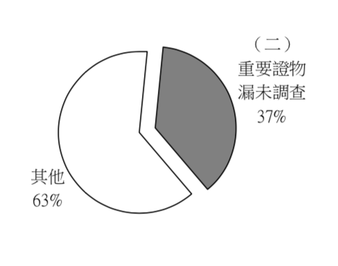
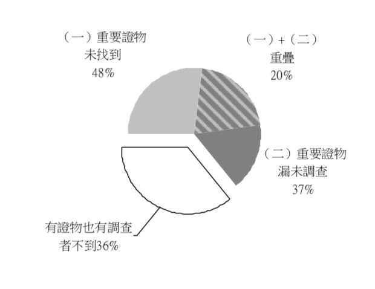

## 貳、「凶器」不見了

### 一、基礎概念：無證據就不得認定犯罪事實

刑事訴訟法證據章節開宗明義揭示：「犯罪事實應依證據認定之，無證據不得認定犯罪事實。」這是證據規定的帝王條款，一般稱為「證據裁判原則」。

另外，依照刑事訴訟法規定，「未經合法調查」之證據就不得作為判斷犯罪之依據[^32]。因此，法院若發現有未經合法調查的證據，應重新踐行合法調查程序。如果法院將未經合法調查的證據資料，作為認定犯罪事實的依據，不僅有礙發現真實，並且損及法治程序對於被告防禦權利的保障。類似這樣的「未經合法調查」（刑訴法第155條第2項），屬於「應於審判期日調查之證據而未予調查者」之判決當然違背法令（刑訴法第379條第10款），為絕對上訴第三審事由。判決確定後並得提起非常上訴加以救濟[^33]。

### 二、判決現況

於殺人案件當中，所謂殺人的「凶器」，也就是一般想像中諸如兇刀、槍枝等。而從本次死刑判決報告裡所研究之案件（75件）中，大部分的案例裡會碰到的共同問題有：「凶器」或重要證物根本沒找到、重要證物漏未經實質調查（例如兇器未鑑定）等。

#### （一）重要證物未找到

重要證物未找到經統計共有32件[^34]，其中，找不到證物（23件），槍枝擊發次數和尋獲或送鑑彈殼不符（5件），以間接證據推論被告殺害被害人（1件），只有看照片，未沒收證物（1件），分屍工具有尋獲，但被害者屍塊並未完全尋獲（2件），詳述如下：

1、找不到證物（23件）：

分兩種類型，一是被告在犯案後自行丟棄，例如【陳金火案】[^35]、【廖敏貴案】[^36]、【吳慶陸案】[^37]，二是則根本找不到，例如【王秀昉案】[^38]、【黃主旺案】[^39]等，也含有縱火案但找不到縱火的證物，例如【郭旗山案】[^40]、【鍾德樹案】[^41]以上共計23件。

2、槍枝擊發次數和尋獲或送鑑彈殼不符（5件）：

【施智元案】[^42]（子彈共12顆，擊發5顆，但送鑑定只有4顆，未說明為何少一顆）、【陳文魁案】[^43]（法院在沒收項目中，只有作案用2把槍，無任何一顆作案用子彈或擊發後的彈殼）、【李嘉軒案】[^44]、【鄭性澤案】[^45]、【劉炎國案】[^46]等案也都類似如此。

3、以間接證據推論被告殺害被害人（1件）：

【王信福案】[^47]（只憑共同被告陳榮傑的證詞而起訴跟判刑，無其它補強證據，且被抓時離案發近20年，重要證人陳榮傑早被槍決，死無對證）。

4、台灣法官只有照片，中國竟未沒收證物（1件）：【杜明雄案】[^48]。

5、分屍工具有尋獲，屍體未尋獲（2件）：【歐陽榕案】[^49]尋獲部分屍體、【邱和順案】[^50]則是屍體全部未尋獲。

#### （二）重要證物漏未經實質調查（如兇器未鑑定）

重要證物漏未調查（實質調查）經統計共有25件[^51]，有重要證物漏未調查（19件），兇器未鑑定（6件），詳述如下：

##### 1、重要證物漏未調查（19件）：

【劉炎國案】[^52]、【王秀昉案】[^53]（在案發現場採樣到毛髮卻未做DNA比對）、【施智元案】[^54]（作案用槍沒有扣案，而在判決文都未提到有無採集到被告指紋）、【鄭武松案】[^55]（鐵條上不知名的毛髮未曾鑑驗，也許可據此查出是否有第三人在現場）、【鄭性澤案】[^56]（未做現場彈道重建）、【邱合成案】[^57]（犯案車輛未調查）、【蕭仁俊案】[^58]（被告三人確係戴手套做案，而扣案物品中有「手套」一付，但無指紋鑑定報告）等19件。

##### 2、兇器未鑑定（6件）：

【唐霖億案】[^59]（未檢驗凶器西瓜刀上是否有被害人的DNA、血液或體液）、【連佐銘案】[^60]（凶器水果刀未送鑑定，僅憑自白認定為凶器）、【黃富康案】[^61]（判決文未提到有無送鑑定凶器黑柄鐵鎚、番刀）、【方金義案】[^62]（查不出犯案前在哪買凶器）、等共計6件。

（表二：證據遺失的型態及數目）

  死刑案總案件的數目                       |67件   
  ------------------------------------- | --- | -----------------------------
  1\. 重要證物未找到（包含證據遺失）          | 32件 | 占死刑案總案件（67件）的數目比約 48%
  2\. 重要證物漏未經實質調查（如兇器未鑑定）    | 25件 | 占死刑案總案件（67件）的數目比約 37%
  **小計：證據有問題的案件**                | 43件 | 1 + 2扣除兩項重疊者（14件[^63]），占死刑案總案件（67件）的數目比約 64%

### 三、評析

從本次死刑判決報告裡所研究之案件初步發現，「凶器或重要證據未被找到」之比例就佔死刑判決將近一半；證據未經合法調查的也超過三分之一。

依照我國刑事訴訟法證據裁判原則：犯罪事實應依證據認定之，無證據不得認定犯罪事實。而國際刑事鑑識專家李昌鈺博士也曾提到：「過去依賴目擊者與嫌犯口供的辦案方式，現在已不管用了，因為他們到法院以後，可能完全翻供。僅憑單薄的一紙自白，根本不足以服人。[如果沒有堅實的物證做後盾，我們得到的就不是真相的臉，而是扭曲的臉。]」[^64]反應出要以什麼態度和方式來取得證據的重要性，否則，即易造成誤判進而產生冤案。而在本次報告的死刑案件共75件，【重要證物未找到】有32件（占總案件約43%），【重要證物漏未調查】有25件（占總案件約33%），若扣除掉兩項都包含的有14件，我們發現證據有問題的就佔了64%（43件），是一半以上。再再顯示出相關單位對調查證據的馬虎或不重視！！若干案件甚至只以被告的自白就被定罪（例如【邱和順案】），如果說，僅憑被告的自白（自白有刑求的疑慮）就可定罪，就有可能再度發生像著名的【江國慶案】[^65]、【蘇建和案】[^66]，就是相關機關[非法刑求取得被告自白和對證據調查的輕慢]，而造成冤案之案例！

因此，如前所說，法院若發現有未經合法調查的證據，即應重新踐行合法調查程序。最後，再以同出處的李昌鈺博士所言作結：「要以謹慎而客觀的態度來分析現場物證，才不會造成冤屈。」

-----

[^32]: 刑事訴訟法第155條規定：「證據之證明力，由法院本於確信自由判斷。但不得違背經驗法則及論理法則。無證據能力、未經合法調查之證據，不得作為判斷之依據。」

[^33]: 林鈺雄，《刑事訴訟法上冊》，七版，2013年，頁283。

[^34]: 計有：【陳憶隆案】、【黃春棋案】、【王秀昉案】、【陳金火案】、【洪明聰案】、【莊天祝案】、【張俊宏案】、【吳慶陸案】、【廖敏貴案】、【蕭仁俊案】【張文蔚案】、【沈岐武案】、【陳瑞欽案】、【徐偉展案】、【黃主旺案】、【王裕隆案】、【王俊欽案】、【方金義案】、【連國文案】、【管鐘演案】、【施智元案】、【李嘉軒案】、【陳文魁案】、【鄭性澤案】、【劉炎國案】、【王信福案】、【杜明雄案】、【歐陽榕案】、【邱和順案】、【鍾德樹案】、【陳東榮案】、【郭旗山案】等共32件。

[^35]: 臺灣高等法院臺中分院96年度矚上重更（三）字第4號判決：「又削刮A女皮肉之未帶柄美工刀片2片及被告廣德強所戴之黑色手套1雙均經丟棄，且又非屬違禁物，……」

[^36]: 臺灣高等法院高雄分院98年度上重更（一）字第3號判決：「『被告廖敏貴所有供上開犯行所用，以2支長螺絲起子及1支小螺絲起子綑綁成而成L行長物及水果刀各1支，分別為被告廖敏貴出賣上開自小客車時一起處理及丟掉於桃園山路上等情，業據被告廖敏貴於原審審理及被告楊可暄於警詢時陳述明確』……上開物品既非違禁物，亦已丟棄滅失，爰均不予宣告沒收。」

[^37]: 臺灣高等法院臺中分院95年度上重更（二）字第8號判決：「被告二人強盜及殺害被害人時，所穿戴之首手套二雙，西瓜刀、V型剪刀各一支因皆未扣案，被告二人復供稱業已丟棄滅失，依法皆不併予宣告沒收，附此敘明。」

[^38]: 臺灣高等法院95年度重上更（十）字第106號判決：「[而行兇所用之不詳棍棒及枕頭則均未扣案，且不能證明尚屬存在而未滅失]，爰均不予宣告沒收，併予敘明。」

[^39]: 臺灣高等法院臺中分院99年度上重更（八）字第26號判決：「至於，私刑拘禁被害人鄭明赫所用之手銬一副，被告雖供稱係伊所有，但並未扣案；[又掩埋鄭明赫所用之圓鍬、鋤頭各一把，係何人所有不明，且未扣案，而上開手銬、圓鍬、鋤頭復並無證據證明仍然存在]，未免將來執行沒收困難，爰不諭知沒收。」

[^40]: 臺灣高等法院臺南分院100年度上重更（一）字第65號判決：「[至被告盛裝汽油所用之寶特瓶之共引燃汽油所用之不明點火物品，均未扣案，且查無證據證明屬於被告所有，不予宣告沒收。]另扣案之寶特瓶、四方形汽油桶各一只（其內所殘留之汽油，業經送檢驗而未能證明仍然存在）及被告放火時所穿戴之衣褲、鞋帽及尖刀一把，雖被告坦承為其所有，惟因非供切本件殺人之用，均不予沒收。」

[^41]: 最高法院刑事判決92年度台上字第4252號判決：「[上訴人隨即蹲下以手中所持不明點火器具引燃流瀉一地之汽油，瞬間引燃大火等情]，業據證人即當時正在一樓櫃前方遊戲之辰○○、鄭至家證稱：當時上訴人在一樓櫃處，將一箱東西倒出，然後蹲下點火等語。」

[^42]: 臺灣高等法院臺南分院95年度上重更（三）字第559號判決：「（五）被告乙○○所持以槍殺徐新生、黃榆峰者，係制式手槍及子彈等情，已經警採集附著被害人徐新生後頸部之彈頭一顆送「內政部警政署刑事警察局」鑑定，鑑定結果該彈頭係口徑九ＭＭ銅包衣彈頭，其上具六條右旋來復線，經比對結果與黃榆峰、丙○○等遭槍擊送鑑之彈頭三顆，其來復線特徵紋相吻合，認係同一槍枝所擊發；且經檢視其彈殼口徑、外觀、彈底紋痕、撞針孔紋痕及彈頭直徑、來復線紋等情形，綜合研判後，認不排除係由口徑九ＭＭ制式槍枝所擊發，此有「內政部警政署刑事警察局」93年1月2日刑鑑字第0000000000號函附槍彈鑑定報告、同局同年2月27日刑鑑字第0000000000號函、同局92年11月28日刑鑑字第0000000000號槍彈鑑定書各一份附卷可稽（見偵字第13245號卷第92至93、204至205頁、262頁）；而該槍彈經擊發，確造成徐新生、黃榆峰死亡之結果，已如前述；是被告乙○○所持上揭手槍係制式手槍，且該槍、彈均具有殺傷力，應可認定。…………六、沒收部分：附表編號一所示之制式九０手槍一支（含彈匣一個），雖未扣案，惟不能證明業已滅失，且與扣案之如附表編號二所示之子彈七顆，均係被告乙○○所有而與被告戊○○殺人部分，爰依修正前刑法第三十八條第一項第一款之規定宣告沒收。至被告乙○○持有供本件犯罪用之子彈五顆，業已擊發，自不具殺傷力，及被告乙○○持有本件犯罪如附表編號一、二所示之手槍及子彈，既經第一審判刑確定，而第一審於該部分主文內，將如附表編號一、二所示之手槍及子彈沒收，於被告乙○○殺人部分即毋庸將上述手槍及子彈重覆宣告沒收，爰均不為另沒收之諭知，併此敘明。」

[^43]: 臺灣高等法院臺南分院刑事判決97年度上重更（六）字第354號判決：「三、又制式九○手槍、制式點三八○手槍各一枝，雖未扣案，然上開制式槍枝係屬違禁品，且為被告等所有供犯本件殺人之工具，[上開諸物不能證明其已滅失]，故仍應依刑法第三十八條第一項第一款規定，宣告沒收。」

[^44]: 臺灣高等法院臺南分院97年度矚上重更（二）字第308號判決。

[^45]: 臺灣高等法院臺中分院刑事判決93年度上重更（二）字第33號判決。

[^46]: 臺灣高等法院臺中分院刑事判決97年度上重更（七）字第13號判決。

[^47]: 臺灣高等法院臺南分院刑事判決99年度上重更（三）字第214號：「迄今[陳榮傑早已伏法多年]，被告再辯稱係李耀昌或李光臨指使陳榮傑殺害被害兩名警員云云，其欲將殺人之罪責推給李耀昌及李光臨之心，亦甚為明顯。事實上被告及辯護人下列請求調查之事項，已事過境遷（[至本院審理時已約20年]），相關證人早已印象模糊，不復記憶，甚至其主觀之想法早已受到干擾、污染，相關證人此時再至原審及本院作證證明案發之初渠等所未曾證述之證言，其憑信性極低。至於相關物證亦早已無從採證。是被告及辯護人所作下列主張，或核屬無謂之主張，核無調查之必要，或已經本院調查，但不足為被告有利之認定……」

[^48]: 臺灣高等法院臺南分院98年度重上更（六）字第353號判決：「雖因兩岸分隔之政治現實，致無法向大陸地區調取上開證物提示被告等人辨認，[惟上開物品均已拍照存證]，並提示被告等人辨認，雖被告等否認其證明力，[但就確有上開照片與真實物品之同一性則未曾爭執，是依前揭最高法院判決意旨，應認上開扣案物品之照片有證據能力。]」

[^49]: 臺灣高等法院高雄分院99年度上重更（六）字第6號判決。

[^50]: 臺灣高等法院刑事判決98年度矚上重更（十一）字第7號 。

[^51]: 計有：【劉炎國案】、【鍾德樹案】、【黃春棋案】、【王秀昉案】、【施智元案】、【鄭武松案】、【鄭性澤案】、【莊天祝案】、【劉榮三案】、【邱合成案】、【蕭仁俊案】、【楊書帆案】、【游屹辰案】、【劉華崑案】、【杜明雄案】、【張嘉瑤案】、【張人堡案】、【鄭金文案】、【邱和順案】、【戴文慶案】、【唐霖億案】、【連佐銘案】、【黃富康案】、【方金義案】、【黃賢正案】等共25件。

[^52]: 臺灣高等法院臺中分院97年度上重更（七）字第13號判決：「被告劉炎國係於短距離情況下對陳志源開槍，開槍所發射之子彈動能，應足以一次穿透陳志源之身體及手部，而造成一槍2個彈孔、另一槍因子彈殘留於體內而造成5個彈孔之結果，自不能單純以被害人陳志源身上有7個彈孔，即認被告劉炎國對被害人陳志源射擊4槍，是上開法醫研究所及現場勘查報告表之認定結果，忽略被告劉炎國係短距離對陳志源槍擊，是法務部法醫研究所上開研判陳志源所受槍傷確係遭開4槍所致等語，尚難憑採。」

[^53]: 臺灣高等法院95年度重上更（十）字第106號判決。

[^54]: 臺灣高等法院臺南分院95年度上重更（三）字第559號判決。

[^55]: 臺灣高等法院高雄分院93年度上重更（二）字第13號判決：「至棄置於凶案現場扣案之鐵條（相字第六九二號相驗卷第一六頁編號九；警卷第二九頁相片）雖留有被害人陳慶之血跡一節，有證物採驗紀錄表暨DNA型別鑑驗書一份在卷足憑（原審卷第三一頁項次九及鑑驗結論１），[惟因其上毛髮未檢出型別]（同上卷第三二頁鑑驗結果），……」

[^56]: 臺灣高等法院臺中分院93年度上重更（二）字第33號判決。

[^57]: 臺灣高等法院101年度上重更（三）字第18號判決。

[^58]: 臺灣高等法院98年度重上更（十）字第227號判決：「扣案之西瓜刀2把（附表編號9至11除外）、透明膠帶1大包、黃色膠布3大塊，手套1付，均為被告等所有，供犯罪所用之物，已如前述，應依法宣告沒收。」

[^59]: 臺灣高等法院臺中分院98年度上重更（一）字第16號判決。

[^60]: 臺灣高等法院93年度重上更（四）字第189號判決。

[^61]: 臺灣高等法院101年度上重更（二）字第9號判決。

[^62]: 臺灣高等法院94年度重上更（六）字第79號判決：「遂決意將張惠慈身體支解後，再行棄屍，[方金義乃外出至臺北市廣州街不詳商店，購買刀、鋸及塑膠袋等物]……。」

[^63]: 計有：【鍾德樹案】、【黃春棋案】、【王秀昉案】、【施智元案】、【陳金火案】、【戴德穎案】、【莊天祝案】、【吳慶陸案】、【蕭仁俊案】、【方金義案】、【黃賢正案】、【杜明雄案】、【鄭金文案】、【邱和順案】等共14件。

[^64]: 張娟芬，〈 無彩的青春蘇建和案十四年〉，《執著的心》，商周出版股份有限公司，2004年7月初版，頁viii。

[^65]: 李茂生，[〈蘇建和案事實認定及證據調查的評鑑報告〉](http://www.taedp.org.tw/story/2561)。

[^66]: [江國慶案專題整理（2014/5/29更新）](https://www.jrf.org.tw/newjrf/index_new2014.asp?id=2912)，財團法人民間司法改革基金會
