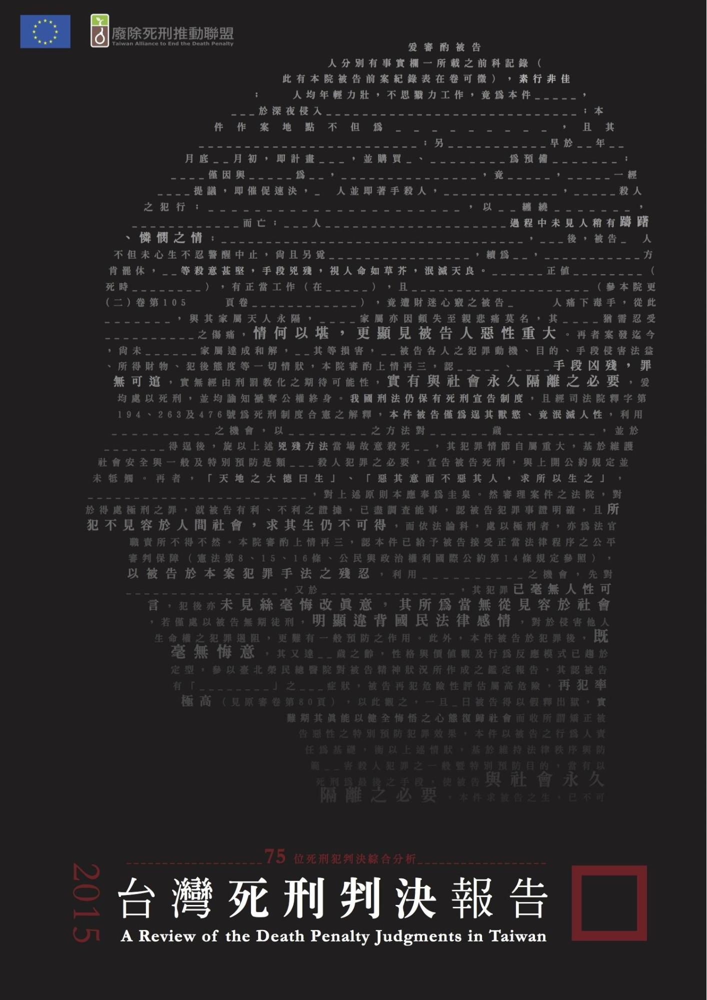

# 台灣死刑判決報告～75位死刑犯判決綜合分析
## A Review of the Death Penalty Judgments in Taiwan

**台灣廢除死刑推動聯盟**

### 前言

死刑判決中，最為民眾所熟悉及常出現的幾個關鍵字：「殺人、悔意、教化可能性、泯滅天良、人神共憤、求其生而不可得」，這幾個詞似乎已成為變成人人皆知的死亡公式。不過，若真正攤開每份判決書，認真地細看這些所謂的「死刑判決」，則將發現，這些判決書對於整起案件犯罪事實之重構及證據的使用等等，或多或少都有證據的問題、也有程序的問題，更令人憂心的是也會有冤枉的問題，實則，這些問題都牽涉到司法正當性及民眾對國家的信賴。

就這些犯罪事實的重構以及應如何對於行為予以評價，我國刑法及刑事訴訟法自有一套規則供法官遵循，即所謂的依「法」審判，也就是說，法官要判一個人死刑，在我國刑事規制上，有其相關之審理要件、證據規則應予以遵循。特別是在2009年，我國將對於死刑判決有嚴格規定的《公民與政治權利國際公約》（下稱「公政公約」）內國法化後，法院於死刑判決的決定勢必要通過這些要件限制及門檻。

不過，於法院的實際操作上，台灣本土的死刑判決究竟有無確遵這些法律及最低人權門檻？這是一個嚴肅的提問且其背後有更深層的質疑是：對於死刑，法官很嚴謹、判決很謹慎？一定是求其生而不可能才會下這樣的判決？那麼多法官判過的案件絕對不會有錯？

### 台灣廢除死刑推動聯盟簡介

廢死聯盟於2003年成立，希望有一天台灣能夠成為一個沒有死刑的國家。我們知道這是一個漫長的對話及理解的過程，因此廢死聯盟的工作重點放在對話。我們舉辦演講、論壇、影展等活動和社會大眾對話；用教育教材工作坊和老師對話；用本土研究、民意調查跟政治人物對話；用專業訓練課程和法律人對話。

除了這些溝通之外，廢死聯盟很大的工作重點在協助個案。美國前死囚Freddie Lee Pitts曾說過「你可以從監獄中，但不能從墳墓中釋放一位無辜的人。」目前我們正在全力救援的冤案包括：邱和順、鄭性澤、謝志宏等個案。

除了冤案，我們相信每位被告都應該擁有公平審判的權利，因此也協助律師進行相關法律工作。而從這些個案實務中，也能發現更多司改問題，進而和其他團體共同促成改革。

- 欲瞭解更多我們的工作，歡迎參閱廢死聯盟網站[[http://www.taedp.org.tw]](http://www.taedp.org.tw)

- 欲掌握我們最新的動態，歡迎訂閱〈廢話電子報〉或關注TAEDP FORUM廢死論壇臉書專頁。

### 致謝

《台灣死刑判決報告：75位死刑犯判決綜合分析》由廢死聯盟理事高涌誠律師擔任召集人，法務主任林慈偉帶領死刑判決工作小組成員，古進皓、初云亭、林紫彤、張淇琳、張禎晏、張譽馨、莊艾潔、許珮甄、黃競文、盧于聖、鍾鳳芝歷經4個月完成本報告，沒有他們無私奉獻及努力，這本報告無法完成。

本報告要感謝王怡今律師、周漢威律師、林志忠律師、林俊宏律師、邱明弘法官、高烊輝律師、張娟芬小姐、陳欽賢法官、詹秉達律師、蔡晴羽律師、鄭凱鴻律師的協助，幫助死刑判決小組更進一步了解司法實務及死刑判決的「眉角」，讓小組成員有足夠的背景知識以進行判決的閱讀及分析。

特別感謝張娟芬小姐為本報告寫序、黃士軒老師撰寫導讀。

最後，更要感謝歐盟贊助本報告的出版。

This publication has been produced with the assistance of the European Union.

The contents of this publication are the sole responsibility of Taiwan Alliance to End the Death Penalty and can in no way be taken to reflect the views of the European Union.

* 出版：台灣廢除死刑推動聯盟
* 主編：林欣怡、林慈偉
* 死刑判決工作小組：古進皓、初云亭、林慈偉、林紫彤、張淇琳、張禎晏、張譽馨、莊艾潔、許珮甄、黃競文、盧于聖、鍾鳳芝
* 封面設計：李杰庭
* 出版日期：2015年12月

本報告採創用CC授權
