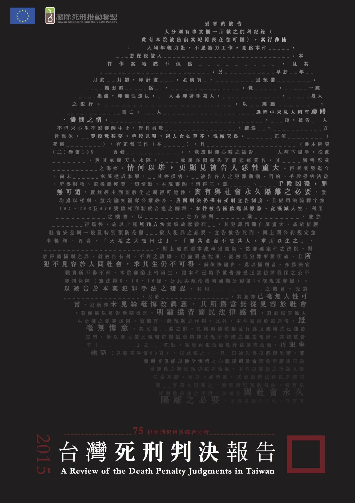

# 2015台灣死刑判決報告

## 序：死刑論辯的三個突破

**張娟芬**

這份報告對於糾纏多時的死刑論辯，有幾項突破。第一，是對於死刑判決進行實況考察。所有人都可以隨口說出對死刑制度的意見，但是卻只有很少很少的人真正看過死刑判決，即使法律專業者亦然。沒看過死刑判決，那對死刑的意見從哪來？依直覺，但直覺往往是人在社會文化影響裡頭不自覺的制約反應；或者憑印象，印象來自於劣質媒體加油添醋的犯罪奇景，食人魔、驚世媳婦、蛇蠍女、冷血殺手。媒體再怎麼被罵，它傳播訊息的感染力仍然強大，大眾往往沒有意識到自己對媒體訊息的依賴。例如前陣子民間司改會的「司法陽光網」將法官檢察官的名字列出，並附上相關新聞連結，法檢強烈反彈，說新聞報導常常錯誤；但是我的文章貼在法官論壇，裡面提到死刑犯徐偉展，立刻有法官把媒體對徐偉展的報導貼在下面證明徐偉展多壞——所以媒體罵到法官的時候都罵錯，不可參考，但罵到小老百姓的時候就一定對，一定是那人犯了罪。

大眾想像中的那種「極端之惡」，幾乎毫無例外是媒體印象。不管有多少例子告訴我們媒體的不可靠，例如「媽媽嘴」案，但一講到死刑、壞人、惡魔，媒體塑造的印象還是大勝，閱聽大眾從來學不到教訓。關於死刑制度的討論，就在這種迷糊仗裡進行。正因如此，廢死聯盟的這份報告，是死刑論辯裡一個很重要的態度：先實事求是地瞭解死刑判決的樣貌。

第二項突破，是這份報告打破了盛行的迷思：死刑案件一定是罪證確鑿。實際檢視67份死刑判決之後，這份報告發現其中32件重要證物沒有找到，例如凶器找不到、或者屍體找不到；25件重要證物沒有調查，例如凶器沒有拿去鑑定、甚至只有照片而沒有實物等等。想像中的「鐵證如山」，在死刑案件裡並不是必然。沒有凶器、沒有屍體、沒有鑑定，那到底靠什麼證據判死刑呢？

自白。這是刑事訴訟的老問題了，但是卻是一個始終沒有改正的老問題。從蘇建和案一九九五年死刑定讞到現在，二十年一晃眼就過去，整個偵審過程還是以自白與供述性證據作為最方便好用的證據。鄭性澤案是一個簡單的例子：偵辦的警方原本以為鄭性澤與羅武雄分持兩槍打死被害人，可是子彈鑑識結果發現被害人身中三槍是同一兇槍所擊發，而持有人是羅武雄。警方拿到鑑識結果的隔天就傳喚證人，製造一份「交槍筆錄」，說羅武雄把兇槍交給了鄭性澤。供述性證據最容易操控，不必動用到刑求，只要誘導、施壓、欺騙加上紀錄不實就可以，頂新案不就活活捉到檢察官在筆錄裡把被告否認犯罪寫成坦承犯罪？

這些重要證物沒找到或者沒鑑定的案件，未必全部是冤案。但是，「反正那是壞人」，這樣就行了嗎？這份報告的第三個突破，就是設定了死刑判決應該要達到什麼樣的水準。殺人的構成要件例如犯意沒有論證，可以嗎？證人未經對質詰問，可以嗎？量刑抄寫一堆成語而沒有調查，可以嗎？情節並非最重大卻判死刑，可以嗎？死刑判決對人民施加最嚴厲的刑罰，當然在品質上必須能夠通過最嚴格的品管，這是現代公民對於節制國家權力最起碼的思考。但是這份報告認真地實地考察之後，卻發現死刑判決遠遠不是大眾一廂情願認定的「罪證確鑿」、「惡行重大才判死刑」，而時常出現違反法學理論、違反國際公約、違反正當程序、或違反邏輯的論理。與其盲目支持死刑，不如沈靜下來如實凝視死刑判決，並且自問：我們怎能容許國家以品質參差不齊的判決將人處死？

（作者著有《無彩青春》、《殺戮的艱難》、《十三姨KTV殺人事件》）

==========

## 導讀：死刑判決現狀探索與認識的起點

**黃士軒**

死刑存廢是刑事法學上的重要議題，也是深受我國社會關心的重點問題。近年來，有關死刑存廢的論述，在刑事法學與相關的學術領域有相當高度的深化；然而，在我國社會上，一般大眾對於死刑的認識與想法則似乎未必與專門領域的高度發展成正比。儘管廢除死刑的立場最近已經逐漸變得有力，但另一方面支持保留死刑的立場也仍然有著相當廣大的支持，因此究竟死刑應保留或應廢除，仍然必須繼續地探討與思辯。

在這樣的狀況下，台灣廢除死刑推動聯盟提出的這份《台灣死刑判決報告～75位死刑犯判決綜合分析》（以下稱「本件報告」），或許提供了一個與向來對死刑的論辯方式較為不同的觀察角度。這份報告蒐集了75位死刑犯共計67件死刑判決，主要從刑事審判程序的角度，選取了被告是否具「殺人故意」可能存有疑問、「凶器」有無、鑑定意見與法律意見的調查與採納、被告自白作為證據的地位與任意性、對證人是否有行使對質詰問權、測謊鑑定的調查與採納、證據評價是否合乎經驗輿論理法則、判決是否符合兩公約中的人權基準、量刑與其他問題等重點，對於法院判決做了相當詳細的觀察。並且，由於本件報告應是以一般社會大眾作為對象，在報告中，就上述每個主題，先就各該主題相關的刑事法學理論做較為簡要的說明，其次再基於此說明對法院判決的現況進行觀察，並於觀察後加上簡單的評析。

透過這樣的方式，應可期待本件報告一定程度反映我國法院的刑事審判程序中，死刑判決的作成在證據調查評價、事實認定乃至量刑上可能面臨的問題所在。例如：在凶器未尋得或未經充分調查的情況下法院應如何認定事實的問題（本件報告「貳、」的部分）、自白任意性的調查方式是否能夠充分確認被告有無受到不當的壓力或刑求的問題（本件報告「肆、」的部分）；是否能夠在合乎刑事訴訟法的規定下給予被告充分詰問證人的機會（本件報告「伍、」的部分）；測謊程序在被告是否適於測謊等前提的確認、是否提出補強證據等（本件報告「陸、」的部分）；死刑量刑的論述是否嚴謹並充分反映法院的量刑上考量等問題（本件報告「玖、」的部分）等等。如前所述，倘若有關死刑的意義、死刑的存廢等問題，社會上支持與反對死刑的立場一時之間難以充分說服對方，則先觀察刑事司法系統內所產生死刑的現象以及死刑的現狀，或許可以是今後相互議論的出發點，就提供這樣的視野的意義上，本件報告有相當的價值。並且，對一般社會大眾而言，比起相對地遙遠的外國情況與議論，這種對於我國的觀察更為貼近自己，同時在基礎說明平易化的努力下，或許更有引人一看的魅力。

這種對於現況的了解，不僅對於反對死刑立場的人而言有其必要，對於贊成保留死刑立場的人而言也有必要。因為，反對我國保留死刑者，應該基於對我國死刑現狀的認識，分析、尋找我國刑事制度下的死刑所造成的各種嚴重問題；贊成保留死刑者，也應該基於對我國死刑現狀的認識，了解自己贊成保留了什麼樣的刑罰，並且實際上哪些人因為這樣的刑罰被剝奪了生命？當然，對於死刑應該廢除或保留的問題尚無定見的人，在決定自己的立場之前，同樣有必要先了解我國刑事審判程序中宣告的死刑判決究竟是什麼？並且如何產生？等問題。

另外，必須在此說明的是，本件報告中，在進行客觀的學理與現狀說明前，有時從標題就可看出本報告已經對法院進行了負面評價（例如；「壹、『殺人故意』之判斷流於恣意」）。倘若觀察、釐清死刑判決的現狀是本件報告的重要目的（至少是重要目的之一），則在客觀的現狀呈現之前先提出上述評價於標題的方式事實上未必適合此一目的。不過，這對包含本人在內的讀者而言，或許正是一個新的契機，讓我們以本件報告所提供的基礎說明與現狀資訊為出發點，不受本件報告的評價制約，更進一步親身探究這些死刑判決的事實關係、法律上爭執的重點與法院判斷，並且透過自己所見與思考得出自己對法院判決的評價。

最後，希望對於死刑判決的現狀探索與認識，能以本件報告提供的契機與視野為起點，在社會上變得普遍。屆時，應該能期待不論贊成或反對死刑的相關論述將能有現狀的充分認識作為支撐，
逐步達到應保留或廢除死刑的最終結論。

（作者為東京大學法學博士、中正大學法律系助理教授）

==========

## 台灣死刑判決報告～75位死刑犯判決綜合分析
## A Review of the Death Penalty Judgments in Taiwan

**台灣廢除死刑推動聯盟**

### 前言

死刑判決中，最為民眾所熟悉及常出現的幾個關鍵字：「殺人、悔意、教化可能性、泯滅天良、人神共憤、求其生而不可得」，這幾個詞似乎已成為變成人人皆知的死亡公式。不過，若真正攤開每份判決書，認真地細看這些所謂的「死刑判決」，則將發現，這些判決書對於整起案件犯罪事實之重構及證據的使用等等，或多或少都有證據的問題、也有程序的問題，更令人憂心的是也會有冤枉的問題，實則，這些問題都牽涉到司法正當性及民眾對國家的信賴。

就這些犯罪事實的重構以及應如何對於行為予以評價，我國刑法及刑事訴訟法自有一套規則供法官遵循，即所謂的依「法」審判，也就是說，法官要判一個人死刑，在我國刑事規制上，有其相關之審理要件、證據規則應予以遵循。特別是在2009年，我國將對於死刑判決有嚴格規定的《公民與政治權利國際公約》（下稱「公政公約」）內國法化後，法院於死刑判決的決定勢必要通過這些要件限制及門檻。

不過，於法院的實際操作上，台灣本土的死刑判決究竟有無確遵這些法律及最低人權門檻？這是一個嚴肅的提問且其背後有更深層的質疑是：對於死刑，法官很嚴謹、判決很謹慎？一定是求其生而不可能才會下這樣的判決？那麼多法官判過的案件絕對不會有錯？

### 廢除死刑推動聯盟的個案工作

台灣近代的廢除死刑運動，可以從1987年湯英伸案引起的討論作為開始，1989年的馬曉濱案發生後，台灣人權促進會呼籲政府槍下留人，並正式以「廢除死刑」為目標展開救援馬曉濱等三人。1991年發生的汐止命案，蘇建和、劉秉郎、莊林勳無辜被判死刑，在1996年由台權會、民間司法改革基金會、人本教育基金會組成死囚平反大隊，積極救援蘇案三人。蘇案歷經21年終於在2012年8月31日無罪確定。

2000年第一次政黨輪替，陳水扁政府宣示台灣逐步廢除死刑的政策，但同年9月，死刑判決非常有問題的盧正案[^1]，卻在監察院決定要開始調查的時候，被執行死刑，引起民間團體的抗議。當時被判決死刑但卻仍有非常多疑慮的案件除了蘇案之外還有徐自強案，蘇案在2000年開啟再審程序，暫時不用擔心會如同盧正案被錯誤槍決，但徐自強案一直無法獲得有效的進展，因此2003年由民間司改會、台灣人權促進會號召，結合其他相關法律、人權團體包括澄社、台北律師公會、東吳張佛泉人權研究中心、輔大和平研究中心等團體組成「替代死刑推動聯盟」（後來於2006年改名回廢除死刑推動聯盟）。這些團體擔心，若是只做「個案」救援，卻不對死刑制度呼籲改革，則我們永遠和死神賽跑，卻不知死神何時會降臨在這些有冤的死刑犯身上，同時這些團體也都認為，死刑是不應該存在的制度。

廢死聯盟從2003年成立之初，組織上是個鬆散的義務平台，因此剛開始囿於人力，並無法針對所有死刑個案進行有效的了解及協助。甚至在那個時候，有多少的死刑犯？死刑犯的狀況如何，都無法獲得政府公開透明的資訊。

總部位於法國的國際人權聯盟（International Federation for Human Rights，FIDH）於2005年來台灣進行死刑實地調查（Fact-finding Mission），來台灣之前，他們已經針對日本、美國等多個國家進行訪查，是一個受人敬重的國際人權組織。2006年FIDH和廢死聯盟共同發表了《台灣死刑調查報告：邁向廢除死刑？[^2]》（The Death Penalty in Taiwan: Towards Abolition?），這份報告算是第一份比較清楚的台灣死刑制度描繪。

2006年開始，廢死聯盟利用收集剪報資料，我們搜集了廢死聯盟的第一份定讞死刑犯名單共19人（已經判決死刑，但尚未執行死刑），從此之後我們持續的更新這份資料，同時也和定讞的死刑犯聯繫，希望可以提供法律協助。廢死聯盟於2006年才算正式有死刑看守小組進行個案工作，和這些定讞死刑犯聯繫，視他們的意願，由律師幫忙提起再審、非常上訴或者釋憲及赦免。同時也有些重大矚目進行中的死刑案件，廢死聯盟開始組織律師協助辯護。

作為台灣主要的廢除死刑團體，一直到2015年才完成這份《台灣死刑判決報告》，我們要承認自己的不足。希望這份報告只是遲到，但還是能發揮影響力，讓台灣各界能重視死刑判決制度的問題。

### 本報告範圍及限制

廢死聯盟從2003年成立以來，接觸過的死刑個案將近100件，最早的個案是2000年定讞的案件，這些個案包括尚未定讞但很可能被判死刑以及已經定讞的。就已定讞的個案以及最後事實審判決為計算，廢死聯盟這邊掌握的具體死刑判決總數為67件、75[^3]位被告（同案可能有數名被告）。

就這些死刑判決，雖長期以來，廢死聯盟或其他人權團體也都陸陸續續地透過個案的方式，指出各個死刑判決的問題。不過，仍缺乏對整體死刑判決的分析觀察，也就是具體地指出台灣死刑判決究竟有哪些通案性或個案性的問題點。

於今年（2015）夏天，廢死聯盟舉辦了為期三日的「罪證確鑿～破解死刑判決的秘密」工作坊，在數位資深刑庭法官、承辦過相關個案的律師以及對死刑判決有相當研究專家之帶領下，提供工作坊參與成員們撰寫死刑判決的經驗以及檢視卷宗的心得，藉以對死刑判決文本的製作過程及閱讀有基本的了解及掌握。參與成員來自司法改革及死刑制度有感、自身及經驗者等。

在判決理由寫作及證據檢視的脈絡下，工作坊學員分工撰寫研究觀察、互相討論以及數次的會議討論後，產出了這次的台灣死刑判決報告。從這份報告，可以看出台灣本土性的死刑判決之面貌，以及其中可能的問題點。希望透過這份報告的產出，能夠使關心台灣死刑制度及死刑判決的人更理解台灣目前的死刑判決製程及主要問題所在。

（表一：死刑判決及死刑執行）

  年度 | 死刑定讞 | 死刑執行
  ---- | ------ | -------
  2000 | 22     | 17
  2001 | 11     | 10
  2002 | 7      | 9
  2003 | 6      | 7
  2004 | 7      | 3
  2005 | 8      | 3
  2006 | 11     | 0
  2007 | 5      | 0
  2008 | 3      | 0
  2009 | 13     | 0
  2010 | 4      | 4
  2011 | 16     | 5
  2012 | 7      | 6
  2013 | 3      | 6
  2014 | 1      | 5
  2015 | 0[^4]  | 6

就本次研究，於方法及資料蒐集上，有若干問題應先予以釐清如下。

##### 1\. 判決挑選期間及最後事實審判決之選擇

如前所述，廢死聯盟目前所掌握之具體死刑判決總數為67件、75位被告（同案可能有數名被告）。判決挑選之時間設定則是從【黃春棋、陳憶隆案[^5]】定讞判決即2000年迄今所有死刑定讞案件之「最後事實審」判決。此外，由於蘇建和案已經平反且討論的專書、專文很多，因此也不列在我們探討的範圍中。

挑選「最後事實審」判決（而非定讞判決）作為觀察客體之原因在於，為死刑定讞判決之最高法院是法律審，也就是說，最高法院對於事實認定之部分不會再行調查，不過，死刑判決更多的故事、事實認定問題、證據使用疑義卻藏諸於「事實審判決」中。基此，本報告即選定各該死刑個案之「最後事實審」判決為主要觀察對象。以【黃春棋、陳憶隆案】為例，該案之定讞判決為「最高法院89年台上字2196號刑事判決」(89/04/27)、最後事實審判決則是「臺灣高等法院88年度重上更(五)字第145號刑事判決」(88/11/16)，因此我們以後者為分析對象。不過，其中若干個案基於爭點的延續觀察及釐清判決軌跡，仍將延伸至地方法院判決或最高法院判決。

##### 2\. 判決文本分析方法及其限制

囿於關心範疇之原因，本報告以死刑判決作為主要檢討素材，事實上，若欲更了解各該死刑案件之全貌，應當看過「全卷」再來評價是最為妥適。但受限於能力、卷宗齊全程度、關心範疇等因素，本報告僅著重判決文本之理由。但我們期待日後若能取得更多個案資訊，能進行更全面的分析。

##### 3\. 判決書取得問題

本報告所選輯之67則死刑判決，判決書內容主要來自於司法院網站中之「[法學資料檢索系統](http://jirs.judicial.gov.tw/Index.htm)」，該等判決原則上係屬公開。至於若干未公開判決[^6]，都經過個案提供並授權供廢死聯盟研究。

##### 4\. 寫作架構

本報告所歸納出爭點，其大致的方向為：

  被告犯意                 | 判決就被告主觀犯意（故意、過失）之認定及論證、被告有無抗辯
  ---------------------- | -----------------------------------------
  「人」的問題             | 被告自白任意性問題、證人未經被告對質詰問
  「物」的問題             | 重要證物（如凶器）未被找到或未經調查
  公政公約死刑判決基準       | 情節最重大之最、精障判死禁止、公政公約就程序保障之規定
  調查方法、經驗法則、論理法則 | 鑑定報告錯誤如鑑定之極限、鑑定意見逕行取代法律意見之疑義、測謊
  量刑                    | 刑法第57條、罪刑相當、教化可能性
  其他                    | 自首、前科紀載、個案被害人人數、辯護人來源

就各該爭點，本報告亦將分三個層次即①定義②判決現況描述③評析，為檢討分析。

本報告於各項爭點中，將先就爭點所涉及之概念定義說明，這有助讀者於閱讀判決理由內容時所涉相關問題之理解；判決現況描述則是指判決言說的歸納與整理、相關死刑判決現況之描述；最後則提出評析及建議。

### 小結

本報告乃本土性死刑判決解析之初步嘗試，於內容的檢討及分析上，不免帶有分析者本身之敘事性、評價性色彩，不過，相較於以媒體塑造出的片段事實、穿鑿附會理由的分析建構，從判決書中做文本析論，其中的脈絡故事及可能聚焦的討論點應當是明確許多。

另外，從初步之研究檢討亦可發現，存於死刑判決中的各項問題點均有個別再深入研析之必要及其價值。

廢死聯盟希望本報告僅為初版，之後經過增補、調整後，會有更完整的二版、三版等，也希望引發相關學者的研究，讓死刑判決的發展及相關問題可以被充分討論。

-----

[^1]: 盧正案請參考蔡崇隆所寫，收錄在《正義的陰影》一書中的〈小警察的輓歌---盧正案〉[[http://www.taedp.org.tw/story/1829]](http://www.taedp.org.tw/story/1829)。

[^2]: 補上報告的內容，將內容重新上網（因為網站轉換而遺失了）

[^3]: 2000年至今有124位定讞的死刑犯，我們掌握且接觸過的名單為75位，佔六成以上。2006年之後定讞的宴見就幾乎全部有過接觸。

[^4]: 截至報告完成發表（2015年12月21日），2015年尚未有死刑確定判決。

[^5]: 本案的共同被告為黃春棋、陳憶隆及徐自強。徐自強之部分嗣因司法院大法官釋字582號解釋再開始再審程序，屬於較特別之狀況，且徐自強於2012改判無期徒刑，今年9月1日高院判決無罪，雖然尚未定讞，但屬於較特別之狀況，另當別論。這次的報告中，我們主要以黃春棋及陳憶隆為研究對象。

[^6]: 共有17個個案判決未公開，請參考表六。

=========

## 壹、「殺人故意」之判斷流於恣意

### 一、基礎概念：法院實務採取的「綜合觀察法」

作為犯罪構成要件的故意[^7]，又分為直接故意與間接故意[^8]，行使刑罰權的國家必須找到一個揣測行為人主觀意思的判準，法官依此形成心證。其方式即是在客觀可認定的事實中尋找間接證據，依照經驗法則和論理法則，對行為人的主觀作出規範上的判斷。目前實務採取綜合觀察法[^9]來認定行為人的殺人故意，行為時的所有情狀皆是可供觀察的指標。常見的指標，例如**行為之背景**，行為人與被害人之關係、行為時所受刺激、犯罪動機等皆是考量的重點；**行為時之言語表示**亦經常被用來推測行為人的心理狀態；而與**被害人傷勢**相關之事實[^10]更是重要的判斷依據，例如犯罪所使用之工具、傷勢部位、攻擊力道等。

### 二、判決現況

#### （一）特殊殺人案件─縱火、勒頸

在像「縱火[^11]」與「勒頸[^12]」這種非一擊致命手段的案件中，犯意的認定經常在確定故意、間接故意和有認識過失間徘徊，法官則往往以結果的嚴重性回推被告的意欲。以【陳東榮案】、【張文蔚案】以及【林金德案】為例：

##### 1、【陳東榮案】（縱火）[^13]

本案被告曾抗辯：其並非獨立擲汽油袋並點火，而是聽從他人指示。且其從未至帝王大飯店消費，不知地下室為營業場所，也不知當時地下室有人，更不知道案發當時該飯店建築物內之逃生路線遭阻隔等情。因此被告縱有預見其於地下室入口處點火將可能造成多人死傷之結果，主觀上卻認為尚有其他出入口可供人逃生而確信該結果不會發生。蓋行為人之所以能「確信結果不會發生」，代表此人對結果之發生只有可能性的認識，並且認為發生的機率不高。

對於被告的犯意抗辯，法官以客觀上火勢太大，帝王大飯店頂樓搭建違章房屋、未設置妥善之防火安全措施、將太平梯及緊急出口堵塞等情形，與被害人死亡之結果並無相當因果關係為由，認定被告對結果有認識並容任其發生，為未必故意[^14]。然而客觀上行為與結果的因果關係是一回事，犯意要討論的是行為人的主觀，此處似乎將主觀與客觀構成要件混為一談。

##### 2、【張文蔚案】（勒頸）[^15]

被告與被害人（少年）原為朋友，兩人原本打算惡作劇，由被告打電話至被害人家中假裝擄人勒贖，嗣後被告卻真起擄人勒贖之意。被告擔心被害人吵鬧而惹人注意，二度以電話線勒住被害人脖子，第一次被害人尚無礙，第二次則發生死亡結果。

被告抗辯其無殺人故意，勒被害人脖子只是為了使其安靜[^16]。法官則認為勒住頸部會造成人體缺氧死亡為一般常識，被告無不知之理，為故意殺人[^17]。然而被告曾勒住被害人兩次，第一次被害人尚能搖手表示不會再吵鬧，且被害人體型壯碩，兩次行為皆用同樣工具，被告是否真能明確認識到兩次行為會造成不同結果，並非只由「勒住頸部會造成人體缺氧死亡」的一般常識就能判定。從被告行為時之言語亦可推斷其目的在於使被害人安靜[^18]。事發後被告檢查被害人之頸動脈和脈搏，發現被害人死亡後棄屍逃逸，從此再無勒贖舉動，似乎可認定其行為時對結果之發生並無預見。本案事實多由被告自白而得，法官只採信能證明其有罪之部分，對於犯意之抗辯卻不採信亦無論述。

##### 3、【林金德案】（縱火）[^19]

法官認為本案的殺人動機和行為背景為：被告多次要求交往十年的同居人江美雪與其復合並返還財產，遭其拒絕，因此心生怨恨，欲放火報復之。被告在案發前一日與江美雪聯繫，得知江美雪案發當日應在其弟江順萬的住處。案發當日，客廳訪客告知被告江美雪不在屋內，被告卻仍認為其躲在屋內，在門口處潑灑汽油並點火。客廳訪客與在臥房睡覺的江順萬夫妻從陽台逃出，在閣樓內的三名兒童則送醫不治。法官認定被告對江順萬夫妻和三名兒童皆有間接的殺人故意。

被告坦承其放火行為，但抗辯其並無殺人之故意，並不認識客廳裡的人，也不知道臥房中有人在睡覺、閣樓裡有兒童，放火只是想恐嚇江美雪[^20]。法則認為「若意在恐嚇，僅以言詞或作勢放火即可達其目的，其既未見江美雪在場，仍執意點燃汽油放火，所辯僅為嚇嚇江美雪云云，自不足採。」另外，判決中說明判斷直接故意與未必故意的方式：「區分方法為凡認識犯罪事實，並希望其發生者為直接故意；僅有認識，無此希望，但其發生亦不違背其本意者，為間接故意（未必故意）。」並認為被告知道江順萬夫妻有小孩，且知道該屋平日為有人居住之處所，因此推斷被告有認識到放火時其未見到之人也在屋內、認識到他們可能會被燒死，並容任其死亡之結果發生。

#### （二）其他

除了勒頸、縱火的案件，其他手段也會出現犯意認定的問題，以【洪晨耀案】和【施智元案】說明實務上依綜合判斷法認定被告犯意的操作情況：

##### 1、【洪晨耀案】[^21]

法官認定【洪晨耀案】之行為背景：被告和被害人夫妻呂清一、乙○○有財務糾紛，被告在呂清一家中等待乙○○返家時，與被害人之子呂建忠發生口角扭打，鄰居陳尚三前來勸架反遭呂建忠打傷。呂清一報警後，被告回房間拿槍朝其腹部射擊。呂建忠將陳尚三推向被告，被告朝其射擊三槍後又朝呂建忠射擊三槍，兩人皆當場死亡。依判決所認定行為時之情狀，被告在朝陳尚三射擊前曾要求其離開，是否有殺人之意欲應有討論空間[^22]；而被告離開現場前，曾與呂清一家中的越南籍外勞一起將尚未死亡之呂清一抬至房內，其若有殺人故意則直接離去即可，但法官仍認為被告殺意堅定[^23]。關於被害人傷勢，呂清一腹部受槍傷，接受手術後，於案發七日後死亡[^24]，法官認為被告對其殺意甚明，並未多做論述。

##### 2、【施智元案】[^25]

本案的行為背景中，被告被雇傭殺害徐新生，開槍射擊後，原本背對被告的黃榆峰轉身作勢要搶槍，被告隨即朝其開兩槍，同時造成其身後的丙○○受傷。徐新生與黃榆峰送醫後，分別於被告行為後十二小時、五天半死亡[^26]。法官認定被告射殺黃榆峰為另行起意，與殺害徐新生出於不同犯意[^27]，從而判處被告死刑。

被告否認有殺害黃榆峰之故意[^28]，但判決中除了一再重複被害人傷勢[^29]，並強調被告殺黃榆峰為另行起意之外，對被告犯意抗辯隻字未提。

### 三、評析

#### （一）就「殺人故意」與否之認定多有循環論證，缺乏實質說明

在殺人案件中，犯意的認定直接影響能否判處死刑，實務的判斷卻標準不一，令人難以捉摸。被害人傷勢之相關事實雖是客觀情狀，但若以作為外顯結果的傷勢嚴重性先認定被告有故意，再回推被告能預見並希望結果發生，實則是陷入循環論證，無異於沒有論述。在【洪晨耀案】中，被告朝被害人腹部射擊，被害人並未當場死亡，且當時尚有幫傭在場，並與之一同將被害人抬至房內，被害人事後更經過手術搶救，被告是否真能預見或容任七天後死亡之結果即有爭議，法官卻只強調被害人傷勢如何，對犯意沒有任何實質的說理。【施智元案】中，法官甚至只提到「以槍、彈對人體頭、頸、胸腹部等要害射擊，擊發力甚猛，足以致人於死，為社會上一般稍具常識者所皆知」，便忽略其他犯意的判斷指標，直接認定被告有殺人犯意。

#### （二）被擴張的「殺人動機」與被忽略的「犯意抗辯」

上述的【洪晨耀案】與【施智元案】，被告皆殺害二人以上，且皆對其中一名被害人有確定的殺人故意，對另一名被害人的犯意則有爭議。被告行為時皆係在緊急、衝動的情況，且該另一名被害人皆在被告行為數日後送醫搶救不治，因此被告未必對其死亡的結果有意欲。然而法官卻往往受到其等殺害另一名被害人的直接故意影響，以至於對其犯意幾乎完全沒有論證。

而在縱火、勒頸案件的犯意抗辯中，主要即是直接故意與未必故意、或是未必故意與有認識過失的區辨，其差別也是**意欲**的強弱有無，此時行為背景與犯罪動機的確認更顯重要，卻同樣被法官忽略。在【陳東榮案】中，被告在酒酣耳熱之際為了替他人無關緊要的恩怨報仇，這樣的動機是否能推斷出被告可預見並容任幾十人死亡、重傷之結果？在【林金德案】中，被告被認定動機為殺害不知是否在場之江美雪，加上被告自己也被燒傷，判決中所稱因已四十幾歲而能預知火勢大小[^30]不無疑問，則判決中被告對於閣樓中之兒童死亡之結果是否具認識和意欲，難謂有充足之說明。也許在類似的結果慘烈的縱火案件中，這是法官不願也不敢去論述的。而在【張文蔚案】中，若其目的為擄人勒贖，何需致被害人於死，事後又為何立刻放棄勒贖並逃亡？僅因為有「擄人勒贖」這個惡性重大的行為在先，便直斷後續殺人行為為故意，乍看之下符合常識與直覺，仔細探究後才發現充滿瑕疵。

#### （三）結論

若被告確實沒有殺人的直接故意，無論造成的結果多麼嚴重，都不應為了滿足人民法感情而將未知的認識和意欲強加於其上，進而處以極刑。但在這些死刑判決裡，對於客觀事實與犯意的連結經常缺乏論證，反而是以被告的心性與人格為底蘊，擴張其意欲，得出其「窮凶極惡」的結論。或許意欲這個感情要素實在難以判斷，以之作為故意和過失的界線，其後果便是讓法官可以恣意直斷他人主觀[^31]。

犯意作為犯罪的構成要件，判決必須論證，且無論是以「勒頸」或「縱火」此類特殊方式造成死亡結果，還是其他手段一般但情況特殊的案件，犯意在其中皆具爭議，卻在死刑判決中被草率帶過。於不計代價地找出「非人」以實現處罰慾望的同時，人與非人都將在國權對人性暴力而明確的犯意下犧牲。

-----

[^7]: 我國實務上，犯罪之構成要件分為客觀與主觀，客觀構成要件是指與顯示在外之客觀行為相關之要素，例如行為客體、行為結果、行為的危險性、行為與結果之因果關係等；主觀構成要件則是指與行為人內在心裡狀態相關的要素，犯意的檢驗即是在此階段進行。在殺人案件中，行為人必須具備殺人的故意始能成立故意殺人罪。

[^8]: 故意又可分為直接故意與間接故意，實務上以行為人的「 **意欲** 」區分兩者。直接故意是指行為人不但 **認識** 到明確的犯罪事實（尤指預見結果的發生），更有實現該犯罪結果的 **積極意欲**；間接故意又稱為未必故意，此時行為人雖明確認識到構成要件事實，但為了達成其他目的，就算結果發生也不違背本意，亦即行為人 **容任** 犯罪結果的發生，具有消極的意欲。未必故意又與有認識過失不同，後者雖也預見到結果發生的可能性，但 **確信其不發生** ，完全沒有意欲。

[^9]: 徐育安，〈故意認定之理論與實務─以殺人與傷害故意之區分難題為核心〉，《中研院法學期刊》，10期，2012年3月，頁81-159。

[^10]: 最高法院100年度台上字第1421號判決：「說明殺人與傷害之區別，本視加害人有無殺意為斷，被害人所受傷害程度，固不能據為認定有無殺意之唯一標準，但加害人下手情形如何，於審究犯意方面，仍不失為重要參考資料」。

[^11]: 縱火殺人的死刑案件，還有【鍾德樹案】、【彭建源案】、【郭旗山案】、【李德榮案】、【林旺仁案】、【洪明聰案】等可供參考。

[^12]: 勒頸殺人的死刑案件，還有【劉華崑案】、【陳錫卿案】、【陳瑞欽案】、【徐偉展案】、【曹添壽案】、【張嘉瑤案】、【蕭仁俊案】等可供參考。

[^13]: 臺灣高等法院臺南分院100年度上重訴字第348號判決。

[^14]: 「縱該建築物符合消防安全設備，以起火點在樓梯出入口，且瞬間引燃，並產生致命濃煙之情況下，在起火點附近之人及樓上住宿旅客，仍難以避免……不及逃生，益徵帝王大飯店消防設施縱未符合法規，並非造成被害人死亡之原因，自不能因該飯店消防安全設施不足，阻卻被告犯罪之成立，被告此部分抗辯，亦難憑採。」

[^15]: 臺灣高等法院臺中分院97年度上重更（三）字第47號判決。

[^16]: 「被告於本院更二審審理時辯稱：這個案子都是我自白的，我也承認人是我殺的沒錯，但我並不是故意的，少年脖子的勒痕應該有二道以上，第一道是警告他的意思，我有放開，我並沒有故意要殺死被害人云云。」

[^17]: 「頸部是呼吸氧氣進入人體之唯一管道，勒住頸部足以造成人體缺氧死亡，為一般人所能知悉，被告心智正常豈有不知之理，其竟以電話線勒住被害人之頸部，直至被害人沒有呼吸才鬆手，不論其是否有放開一次之行為，然被害人確因被勒死，已如前述，足認被告確有殺人之故意甚明。」

[^18]: 「經過約10至20分鐘後，少年Ａ又開始喊叫，適有不詳之路人騎乘機車途經該處。張文蔚因怕其擄人勒贖之犯行為路人查覺，在一時盛怒之下，乃基於擄人勒贖而故意殺人之犯意，先繞到該車之後車廂蹲著，再以上開電話線緊勒少年Ａ之頸部。剛開始少年Ａ尚有掙扎，但過約1分多鐘後，少年Ａ因頸部遭繩索或長線類施壓，造成頸靜脈壓迫，頭部血流回不去，形成顏面鬱血樣，加上局部氣管及動脈壓迫，導致腦部缺氧窒息，少年Ａ因受外力勒頸後，已心跳停止，其因頸部外在壓迫血管、氣管，影響心跳及循環導致缺氧而被勒死。張文蔚見少年Ａ無反應，始放開電話線，並以手觸摸少年Ａ之頸動脈，發現已經沒有跳動反應，再解開少年Ａ之手銬，以手觸摸少年Ａ之脈搏，亦無反應。」

[^19]: 臺灣高等法院97年度重上更（七）字第152號判決。

[^20]: 「……惟矢口否認有何殺害江美雪、林○璇、江○雯、江○柔、江朱吟、江美玲、江麗珠、許美嬌、江順萬、蔡嵐鳳等人之故意，辯稱：伊與江美雪有金錢糾紛，用汽油放火只是想嚇嚇江美雪，並無殺人之犯意；又案發當時應是小孩上課之時間，伊並不知江○雯、江○柔會在屋內，更不可能知悉鄰居之小孩林○璇也會在場，伊放火後隨即離開現場，並未將門關起來之行為云云。被告之辯護人則為被告辯稱：……又被告與屋內之被害人皆無仇怨，且被告係將汽油桶割開點火，並未將汽油潑灑於被害人等身上；再被告知悉該屋後方有陽台，大火應不至於延燒至陽台，而案發當時，所有在場之人均由陽台逃離現場，且被告主觀上認為當時小孩均在學校，被告並無殺死被害人等人之直接故意或間接故意，對於小孩被燒死部分，至多僅成立過失致人於死罪云云。」

[^21]: 臺灣高等法院臺中分院97年度上重更（一）字第56號判決。

[^22]: 「又呂建忠係藉陳尚三為屏障，縱被告曾要求陳尚三離開，惟被告仍不顧陳尚三生命之危險，為報復呂建忠前所為之傷害行為，對陳尚三身體連開數槍，造成陳尚三因多發性（3槍）槍傷，致胸主動脈穿孔並大量出血及胸腔積血而死亡，是被告致陳尚三於死之決意亦甚明顯。」

[^23]: 「雖被告於逃離現場之前，曾與PHAM.THI THUY將呂清一抬至房內，被告既係朝呂清一要害射擊，雖呂清一未立即死亡，仍無礙其具殺人故意之認定。」

[^24]: 「呂清一復因中彈腹部單一貫穿性槍傷，於95年6月22日接受緊急剖腹止血、肝縫合及小腸縫合手術，又於95年6月30日行胃空腸吻合，空腸造口、及清創手術，終因腹部單一貫穿性槍傷，造成肝臟破裂、小腸及腸系膜多處穿孔及胰臟破裂，引發後續之急性胰臟炎、急性腹膜炎、脂肪壞死、及散在性血管內凝集而死亡，足認被告對呂清一之死亡係有認識，亦有意為之，自應負故意殺人之責。」

[^25]: 臺灣高等法院臺南分院95年度上重更（三）字第559號判決。

[^26]: 「後徐新生、黃榆峰雖經送醫急救，惟徐新生延至九十二年十一月二十四日下午六時許仍不治死亡，而黃榆峰延至同年月二十九日下午五時四十一分許亦不治去世之事實，業據被告戊○○、乙○○於警詢、檢察官偵查及原審審理時供認不諱在卷……」

[^27]: 「易言之，其先後持槍射殺被害人徐、黃二人，主觀上並非出於一個預定犯罪計畫（或一個殺人犯意）之連續進行，而係出於各別不同之犯意而為之。」

[^28]: 「訊據被告乙○○對於其確有於上揭時地以手槍殺害徐新生之犯行，已坦承不諱在卷；惟矢口否認有殺害黃榆峰之行為，辯稱：其並無殺黃榆峰之故意云云。」、「其後於本院上訴審時亦供稱：『當時我看到他（指黃榆峰）一個動作要跟我搶槍，我才打他的』、『黃榆峰部分是誤以為他要搶槍才開槍的』等語……」

[^29]: 「而被害人黃榆峰亦因被告乙○○持槍向其頭部及身上，開槍二發擊射，致被害人黃榆峰受有如事實欄之頭部、頸部等身體重要部位中彈，並因多發性槍傷導致嚴重中樞神經損傷，造成死亡，業經檢察官督同法醫相驗，並解剖證實確遭槍擊致死，有前開相驗證明書、法務部法醫研究所鑑定書各一份在卷可憑。顯見被告乙○○、戊○○、張宗強及呂進發等具有共同殺人之犯行，已甚明確。」

[^30]: 「又以汽油為易燃液體，若率予引燃，極易釀成人員嚴重傷亡，時有所聞，被告於案發時年逾40歲，飽經社會歷鍊，自不得諉稱不知。」

[^31]: 有關學說上故意過失的區分及刑法體系之問題，可參考李茂生，[《刑法總則講義2007年修訂版》](http://www.law.ntu.edu.tw/main.php?mod=document&func=show_document&show_edu=main&site_id=0&show_folder=24)（最後瀏覽日：2015/11/17）。

==========

## 貳、「凶器」不見了

### 一、基礎概念：無證據就不得認定犯罪事實

刑事訴訟法證據章節開宗明義揭示：「犯罪事實應依證據認定之，無證據不得認定犯罪事實。」這是證據規定的帝王條款，一般稱為「證據裁判原則」。

另外，依照刑事訴訟法規定，「未經合法調查」之證據就不得作為判斷犯罪之依據[^32]。因此，法院若發現有未經合法調查的證據，應重新踐行合法調查程序。如果法院將未經合法調查的證據資料，作為認定犯罪事實的依據，不僅有礙發現真實，並且損及法治程序對於被告防禦權利的保障。類似這樣的「未經合法調查」（刑訴法第155條第2項），屬於「應於審判期日調查之證據而未予調查者」之判決當然違背法令（刑訴法第379條第10款），為絕對上訴第三審事由。判決確定後並得提起非常上訴加以救濟[^33]。

### 二、判決現況

於殺人案件當中，所謂殺人的「凶器」，也就是一般想像中諸如兇刀、槍枝等。而從本次死刑判決報告裡所研究之案件（75件）中，大部分的案例裡會碰到的共同問題有：「凶器」或重要證物根本沒找到、重要證物漏未經實質調查（例如兇器未鑑定）等。

#### （一）重要證物未找到

重要證物未找到經統計共有32件[^34]，其中，找不到證物（23件），槍枝擊發次數和尋獲或送鑑彈殼不符（5件），以間接證據推論被告殺害被害人（1件），只有看照片，未沒收證物（1件），分屍工具有尋獲，但被害者屍塊並未完全尋獲（2件），詳述如下：

1、找不到證物（23件）：

分兩種類型，一是被告在犯案後自行丟棄，例如【陳金火案】[^35]、【廖敏貴案】[^36]、【吳慶陸案】[^37]，二是則根本找不到，例如【王秀昉案】[^38]、【黃主旺案】[^39]等，也含有縱火案但找不到縱火的證物，例如【郭旗山案】[^40]、【鍾德樹案】[^41]以上共計23件。

2、槍枝擊發次數和尋獲或送鑑彈殼不符（5件）：

【施智元案】[^42]（子彈共12顆，擊發5顆，但送鑑定只有4顆，未說明為何少一顆）、【陳文魁案】[^43]（法院在沒收項目中，只有作案用2把槍，無任何一顆作案用子彈或擊發後的彈殼）、【李嘉軒案】[^44]、【鄭性澤案】[^45]、【劉炎國案】[^46]等案也都類似如此。

3、以間接證據推論被告殺害被害人（1件）：

【王信福案】[^47]（只憑共同被告陳榮傑的證詞而起訴跟判刑，無其它補強證據，且被抓時離案發近20年，重要證人陳榮傑早被槍決，死無對證）。

4、台灣法官只有照片，中國竟未沒收證物（1件）：【杜明雄案】[^48]。

5、分屍工具有尋獲，屍體未尋獲（2件）：【歐陽榕案】[^49]尋獲部分屍體、【邱和順案】[^50]則是屍體全部未尋獲。

#### （二）重要證物漏未經實質調查（如兇器未鑑定）

重要證物漏未調查（實質調查）經統計共有25件[^51]，有重要證物漏未調查（19件），兇器未鑑定（6件），詳述如下：

##### 1、重要證物漏未調查（19件）：

【劉炎國案】[^52]、【王秀昉案】[^53]（在案發現場採樣到毛髮卻未做DNA比對）、【施智元案】[^54]（作案用槍沒有扣案，而在判決文都未提到有無採集到被告指紋）、【鄭武松案】[^55]（鐵條上不知名的毛髮未曾鑑驗，也許可據此查出是否有第三人在現場）、【鄭性澤案】[^56]（未做現場彈道重建）、【邱合成案】[^57]（犯案車輛未調查）、【蕭仁俊案】[^58]（被告三人確係戴手套做案，而扣案物品中有「手套」一付，但無指紋鑑定報告）等19件。

##### 2、兇器未鑑定（6件）：

【唐霖億案】[^59]（未檢驗凶器西瓜刀上是否有被害人的DNA、血液或體液）、【連佐銘案】[^60]（凶器水果刀未送鑑定，僅憑自白認定為凶器）、【黃富康案】[^61]（判決文未提到有無送鑑定凶器黑柄鐵鎚、番刀）、【方金義案】[^62]（查不出犯案前在哪買凶器）、等共計6件。

（表二：證據遺失的型態及數目）

  死刑案總案件的數目                       |67件   
  ------------------------------------- | --- | -----------------------------
  1\. 重要證物未找到（包含證據遺失）          | 32件 | 占死刑案總案件（67件）的數目比約 48%
  2\. 重要證物漏未經實質調查（如兇器未鑑定）    | 25件 | 占死刑案總案件（67件）的數目比約 37%
  **小計：證據有問題的案件**                | 43件 | 1 + 2扣除兩項重疊者（14件[^63]），占死刑案總案件（67件）的數目比約 64%

### 三、評析

從本次死刑判決報告裡所研究之案件初步發現，「凶器或重要證據未被找到」之比例就佔死刑判決將近一半；證據未經合法調查的也超過三分之一。

依照我國刑事訴訟法證據裁判原則：犯罪事實應依證據認定之，無證據不得認定犯罪事實。而國際刑事鑑識專家李昌鈺博士也曾提到：「過去依賴目擊者與嫌犯口供的辦案方式，現在已不管用了，因為他們到法院以後，可能完全翻供。僅憑單薄的一紙自白，根本不足以服人。[如果沒有堅實的物證做後盾，我們得到的就不是真相的臉，而是扭曲的臉。]」[^64]反應出要以什麼態度和方式來取得證據的重要性，否則，即易造成誤判進而產生冤案。而在本次報告的死刑案件共75件，【重要證物未找到】有32件（占總案件約43%），【重要證物漏未調查】有25件（占總案件約33%），若扣除掉兩項都包含的有14件，我們發現證據有問題的就佔了64%（43件），是一半以上。再再顯示出相關單位對調查證據的馬虎或不重視！！若干案件甚至只以被告的自白就被定罪（例如【邱和順案】），如果說，僅憑被告的自白（自白有刑求的疑慮）就可定罪，就有可能再度發生像著名的【江國慶案】[^65]、【蘇建和案】[^66]，就是相關機關[非法刑求取得被告自白和對證據調查的輕慢]，而造成冤案之案例！

因此，如前所說，法院若發現有未經合法調查的證據，即應重新踐行合法調查程序。最後，再以同出處的李昌鈺博士所言作結：「要以謹慎而客觀的態度來分析現場物證，才不會造成冤屈。」

-----

[^32]: 刑事訴訟法第155條規定：「證據之證明力，由法院本於確信自由判斷。但不得違背經驗法則及論理法則。無證據能力、未經合法調查之證據，不得作為判斷之依據。」

[^33]: 林鈺雄，《刑事訴訟法上冊》，七版，2013年，頁283。

[^34]: 計有：【陳憶隆案】、【黃春棋案】、【王秀昉案】、【陳金火案】、【洪明聰案】、【莊天祝案】、【張俊宏案】、【吳慶陸案】、【廖敏貴案】、【蕭仁俊案】【張文蔚案】、【沈岐武案】、【陳瑞欽案】、【徐偉展案】、【黃主旺案】、【王裕隆案】、【王俊欽案】、【方金義案】、【連國文案】、【管鐘演案】、【施智元案】、【李嘉軒案】、【陳文魁案】、【鄭性澤案】、【劉炎國案】、【王信福案】、【杜明雄案】、【歐陽榕案】、【邱和順案】、【鍾德樹案】、【陳東榮案】、【郭旗山案】等共32件。

[^35]: 臺灣高等法院臺中分院96年度矚上重更（三）字第4號判決：「又削刮A女皮肉之未帶柄美工刀片2片及被告廣德強所戴之黑色手套1雙均經丟棄，且又非屬違禁物，……」

[^36]: 臺灣高等法院高雄分院98年度上重更（一）字第3號判決：「『被告廖敏貴所有供上開犯行所用，以2支長螺絲起子及1支小螺絲起子綑綁成而成L行長物及水果刀各1支，分別為被告廖敏貴出賣上開自小客車時一起處理及丟掉於桃園山路上等情，業據被告廖敏貴於原審審理及被告楊可暄於警詢時陳述明確』……上開物品既非違禁物，亦已丟棄滅失，爰均不予宣告沒收。」

[^37]: 臺灣高等法院臺中分院95年度上重更（二）字第8號判決：「被告二人強盜及殺害被害人時，所穿戴之首手套二雙，西瓜刀、V型剪刀各一支因皆未扣案，被告二人復供稱業已丟棄滅失，依法皆不併予宣告沒收，附此敘明。」

[^38]: 臺灣高等法院95年度重上更（十）字第106號判決：「[而行兇所用之不詳棍棒及枕頭則均未扣案，且不能證明尚屬存在而未滅失]，爰均不予宣告沒收，併予敘明。」

[^39]: 臺灣高等法院臺中分院99年度上重更（八）字第26號判決：「至於，私刑拘禁被害人鄭明赫所用之手銬一副，被告雖供稱係伊所有，但並未扣案；[又掩埋鄭明赫所用之圓鍬、鋤頭各一把，係何人所有不明，且未扣案，而上開手銬、圓鍬、鋤頭復並無證據證明仍然存在]，未免將來執行沒收困難，爰不諭知沒收。」

[^40]: 臺灣高等法院臺南分院100年度上重更（一）字第65號判決：「[至被告盛裝汽油所用之寶特瓶之共引燃汽油所用之不明點火物品，均未扣案，且查無證據證明屬於被告所有，不予宣告沒收。]另扣案之寶特瓶、四方形汽油桶各一只（其內所殘留之汽油，業經送檢驗而未能證明仍然存在）及被告放火時所穿戴之衣褲、鞋帽及尖刀一把，雖被告坦承為其所有，惟因非供切本件殺人之用，均不予沒收。」

[^41]: 最高法院刑事判決92年度台上字第4252號判決：「[上訴人隨即蹲下以手中所持不明點火器具引燃流瀉一地之汽油，瞬間引燃大火等情]，業據證人即當時正在一樓櫃前方遊戲之辰○○、鄭至家證稱：當時上訴人在一樓櫃處，將一箱東西倒出，然後蹲下點火等語。」

[^42]: 臺灣高等法院臺南分院95年度上重更（三）字第559號判決：「（五）被告乙○○所持以槍殺徐新生、黃榆峰者，係制式手槍及子彈等情，已經警採集附著被害人徐新生後頸部之彈頭一顆送「內政部警政署刑事警察局」鑑定，鑑定結果該彈頭係口徑九ＭＭ銅包衣彈頭，其上具六條右旋來復線，經比對結果與黃榆峰、丙○○等遭槍擊送鑑之彈頭三顆，其來復線特徵紋相吻合，認係同一槍枝所擊發；且經檢視其彈殼口徑、外觀、彈底紋痕、撞針孔紋痕及彈頭直徑、來復線紋等情形，綜合研判後，認不排除係由口徑九ＭＭ制式槍枝所擊發，此有「內政部警政署刑事警察局」93年1月2日刑鑑字第0000000000號函附槍彈鑑定報告、同局同年2月27日刑鑑字第0000000000號函、同局92年11月28日刑鑑字第0000000000號槍彈鑑定書各一份附卷可稽（見偵字第13245號卷第92至93、204至205頁、262頁）；而該槍彈經擊發，確造成徐新生、黃榆峰死亡之結果，已如前述；是被告乙○○所持上揭手槍係制式手槍，且該槍、彈均具有殺傷力，應可認定。…………六、沒收部分：附表編號一所示之制式九０手槍一支（含彈匣一個），雖未扣案，惟不能證明業已滅失，且與扣案之如附表編號二所示之子彈七顆，均係被告乙○○所有而與被告戊○○殺人部分，爰依修正前刑法第三十八條第一項第一款之規定宣告沒收。至被告乙○○持有供本件犯罪用之子彈五顆，業已擊發，自不具殺傷力，及被告乙○○持有本件犯罪如附表編號一、二所示之手槍及子彈，既經第一審判刑確定，而第一審於該部分主文內，將如附表編號一、二所示之手槍及子彈沒收，於被告乙○○殺人部分即毋庸將上述手槍及子彈重覆宣告沒收，爰均不為另沒收之諭知，併此敘明。」

[^43]: 臺灣高等法院臺南分院刑事判決97年度上重更（六）字第354號判決：「三、又制式九○手槍、制式點三八○手槍各一枝，雖未扣案，然上開制式槍枝係屬違禁品，且為被告等所有供犯本件殺人之工具，[上開諸物不能證明其已滅失]，故仍應依刑法第三十八條第一項第一款規定，宣告沒收。」

[^44]: 臺灣高等法院臺南分院97年度矚上重更（二）字第308號判決。

[^45]: 臺灣高等法院臺中分院刑事判決93年度上重更（二）字第33號判決。

[^46]: 臺灣高等法院臺中分院刑事判決97年度上重更（七）字第13號判決。

[^47]: 臺灣高等法院臺南分院刑事判決99年度上重更（三）字第214號：「迄今[陳榮傑早已伏法多年]，被告再辯稱係李耀昌或李光臨指使陳榮傑殺害被害兩名警員云云，其欲將殺人之罪責推給李耀昌及李光臨之心，亦甚為明顯。事實上被告及辯護人下列請求調查之事項，已事過境遷（[至本院審理時已約20年]），相關證人早已印象模糊，不復記憶，甚至其主觀之想法早已受到干擾、污染，相關證人此時再至原審及本院作證證明案發之初渠等所未曾證述之證言，其憑信性極低。至於相關物證亦早已無從採證。是被告及辯護人所作下列主張，或核屬無謂之主張，核無調查之必要，或已經本院調查，但不足為被告有利之認定……」

[^48]: 臺灣高等法院臺南分院98年度重上更（六）字第353號判決：「雖因兩岸分隔之政治現實，致無法向大陸地區調取上開證物提示被告等人辨認，[惟上開物品均已拍照存證]，並提示被告等人辨認，雖被告等否認其證明力，[但就確有上開照片與真實物品之同一性則未曾爭執，是依前揭最高法院判決意旨，應認上開扣案物品之照片有證據能力。]」

[^49]: 臺灣高等法院高雄分院99年度上重更（六）字第6號判決。

[^50]: 臺灣高等法院刑事判決98年度矚上重更（十一）字第7號 。

[^51]: 計有：【劉炎國案】、【鍾德樹案】、【黃春棋案】、【王秀昉案】、【施智元案】、【鄭武松案】、【鄭性澤案】、【莊天祝案】、【劉榮三案】、【邱合成案】、【蕭仁俊案】、【楊書帆案】、【游屹辰案】、【劉華崑案】、【杜明雄案】、【張嘉瑤案】、【張人堡案】、【鄭金文案】、【邱和順案】、【戴文慶案】、【唐霖億案】、【連佐銘案】、【黃富康案】、【方金義案】、【黃賢正案】等共25件。

[^52]: 臺灣高等法院臺中分院97年度上重更（七）字第13號判決：「被告劉炎國係於短距離情況下對陳志源開槍，開槍所發射之子彈動能，應足以一次穿透陳志源之身體及手部，而造成一槍2個彈孔、另一槍因子彈殘留於體內而造成5個彈孔之結果，自不能單純以被害人陳志源身上有7個彈孔，即認被告劉炎國對被害人陳志源射擊4槍，是上開法醫研究所及現場勘查報告表之認定結果，忽略被告劉炎國係短距離對陳志源槍擊，是法務部法醫研究所上開研判陳志源所受槍傷確係遭開4槍所致等語，尚難憑採。」

[^53]: 臺灣高等法院95年度重上更（十）字第106號判決。

[^54]: 臺灣高等法院臺南分院95年度上重更（三）字第559號判決。

[^55]: 臺灣高等法院高雄分院93年度上重更（二）字第13號判決：「至棄置於凶案現場扣案之鐵條（相字第六九二號相驗卷第一六頁編號九；警卷第二九頁相片）雖留有被害人陳慶之血跡一節，有證物採驗紀錄表暨DNA型別鑑驗書一份在卷足憑（原審卷第三一頁項次九及鑑驗結論１），[惟因其上毛髮未檢出型別]（同上卷第三二頁鑑驗結果），……」

[^56]: 臺灣高等法院臺中分院93年度上重更（二）字第33號判決。

[^57]: 臺灣高等法院101年度上重更（三）字第18號判決。

[^58]: 臺灣高等法院98年度重上更（十）字第227號判決：「扣案之西瓜刀2把（附表編號9至11除外）、透明膠帶1大包、黃色膠布3大塊，手套1付，均為被告等所有，供犯罪所用之物，已如前述，應依法宣告沒收。」

[^59]: 臺灣高等法院臺中分院98年度上重更（一）字第16號判決。

[^60]: 臺灣高等法院93年度重上更（四）字第189號判決。

[^61]: 臺灣高等法院101年度上重更（二）字第9號判決。

[^62]: 臺灣高等法院94年度重上更（六）字第79號判決：「遂決意將張惠慈身體支解後，再行棄屍，[方金義乃外出至臺北市廣州街不詳商店，購買刀、鋸及塑膠袋等物]……。」

[^63]: 計有：【鍾德樹案】、【黃春棋案】、【王秀昉案】、【施智元案】、【陳金火案】、【戴德穎案】、【莊天祝案】、【吳慶陸案】、【蕭仁俊案】、【方金義案】、【黃賢正案】、【杜明雄案】、【鄭金文案】、【邱和順案】等共14件。

[^64]: 張娟芬，〈 無彩的青春蘇建和案十四年〉，《執著的心》，商周出版股份有限公司，2004年7月初版，頁viii。

[^65]: 李茂生，[〈蘇建和案事實認定及證據調查的評鑑報告〉](http://www.taedp.org.tw/story/2561)。

[^66]: [江國慶案專題整理（2014/5/29更新）](https://www.jrf.org.tw/newjrf/index_new2014.asp?id=2912)，財團法人民間司法改革基金會

==========

## 參、鑑定意見≠法律意見

### 一、基礎概念：鑑定人的任務乃輔助法官作事實認定

鑑定意見，即鑑定人於法院上針對證據分析或判斷而提出之證言。而鑑定人，係指針對特定證據判斷，具備特殊專業知識或技能之人，鑑定人僅能就其特殊專業來輔助「事實認定」。因此，鑑定人並不能代替法院的角色，越俎代庖擅自作法律適用上的判斷（例如：判斷被告是否為「故意」或「過失」，或者有無刑法第19條「責任能力」的適用問題），僅能「輔助」法院判斷特定證據[^67]。

鑑定人之鑑定意見，本質上與證人同為「人之證據方法」，除有特別規定外，準用證人之證據方法[^68]，當被告方質疑鑑定意見時，同樣也適用證人詰問之規定，應保障被告與鑑定人之對質詰問權。另外，由於台灣形式採職權調查主義，鑑定意見僅作為法院心證之材料，法院可以自主地審查是否可採，鑑定意見對判決本身並無強制力，但無論法院採納與否，皆應於判決中敘明法院對其的證據評價，或者不採納鑑定意見之理由，以利上級審能進行事後的法律審查。

### 二、判決現況

#### （一）鑑定人之意見已逾越鑑定人之任務範圍

於死刑判決中常有的一種情形是對於被告做精神鑑定。而精神鑑定內容經常直接斷定被告於「行為時」的精神狀態和行為能力，亦即對於被告過去特定時刻的精神狀態做鑑定，不過，這樣的鑑定標的以及所得出之鑑定意見顯示於死刑判決中，正凸顯了「鑑定有其極限」的問題。例如：【張胞輝案】，對於被告於案前24小時曾吸食強力膠一節，姓名不公開之鑑定人卻證稱[^69]，認為被告於犯案當時雖受強力膠影響，但「應負完全之責任」，此等「判斷有無行為能力」、「應負完全或部分刑事責任」等問題，顯逾越鑑定人任務範圍，非為鑑定人專業或客觀科學所能評價，更已涉及法律評價層次，應屬於法院的責任。顯現鑑定人常忽略自己在訴訟程序中的角色，係運用其專業知識，幫助法官對證據加以判斷，如鑑定結論是判斷被告有無責任能力，就不只是精神醫學的專業意見，而是已經跨入法律評價的領域。同理，法官於證人詰問程序中，詢問鑑定人的問題也不應指涉到客觀科學之外，或者現代科學判斷能力所不能及的內容，要求鑑定人背書超過鑑定能力的問題，例如：被告行為時的確切精神狀態、被告的犯意等。

#### （二）精神鑑定意見脫離客觀科學能論證之範疇

另外，由於精神醫學的知識仍在變動，故精神鑑定的結果可能不確定，甚至不實，而造成這種不確定的原因有二：其一，醫學家認為，健康與疾病的過程是流動性的[^70]，且一般精神病患僅為間歇性發作，今日之精神鑑定能力僅能粗略判斷週期，鑑定人如何能於已遠離犯案的時間點，正確鑑定被告於案發時之精神狀態，鑑定結果的準確性難讓人信服，例如【林金德】案發於2002年，台北榮民總醫院於2007年才執行鑑定[^71]；其二，缺乏客觀的方法，證明一個人並非罹患精神病，精神醫學的診斷及預測，仍有其困難[^72]；再者，精神鑑定結果受診斷醫師主觀成分認定及判斷影響極深，亦受鑑識過程病人配合與否而有所差異[^73]，都使精神鑑定的確定性及可靠程度備受質疑。

除了精神醫學之外，較傳統的物理、化學和生物跡證的鑑定科學知識及技術亦具有不確定性，以【陳錫卿案】更（十一）審時，因新的鑑識技術提供更準確的DNA鑑識報告[^74]，排除原先認定的共同被告呂金鎧涉案嫌疑，足見鑑識技術尚未完備，易有誤判發生之可能。

#### （三）法院恣意使用或錯誤解讀鑑定意見

判決現況中，鑑定人提供法院之鑑定意見常基於鑑定技術或科學之不確定性，僅能勾勒證據或現象所呈現的概況，無法給予證據更明確且肯定的判斷（譬如鑑定意見以「……不排除」等字眼顯示），但法院常錯誤解讀或解釋鑑定報告[^75]，例如：【謝志宏案】中，對於被害人的傷勢鑑定僅說明造成被害人傷口的攻擊力道極大，卻被法院用以解釋有其他共同犯[^76]，顯然與【蘇建和案】同為法院已認定有多人犯案，在沒有其他證據支持情況下即「有罪推定」被告參案，明顯違背常理。

另外，由於法庭的審判由法官主導，關於事實的認定，雖有鑑定人的意見供法官參考，但鑑定證據的證明力與是否採用，仍由法官本於自由心證，對一切事實證據自由評價。由於法官對於鑑定意見可以不加採用，因此鑑定結果與裁判常會出現不一致之情形，例如【林旺仁案】共有三個醫院做過精神鑑定，法院採用長庚醫院鑑定[^77]，認定被告犯案時未達心神喪失或精神耗弱之程度，然台大醫院鑑定意見質疑該報告，稱「顯然該院（長庚醫院）僅著眼於被告於89年腦傷後之人格及行為模式改變，而未就本案之事發經過及被告如何事先計畫犯案，如何逃避責任之案發時精神狀況加以考量。」卻不為法院採納，令人難以接受。

### 三、評析

為了提供法官更加全面且客觀的案件事實全貌，給予僅受專業法學訓練的法官協助理解真相，具特定領域專業之鑑定人在司法程序中的地位漸趨重要，歷年來法院對於鑑定報告的依賴性漸增，從2003年2月公布修正刑事訴訟法中，鑑定制度的大幅增修可以得到印證[^78]，因此，一份完備的理想判決中，鑑定報告的品質、使用和解讀，對於判決是否能貼近事實且符合公平正義價值，有著決定性的關鍵。

但由於科學鑑定意見具有權威性，且鑑定技術中的專業特性，使得法官及非相關專業領域之人難以輕易提出質疑或反駁，複雜的技術和檢驗過程更使外部無法輕易理解、檢驗、重新鑑定以確定鑑定報告的真偽，成為了司法判決中最「黑箱」的部分，更甚者，由於科學知識和技術目前仍無人可稱之百分之百正確無誤，尤其精神科學（如：測謊、精神鑑定）和生物跡證鑑識（如：遺傳物質比對），乃奠基於經驗法則與統計發展之科學，可能忽略個體差異而作出錯誤的判斷，且鑑識結果易受採樣誤差、施測方式或環境等多變因因子影響，除詳細說明鑑定方法及過程之外，鑑定人應有義務於鑑定意見中敘明科學鑑定之限制，作最審慎、保守之因果推論之外，或應參考英國實務中，鑑定報告以其真實性及獨立性聲明作結[^79]，法官更應該體認科學鑑定的極限與意義，避免荒謬得引用鑑定報告而作不合邏輯的推論，或者武斷依賴特定的鑑定意見，違背了司法「還原真相以維公平正義」的初衷。

-----

[^67]: 鑑定人輔助法院之可能方式：「1、經驗法則：鑑定人依照其科學專業知識，向法院報告某個一般經驗法則，例如：鑑定人根據經驗法則指出「新生兒出生六小時後，空氣才會進入腸胃系統」；2、事實認定：鑑定人依照其專業鑑定技能，報告客觀察覺、判斷之事實，例如：鑑定人經專業解剖後，觀察至該新生兒屍體腸胃中尚無空氣進入；3、結論推衍：依照科學論證規則，結合上述兩項（經驗法則為何，事實認定又為何，所以結論為……）而得出之結論，例如：鑑定人依照上述兩項，推論新生兒死亡時間落於出生後六小時內。」參見林鈺雄，《刑事訴訟法上冊》，七版，2013年，頁552-568。

[^68]: 刑事訴訟法第197條：「鑑定，除本節有特別規定外，準用前節 (編按：「人證」節) 關於人證之規定。」

[^69]: 「……如果確定被告他二天都沒有吸食，而且從家裡帶來菜刀，我會認為被告應該要負完全的責任，雖然他還是會受強力膠的影響，但是並沒有嚴重的影響，所以應該不是精神耗弱。」

[^70]: 張麗卿，〈精神鑑定的問題與挑戰〉，《東海大學法學研究》，20期，2004年6月，頁163。

[^71]: 臺灣高等法院97年度上重更（七）字第152號判決：「被告案發前無慢性精神疾病，被告非為智能障礙之人，案發當時無法確認被告為「急性酒精中毒」，被告之個性固然較有敵意，脾氣控制力較差，然綜合以上推斷，被告於案發行為時並無「因精神障礙或其他心智缺陷，致不能辨識其行為違法或欠缺其辨識而行為之能力」或「因前項之原因，致其辨識其行為違法或依其辨識而行為之能力顯著減低」之情形，此有臺北榮民總醫院96年8月31日北總精字第0960016995號函所附精神鑑定報告在卷可稽」

[^72]: 張麗卿，〈精神鑑定的問題與挑戰〉，《東海大學法學研究》，20期，2004年6月，頁163。

[^73]: 張麗卿，〈精神鑑定的問題與挑戰〉，《東海大學法學研究》，20期，2004年6月，頁164。

[^74]: 判決中推翻了之前審判的鑑定報告並指出以前鑑定的錯誤：今日之DNA萃取技術進步，由口腔使用棉棒採取表皮細胞即可萃取DNA，以今日之PCR-STR，16個基因位之鑑定，詳細鑑定過程與結論如刑事警察局之鑑定報告，明確排除呂金鎧涉案，即案發後法醫從被害人所採取之檢體，經精密鑑定結果，僅有被告陳錫卿一人之DNA混同被害人之DNA，即實際對被害人范００進行性侵害者，僅有被告陳錫卿一人。

[^75]: 本報告第七章「證據評價違背經驗法則及論理法則」另專章討論法院違反常理解釋證據部分。

[^76]: 臺灣高等法院臺南分院99年度上重更（七）字第186號判決：「本案被告郭俊偉、謝志宏所使用之蝴蝶刀，屬無血溝之刀械，刺入人體後隨即為肌肉夾緊，需使用相當之力道才能拔出，陳女身體深層傷達十一刀之多，所需力道匪淺，故下手殺害陳女者，除被告郭俊偉之外應另有他人，且被害人陳女之傷勢，無法排除一人以上行兇所造成，亦經法務部法醫研究所於九十三年二月十二日以法醫理字第○九二○○○三六七四號函覆明白。」

[^77]: 臺灣高等法院100年度上重更（六）字第20號判決：「被告犯案當時並未明顯受精神症狀如妄想及幻聽之控制或干擾而為之，且其於案發行為時仍可獨自駕車至案發地點縱火，故其犯案行為時並未達心神喪失或精神耗弱之程度。」

[^78]: 張麗卿，〈鑑定制度之改革〉，《月旦法學雜誌》，第97期，2003年6月，頁126以下

[^79]: 黃致豪，〈台灣死刑案件司法精神鑑定實務手冊〉，2015年，頁76

==========

## 肆、「自白」變「自黑」

### 一、基礎概念：自白應具任意性

#### （一）若對於自白存有疑慮就不該使用[^80]

一個刑事案件發生當下的事實情況，並非像錄影帶一般，能夠隨意地倒帶回去而還原真相去探究每一個細節；即使犯罪現場有監視器，也只能拍到特定角度的畫面，因此被告的自白對於法官於司法實務上認定事實往往具有相當的重要性。

然而，並非所有的自白都可以採納為證據，被告在若干特殊情況如刑求或騙誘等不正訊問之情形下，可能會因此承認自己沒做的事，譬如【邱和順案】，或是建構一個和案發事實不一樣的情節[^81]。因此，被告的自白，依刑事訴訟法第156條第1項，必須非出於強暴、脅迫、利誘、詐欺、疲勞訊問、違法羈押或其他不正方法，才能夠作為證據。也就是自白需具有「任意性」，此處的「任意性」是指自白出於被告自由意志，未受強暴脅迫等不正方法取得。

因此，於刑事訴訟法上的一個程序規則是：如果被告抗辯其自白是出於不正方法的話，依照刑事訴訟法第156條第3項，法官對於「自白是否出於任意性」這件事就應該優先於其他事證調查[^82]。而且自白是否出於不正之方法，並非由提出抗辯之被告來證明，而是由檢察官負舉證責任，檢察官必須證明被告的自白出於自由意志，而非以不正方法所取得。

#### （二）被告的自白不得作為有罪判決的唯一證據

另外，即使自白是法官在認定事實的重要依據，被告或共犯的自白，不得作為有罪判決之唯一證據，仍應調查其他必要之證據，以查其是否與事實相符。可見被告之自白雖得作為證據，惟其必須先具有任意性；若取得自白方式係出於不正手段之非任意性，則根本喪失證據能力，不得作為判斷事實之依據。再者，自白雖出於被告任意所為，法院仍應調查其他必要證據，以查其是否與事實相符，以確保自白之其實性。又法院審判時，被告可能行使緘默權，這是被告在審判時的程序權利，而非默認罪行，依據刑事訴訟法第156條第4項規定，法院不能因為被告拒絕陳述或行使緘默權，而推斷其罪刑。非任意性自白，依據刑訴法第156條第1項，不具備證據能力，不得做為證據。

### 二、判決現況

非任意性自白出自於不正方法的取供，在死刑判決中，唯有被告抗辯其自白出自於不正方法，才會在判決書理由欄中的程序部分檢視自白的證據能力，一旦被告提出抗辯，判決中應有檢察官舉證、法官調查的紀錄來檢視該自白是否仍具證據能力。於本次死刑判決報告研究，茲提出以下幾點說明、檢視。

#### （一）過分依賴自白並欠缺補強證據

檢視台灣的死刑判決後發現有許多過分依賴被告及共同被告自白的案例，其中這些案例可以分為補強證據的缺乏，或是補強證據缺乏證明力兩種類型：

##### 1、補強證據的缺乏：

在【陳東榮案】[^83]中，火燒帝王大飯店造成26人死亡，但造成死傷之汽油、火柴均未扣案，也沒有證人可證明係陳東榮投擲汽油，僅依共同被告互相矛盾的自白[^84]判處被告死刑。在【王信福案】中，共同被告陳榮傑在警詢時證稱係王信福托著其右手肘槍擊被害人[^85]，然而除證人顏淑香、李宗憼及洪清一證述[^86]被告站在陳榮傑附近、後面、左右外，均無人指證被告扶著陳榮傑的手開槍，僅依共同被告遽以判處死刑。另外，在【邱和順案】中，整份判決均未提到直接物證，僅仰賴被告及共同被告自白。

##### 2、補強證據缺乏證明力：

在【王秀昉案】中，被害人呂美玲、呂瑞瑩死因分係遭鈍器毆擊及窒息而死，然扣案之鋁棒及領帶均無血跡反應，法院後以被告住處電梯錄影帶所攝照片輔以證明，被告已將犯案兇器丟棄，扣案之鋁棒、領帶非兇器，然電梯錄影帶所攝照片之內容是否能證明被告所丟棄的係犯案鋁棒無法得知，該補強證據之證明力尚待質疑。在【戴文慶案】中，沒有直接證據證明戴文慶強制性交殺人，雖扣案有一把水果刀，然兇器和被告之間的連結薄弱，主要定罪依據還是被告自白。在【王俊欽案】中，法官以死者死因鑑定報告作為被告自白真實性的補強證據，然該鑑定僅能確定被害人死於「他為」[^87]，並無法證明和被告之間有何關聯性，顯然缺乏證明力。

#### （二）自白任意性未經舉證及調查

##### 1、檢察官未負自白任意性舉證責任：

在【林于如案】中，法官指出被告林于如無法提出曾受不正方法取供的證明，然而，當被告提出非任意性自白之抗辯時，被告不需提出證據，而是應由檢察官負起舉證責任[^88]。在【謝志宏案】中，謝志宏抗辯自己曾遭刑求，但法院認為謝志宏說不出刑求員警姓名[^89]無法認定其曾遭刑求，此點明顯違反檢察官應舉證被告自白係出於任意性的舉證責任。在【歐陽榕案[^90]】及【陳瑞欽案[^91]】中都有如同上述兩案例的相同情形。另外，在【徐偉展案】中，有部分警詢筆錄因為傷情記載而被不採為證據資料[^92]，然其他警詢筆錄檢察官卻無提出係出於被告任意性之證據，法官逕而認定可採為證據資料。在【王柏英案】中，檢察官有勘驗傷勢，但有些刑求的方法如灌水、打肚子不一定會留下明顯傷勢，是否為有效的舉證方法尚待質疑。

##### 2、法官未調查自白任意性：

當被告提出自白係出於不正方法取供的抗辯時，法官不會不去調查，但通常是只是形式上調查，而未思考該調查方法是否有實質的效力。法官在調查自白任意性時，最常使用的方法是傳訊警員，在【吳慶陸案】[^93]傳訊警員張承瑞
;在【黃主旺案】[^94]中傳訊警員黃進昌、何國枝，而【李德榮案】有勘驗警詢錄音帶，然8小時的警詢僅有3小時的筆錄，法院卻認定：「詢問時間較長，而製作筆錄之頁數不多，尚不足認定被告於警詢之陳述即非任意性自白。」，又傳訊員警阮新智、林芳正、林郁誌，均證稱被告之自白係出於任意性。此外，法院亦常勘驗看守所身體健康紀錄及內外傷檢查紀錄，如【劉炎國案】[^95]、【鄭性澤案】[^96]都曾調閱，但只要被告曾自承未遭刑求，或是該內外傷紀錄日期和被告所供稱之刑求日期有一定差距，法官則認被告未受刑求。另有法官認定標準無法得知的案例，如【陳錫卿案】[^97]，法官認定被刑求和夜訊的警詢供述不得為證據，然檢察官與警察同一日根據警詢筆錄做的偵查供述得為證據。

#### （三）附論：證人（共同被告）非任意性供述

就這個面向，本報告著眼於共同被告作為證人時，遭不正方法取供而為自白的區塊，而不討論其他證人的非任意性供述。在【李德榮案】[^98]中，同案被告吳榮福稱自己遭夜間訊問，且筆錄係警察自己寫的；蔡峰宗則稱自己曾遭矇眼刑求。在【邱和順案】中，共同被告吳淑貞、羅濟勳、曾朝祥、黃運福、余志祥、鄧運振、陳仁宏均提出刑求自白之抗辯，且有多份錄音不完整，或是警方口氣不佳、有異常之拍打聲等情況，其中余志祥之警詢筆錄，法官認定為無證據能力[^99]。在【鄭性澤案】中，張邦龍[^100]及蕭汝文[^101]皆因被刑求而提供錯誤供詞，其中張邦龍更進一步提出診斷證明書證明傷勢。

### 三、評析

自白是法官認定事實的重要依據之一，自白作為法官認定事實的前提是其具有任意性。又被告及共同被告之自白不得作為有罪判決的唯一證據，需有其他補強證據之輔助，然觀察本報告研究之67則死刑判決中，光從判決理由即可發現，至少就有6[^102]起過分依賴自白的情況，其中不是缺乏證據，就是補強證據缺乏證明力，顯與刑事訴訟法的156條第2項有違，死刑判決決定的是一個人生命權的剝奪，為何能如此輕率？

本報告所觀察的標的是死刑判決，就非任意性自白的這個部分，需有被告提起遭不正方法取供之抗辯，法官才會調查，而理論上檢察官也才會提起相關證據證明被告自白係出於任意性。然而，從判決中可以發現，法官經常錯將舉證責任放在被告身上，而忽略檢察官未盡到自白任意性的舉證責任，顯然侵害了被告的程序權，又法官在調查自白任意性時，時常使用無效之方法，如傳訊員警，員警如果承認刑求，豈不等於在法庭上伏首認罪？法官竟期待檢警單位有如此情操，顯然違背經驗法則。又其他方法如勘驗錄音/影帶等，即使有錄音／影帶的長度和警詢筆錄的長度顯有落差的情況，法官仍不去明察背後的原因，而逕行認定這樣的落差對於被告自白之任意性沒有影響，可以說法官在調查自白任意性僅形式上去調查，而未實質的保障到被告的權利。

就共同被告的非任意性自白部分，共同被告因不堪刑求而供述非真實犯罪情節的情形亦所在多見，而邱和順案中，多名共同被告均抗辯曾遭刑求，且共同被告之間的自白多有矛盾，法官在沒有直接證據下，僅拼湊共同被告間之自白作為判決依據，而判邱和順死刑，令人瞠目結舌。

本報告僅就死刑判決中看得到的非任意性自白處理，然而若被告曾遭刑求而未提起抗辯，或是來不及提起抗辯就遭死刑執行呢？從判決中可以發現，只要被告曾經「自白」，縱使後來提起勇氣想要翻供，法官仍會視其為畏死之詞而不予採納，自白就像一塊黑布一樣遮住了法官的雙眼，遮蓋住法官看見事實的可能性，在實務的操作下，自白顯然成了染黑被告人生的「自黑」。究竟被告是在為自己的犯行負責，又或是為他人建構的犯行背黑鍋呢？

-----

[^80]: 刑事訴訟法第98條：「訊問被告應出以懇切之態度，不得用強暴、脅迫、利誘、詐欺、疲勞訊問或其他不正之方法。」、第156條：「被告之自白，非出於強暴、脅迫、利誘、詐欺、疲勞訊問、違法羈押或其他不正之方法，且與事實相符者，得為證據。（第1項）……被告陳述其自白係出於不正之方法者，應先於其他事證而為調查。該自白如係經檢察官提出者，法院應命檢察官就自白之出於自由意志，指出證明之方法。（第3項）」、第186條第1項：「證人應命具結。但有下列情形之一者，不得令其具結：未滿十六歲者（第1款）。因精神障礙，不解具結意義及效果者。（第2款）」。

[^81]: 也就是「虛偽自白」的問題，「虛偽自白」的形成是許多因素交錯下的錯誤結果。在此可以思考的是：一個人為什麼會對其沒有作過的犯罪加以自白?特別是之後會導致一連串不利於己的後果，甚至是被判處死刑。

[^82]: 最高法院91年台上字第2908號判例：「被告供認犯罪之自白，如係出於強暴、脅迫、利誘、詐欺或其他不正方法，取得該項自白之偵訊人員，往往應擔負行政甚或刑事責任，若被告已提出證據主張其自白非出於任意性，法院自應深入調查，非可僅憑負責偵訊被告之人員已證述未以不正方法取供，即駁回此項調查證據之聲請。刑事訴訟之目的，固在發現實體的真實，使國家得以正確的適用刑法權，並藉之維護社會秩序及安全，惟其手段仍應合法、潔淨、公正，以保障人權，倘證據之取得，非依法定程序，則應就人權保障與公共利益之均衡維護，依比例原則予以衡酌，以決定該項非依法定程序取得之證據應否賦予證據能力。」

[^83]: 臺灣高等法院臺南分院100年度上重訴自第348號判決：「被告陳東榮99年被捕後：否認有潑灑汽油之行為，伊至帝王大飯店下車後，是與王金定、鄭志平三人一起進入飯店，王金定丟擲汽油後，將火柴棒交伊點火等語。辯護人則以：案發當時被告完全依王金定指揮行動，並非如起訴書所載，謂王金定下車僅為把風，係被告一人獨力丟擲汽油袋隨即點火引燃。被告從未至帝王大飯店消費，誤以為該建築物地下室僅係堆放雜物之倉庫，不知其為營業場所，更不知當時地下室尚有客人及服務生在場。縱認被告知悉地下室有人在內，於案發當時，帝王飯店建築物內太平梯及緊急出口均遭業者堵塞，並在頂樓搭建違章房屋，導致緊急樓梯及出口等逃生路線遭阻隔等情，亦非被告於行為時所能預見，因之，被告行為時，就其於地下室入口處點火將造成多人死傷之事實應無預見；縱有預見，其主觀上亦認為尚有其他出入口可供地下室內人員及時逃生而確信該死傷事實不致發生，被告無直接故意或間接故意，而應屬過失。」

[^84]: 【陳東榮案】中關於點燃的關於點燃的火柴棒是誰的、縱火的情節和分工的說詞共同被告均互相矛盾。關於火柴的部分，王金定說陳東榮用的是另外預備的火柴；鄭○平只講被告用預備好的火柴點燃，沒講誰預備；而陳東榮則說是以王金定事前預備捆綁之火柴棒點火以後，丟擲在地面之汽油點燃。關於縱火的情節，陳東榮說是自己和王金定、鄭○平一起進入飯店，王金定潑灑汽油後由陳點火；鄭○平說王金定站立車旁，他和陳進入飯店，陳拋汽油塑膠袋入內並以火柴棒點燃；王金定則稱自己是下車嘔吐並非把風，更沒有潑灑汽油。

[^85]: 臺灣高等法院臺南分院99年度上重更（三）字214號判決：「陳榮傑於79年10月17日第1次警詢時即證稱：「……王信福就拿一把銀色轉輪手槍給我，我用雙手去接，要開口說話時王信福不讓我講，就說『不要問那麼多，均安排好了』，然後王信福托著我的右手肘帶到吳、黃二人那桌，邊走邊罵吳、黃二人，王信福一手托著我的手，一手指向吳、黃二人說『結（台語即幹掉的意思）這二人』，我就開槍，第一發不響，第二發打中坐者，第三發打中躺者，開完槍後王信福對吳、黃二人說『有辦法你就抓我王信福去管訓』」等語。」

[^86]: 臺灣高等法院臺南分院99年度上重更（三）字214號判決：「證人顏淑香於79年10月11日警詢證稱：……案發時，陳榮傑站在王信福身邊，槍聲響時，我看到陳榮傑雙手持槍朝著那兩位警員，不一會兒，陳榮傑就拿著槍逃往大門。」「李宗憼於79年10月18日警詢證稱：我當時聽到第一聲槍聲時即站立起來，朝槍聲方向看去，正看到陳榮傑以雙手持槍繼續射擊第二槍，同時看到王信福站在陳榮傑右側面對雙警。」、「證人洪清一於79年10月19日警詢證稱：陳榮傑開槍時，王信福在陳榮傑後側。我沒看到被告扶著陳榮傑的手射擊。我只聽到2聲槍響，因為當時音樂也很大聲。我未注意李慶臨席間有無離席過。陳榮傑槍殺二位警員後，我只聽到什麼管訓等語」

[^87]: 臺灣高等法院臺南分院93年度上重訴字第736號判決：「死亡機轉為『中樞神經衰竭』。死亡方式為『他為』……被告所供承殺害黃文中之方式、過程與棄屍等地理位置，核與前揭復行鑑定之法醫意見吻合，堪信屬實，上開事證均得補強被告自白之真實性，被告所為供述之內容，允為其親身經歷始得知悉，顯與事實相符，洵可採認。」

[^88]: 臺灣高等法院臺中分院101年度上重更（一）字第5號判決：「本件上訴人即被告林于如(下稱被告)所為之自白，並未提出其他可供證明被告究有如何之遭受「強暴、脅迫、利誘、詐欺、疲勞訊問、違法羈押或其他不正之方法」始為自白之證據，以供本院得以即時調查審認，被告所為之自白，堪認出於自由意志，得採為本件判決之基礎。」

[^89]: 臺灣高等法院臺南分院99年度上重更（七）字第186號判決：「『（你在警訊說你看見郭俊偉蝴蝶刀放在身旁地上你將蝴蝶刀拿起來，以右手持刀走到陳女身旁，輕刺陳女腹部三下左右，你有何意見？）警方用不正當的方法逼我說。（警方用何不正當方法？）暴力。（警方用何暴力？）他們用手打我，我不知他們名字。（是不是製作筆錄的警員？）不是。（是誰？）除了歸仁分局，還有台北的」等語，然謝志宏並無法舉出何人對其刑。」

[^90]: 臺灣高等法院臺中分院98年度上重更（五）字第46號判決：「查上訴人即被告（下稱被告）歐陽榕雖稱其於警詢中之陳述，係遭警察不當取供，且警察於每詢其一句話後，即將錄音機中斷，等到其回答為警察滿意後，再行錄音等語。惟證人即承辦警察蔣昭南於本院前審已證稱：警詢錄音係連續錄音，但有時會有電話、或上廁所，長官或同事找我，就會有中斷，本案並無不當取供情形等語。」檢察官未就筆錄是否「錄一句中斷一句」這點負起舉證責任。

[^91]: 臺灣高等法院高雄分院99年度上重更（六）字第6號判決：「然依證人丙○○上開證詞，既僅證明於92年5月23日當天下午被告曾出現在南投縣政府警察局刑警隊大辦公室，且證人即竹山分局刑事組長陳瑞沛亦僅否認曾刑求或恐嚇被告，然並未證稱被告在92年5月23日當天均出現在南投縣政府警察局刑警隊，再佐以證人丙○○除證稱竹山分局偵查隊長陳瑞沛於當天即92年5月23日下午比伊晚進入南投縣政府警察局刑警隊外，亦證稱當天到刑警隊時，未見有人對被告進行訊問，亦無人在製作筆錄等情，自難僅以證人丙○○上開證詞，即據以認定被告於92年5月23日曾在南投縣政府警察局刑警隊遭人刑求、恐嚇後，並在該址接受詢問。」檢察官應盡到證明陳瑞欽在竹山分局未受到刑求的舉證責任。

[^92]: 臺灣高等法院99年度重上更(十)字第184號判決：「被告乙○○於86年3月19、26：4月4、7、8、16、17及18日還押入所時曾有身體傷情記載之警詢筆錄，此部分關於被告自白任意性既受到質疑且有身體傷情之佐證，此部分即不採為證據資料。」、「86年3月16（3月15日警詢接續即移送偵查）、20、21、22、24及25日被告乙○○之身體檢查紀錄，既經被告乙○○陳述無內外傷，也查無積極證據足以證明有妨害被告自白任意性情事。以上各次警詢筆錄關於被告的自白，應認具有任意性，如經調查與事實相符，得作為論罪之證據。辯護人以被告乙○○既於上開86年3月19、26；4月4、7、8、16、17及18日警訊有非任意性自白情形，是其他警訊自白犯罪顯有可疑為非任意性自白云云，辯論人此部分所為辯護並無證據可資為憑，自非可採。」

[^93]: 臺灣高等法院臺中分院95年度上重更（二）字第8號判決：「本院傳訊証人張承瑞警員具結後証稱『（問：被告吳慶陸於原審供述「……在刑事局作筆錄時，警察說Ｖ型刀是我拿的，我怎麼可能沒有殺，他們這樣要我承認，不然要刑求」等語，是否屬實？）不可能有此情形，警方不可能跟被告這麼說，此無意義。因我們是先查獲被告呂文昇，呂文昇說被害人黃庭胸部的傷口是被告吳慶陸所刺的，所以被告吳慶陸到案時，我們才這樣問他，被告吳慶陸有承認黃庭胸口的刀傷是他刺的，我們沒有說要對他刑求，是他自動承認的，……』等情，核與被告呂文昇先為警查獲時，於九十三年二月十八日之警偵訊中即供稱「黃庭胸口心臟部位，係被告吳慶陸以Ｖ型小剪刀所刺殺。」等情相符，足見証人所供，確屬有據，堪予採信，且乏其他事証足認警員有何以不正方法取得被告吳慶陸自白之情事。」

[^94]: 臺灣高等法院臺中分院99年度上重更（八）字第26號判決：「被告雖於本院上訴審辯稱其在警局有被警刑求。惟證人即參與本案緝捕之警員黃進昌、何國枝均在本院上訴審到庭證稱：未對被告等及關係人刑求等語。」

[^95]: 臺灣高等法院臺中分院97年度上重更（七）字第13號判決：「查被告劉炎國於87年7月29日遭羈押於臺灣臺中看守所時，除右上臂、右肱骨附近及右小腿舊疤痕外，其餘正常，無外傷，有臺灣臺中看守所88年11月16日88中所太總字第944號函附健康檢查資料在卷可按；又被告劉炎國於87年7月29日、87年7月31日偵查中均自承未遭刑求，是被告劉炎國於原審法院及本院上訴審、本院審理辯稱：伊於87年7月28日下午13時許經警查獲之後，有受刑求云云，自無可採。」

[^96]: 臺灣高等法院臺中分院93年度上重更（二）字第33號判決：「被告雖以該項自白係出於警方刑求所致，供稱：遭警方以自鼻子灌水及電擊嘴吧、生殖器之方式刑求逼供等語。經原審法院函查被告進入臺灣臺中看守所時之身體健康檢查及內外傷記錄情形，被告有左腳槍傷(貫穿)、左眼內瘀傷、左眼浮腫及左大腿外側瘀傷等傷害，……雖依上開事證及本件係屬殺警案，承辦警員與被害警員在感情上有相當密切關係，本院就警詢自白是否出自被告之自由意志有合理之懷疑，而不採為認定被告犯罪之依據；然此非謂被告其後任何自白均得以上開事證主張其不具有任意性，而排除其證據能力。又依卷附訊問筆錄記載觀之，該筆錄係由臺中地檢署檢察官沈淑宜於九十一年一月六日上午十時四十分，在行政院衛生署豐原醫院所製作。無論就訊問時間、空間，尤其負責訊問者是檢察官，均與前開警詢有相當差距，……尚不得認定被告此部分自白無證據能力。」

[^97]: 臺灣高等法院97年度重上更（十一）字第218號判決：「被告陳錫卿於83年1月9日警詢供述不得為證據：被告陳錫卿於83年1月9日到案後，在中和消防分隊接受警詢時，供承之內容，核與本院經調查、審理程序後所認定之事實大致相符，惟依臺灣臺北看守所新收被告內外傷記錄表上檢查人記載有：被告陳錫卿於83年1月9日下午5時5分入所時，受有左嘴唇破皮輕微之傷害，依被告陳錫卿自述於83年1月8日晚上約21點在新莊路上及中和消防隊內被三至四名便衣刑警打傷。依此記錄表所載，被告陳錫卿於83年1月9日進入臺灣臺北看守所羈押時，確實受有上開傷害。且觀被告陳錫卿二次警訊筆錄係於中和分局消防分隊作成，時間分別為83年月8日22時25分及同年月9日2時45分，係在其所自述遭便衣刑警打傷後不久即開始製作，製作時間又係分別於深夜及凌晨，本院即有合理可疑認上開自白為非任意性自白，雖被告陳錫卿上開警詢筆錄自白犯罪部分，與事實相符，然仍不得作為證據。」、「被告陳錫卿於83年1月9日偵查中之供述得為證據：被告陳錫卿於83年1月9日偵查時曾供陳，呂金鎧為本件共犯，本院前審雖經勘驗該期日偵訊錄音帶結果，認該項供述因係檢察官參考被告陳錫卿於警詢筆錄中之陳述內容作為問句而加以訊問，被告陳錫卿則僅簡單回答「是」，然因訊問被告，應與以辯明犯罪嫌疑之機會；如有辯明，應命其就始末連續陳述；其陳述有利之事實者，應命其指出證明之方法，刑事訴訟法第96條定有明文。……被告陳錫卿於檢察官參考其警詢筆錄內容加以訊問本件犯罪經過時，既已明確坦承犯行，並肯定回答「是」，並無欲辯明之事項，則其縱未再就犯罪情節為始末作連續性之陳述，殊不得謂該項偵查中之供述即不具證據證明力。」

[^98]: 臺灣高等法院臺南分院100年度上重更（十）字第33號判決：「被告吳榮福辯稱：九十一年三月二十五日蒐證回來是夜間訊問，警察說要再做一份筆錄，也沒有徵求伊同意，筆錄是警察他自己寫的，寫同意，錄音帶可證事實是否這樣，九十一年八月十四日在原審到更一審伊講的都不實在，伊現在講的才是實在的云云；被告蔡峰宗辯稱：他有被矇眼刑求云云。」

[^99]: 臺灣高等法院98年度矚上重更（十一）字第7號判決：「證人余志祥於77年10月1日警方向新竹少年觀護所借提訊問時之自白，經本院前審勘驗結果（更十卷二第399頁），由錄音譯文中顯然可看出警方有強暴脅迫的方式訊問（例如：欠搞、還是要我們再玩一次、幹你娘xx、他媽的x再來、再一次、他媽的等語），且有不尋常的聲響（例如：唉叫聲與警方叫罵聲響交互穿插）。辯護人就此部分所為之刑求抗辯為有理由，此部分供述應無證據能力。」

[^100]: 臺灣高等法院臺中分院93年度上重更(二)字第33號號判決：「證人張邦龍雖於警詢時陳稱：警察進來後，羅武雄便持二把手槍朝警察射擊，聽到槍聲後，我趴到桌下，同時看到鄭性澤持一枝手槍朝警察開槍等語；同日檢察官訊問時則證稱：我雖沒有看到鄭性澤開槍，但依槍聲及方位，應是鄭性澤開後面的槍等語；再於法院訊問時證稱：因為當時我只是害怕，我是被刑求，當時警察叫我簽，我也不知道裡面寫什麼等語。而證人吳銘堂、梁漢璋均證稱張邦龍曾遭警方刑求，且張邦龍亦提出診斷證明書證明其確有受傷。」

[^101]: 臺灣高等法院臺中分院93年度上重更(二)字第33號號判決：「證人蕭汝汶雖於警詢時陳稱：當晚有警察進入包廂，要我們不要動，隨即羅武雄便朝警察開槍，後來就聽到一連串槍響，又過了約兩分鐘，包廂內又突然槍響，應該是鄭性澤又開槍等語；惟於同日檢察官訊問時改稱：「（妳在警詢中為何說是鄭性澤開最後一、二槍？）是警察分析給我聽，說羅某中了很多槍，早就ＧＡＭＥＯＶＥＲ，只有鄭性澤最有可能開最後二槍，我覺得實情應也是如此」等語；復於法院訊問時稱：因我在警局時有被警察打，警察將我的眼睛矇起來，打我的頭、腳，踹我的屁股，所以我才承認可能是鄭性澤又開槍。」

[^102]: 【陳東榮案】、【王信福案】、【邱和順案】、【王秀昉案】、【戴文慶案】、【王俊欽案】。

==========

## 伍、證人未經對質詰問

### 一、基礎概念：對質詰問是被告重要的防禦權利

#### （一）對質詰問權

對質是指被告與證人面對面相互進行質問；詰問則是採取一問一答的方式，也就是一方提問，他方只能回答而不可反問的方式。對質的目的在保障被告在法庭中與證人面對面的權利；詰問則是對於證人陳述的瑕疵進行檢驗，兩者均有助於發現真實。

對質權的部分，刑事訴訟法第97條第2項[^103]賦予被告對於共同被告的對質權，除非顯無必要，法院不得拒絕，此外，被告亦得依刑事訴訟法第184條第2項[^104]，聲請法院命其與證人對質。詰問權的部分，刑事訴訟法第248第1項[^105]規定，偵查中檢察官訊問訊問證人或鑑定人時，在場被告得親自詰問，同法第166條[^106]亦規定，審判中被告亦得詰問證人與鑑定人。

#### （二）證人未經對質詰問的法律效果

依我國實務之見解，證人未經對質詰問，應區分兩種情形分別論述。第一，若審判中能傳喚證人而不傳喚，則會對於被告的對質詰問權造成侵害，因此證人的陳述不具證據能力，不能作為認定犯罪事實之依據。反之，如果證人「客觀上不能受詰問」，依大法官釋字第582號解釋，並未侵害被告的對質詰問權。

最高法院95年台上字第5160號判決指出：「刑事訴訟法第一百五十九條之一所稱被告以外之人於審判中向法官所為之陳述，以及於偵查中向檢察官所為之陳述，均係指已經被告或其辯護人行使反對詰問權者而言，如法官於審判外或檢察官於偵查中訊問被告以外之人之程序 **，未予被告或其辯護人行使反對詰問權之機會，除有刑事訴訟法第一百五十九條之三所列各款之情形以外，法院均應傳喚該陳述人到庭，使被告或其辯護人有行使反對詰問權之機會** ，否則該項在審判外向法官所為之陳述，或在偵查中向檢察官所為之陳述，縱使已經具結，或並無顯不可信之情況，仍 **不具備適法之證據能力** 。」

#### （三）對質詰問的限制

本報告依照以下的流程，檢驗目前臺灣死刑判決中對質詰問權的落實情形，首先，先檢驗法院是否有讓被告與不利證人進行對質詰問；再來，若法院並未讓被告實行對質詰問權，是否符合特定要件，如果不符合，法院不得任意限制被告的對質詰問權。本報告採取林鈺雄教授[^107]的看法，檢驗台灣的死刑判決，法院如果必須限制被告的對質詰問權，須符合以下的要件：

##### 1、義務法則（例外具備證據能力的前提要件）：

指國家機關應先履行自身的促成傳喚義務（包括拘提），法院必須竭盡全力，用盡所有方法，讓證人能夠出現在審判中，否則法院不得限制被告的對質詰問權，同時該證詞不得作為審判中認定犯罪事實的證據。

##### 2、歸責法則（例外具備證據能力的前提要件）：

即，對被告不利的證人無法出現在法庭，與被告對質詰問的原因，若可以歸咎於國家，則法院不能限制被告的對質詰問權，該證詞亦不得作為審判中認定犯罪事實的證據。

##### 3、防禦法則（例外具備證據能力的前提要件）：

即使因為通過義務及歸責法則，使得不利證人無法親自接受被告的對質詰問，法院也必須賦予被告其他方式質疑該不利證詞，若法院未賦予，同樣不得限制被告的對質詰問權，也不得作為審判中認定犯罪事實的證據。

##### 4、佐證法則（關於證明力的限制）：

即使通過義務、歸責及防禦法則的檢驗，法院得限制被告的對質詰問權，但未經對質詰問的不利證詞，不得作為有罪判決的主要及唯一證據。

### 二、判決現況

檢驗2000年後每個死刑判決的最後事實審，可以發現許多案件都有證人未受對質詰問的情形，本報告將這些案例整理成五大類型。

#### （一）重要證人在國外，故未傳喚

本類型的狀況為，不利證人在國外無法傳喚，導致被告無法對不利證人進行對質詰問。

【洪晨耀案】[^108]中，現場 **只有一名目擊證人** ，其身分為越南籍看護，在作完警局的筆錄後即離境，法院雖然有請移民署調查該證人的住址，卻無結果，因此認定證人無法傳喚，其供述雖然未經詰問，但仍被用來認定事實。

而【杜明雄、杜明郎案】中，情況更加離譜，全案的重要證人付光選，其證詞是在中國所做[^109]， **到底有沒有經由合法程序取得供述，根本不可而知** ，對於被告極度不利的證詞也未經過對質詰問。

#### （二）共同被告被執行槍決

本類型的狀況為，共同被告在不同時間點被逮捕、接受審判，其中某些共同被告已經先被國家執行槍決，致使後接受審判的被告無法享有對質詰問權。

如【管鐘演案】[^110]中，法院認定被告與劉漢屏、吳錦燦、陳進共同殺害廖厚遇夫婦，其中劉漢屏、吳錦燦已於1991年3月被執行死刑，無法於被告審理時到庭接受對質詰問，故法院僅以劉漢屏、吳錦燦的警詢陳述，認定被告之犯罪事實。

【沈鴻霖案】[^111]中，共同被告黃錫任、黃啟雄二人已槍決死亡，兩人於警詢中的供述，成為認定沈鴻霖犯罪的依據，但卻無法當面對質詰問。

【陳東榮案】中，被告於本件縱火案既非倡議者，亦無縱火動機，是否因為陳東榮於案發隨即逃逸無蹤而遭其他人推諉？由於本案共同被告已遭執行，案發當時共同被告間的分工為何，真正動機為何，在未經對質詰問，法院即採用共同被告於警詢時所作的筆錄，認定對被告不利的事實。

【王信福案】[^112]中，被告被指控教唆共同被告陳榮傑槍殺兩名員警，被告於案發後逃亡，歷經將近十五年才歸案，而共同被告陳榮傑已被槍決。

#### （三）證人已經死亡

本類型的狀況為，證人或共同被告在審判時死亡，使被告無法進行對質詰問，與前類型不同，在「歸責法則」的檢驗中，通常無法歸咎國家。

【鄭武松案】中，被害人在送醫時有做出供述[^113]，但之後被害人死亡無法接受交互詰問，如此證詞直接被採為證據，對被告作不利認定。

【王信福案】中，在場的重要證人蔡淵明及洪清一已經死亡，其警詢筆錄中的陳述，對被告不利，但被告根本無從辯駁，該證人對於案情認定十分重要，其證詞可能左右法院對於事實的認定，在未經被告對質詰問，其證詞即作為對被告不利的認定。

#### （四）共同被告未對質詰問

檢驗臺灣的死刑判決，發現有許多案例並未履行共同被告間的對質詰問權，如【陳錫卿案】中，共同被告呂金鎧沒有和陳錫卿對質，到底有沒有其他共同犯案者不得而知。而【連國文案】中，另外三名共同參與殺人的共同被告證詞，認定連國文為主謀的唯一依據，甚至其中一位共同被告黃啟聰曾在更二及更三審中，翻供連國文未參與殺害，之後法官採用的三人證詞一直彼此不符，尤其對於連國文在事發時扮演的角色，法院有能力同時傳喚四名共同被告進行對質詰問，卻不做。【陳東榮案】中，被告並未於審判中與其他生存共犯林志鴻、鄭志平對質詰問。

另外【陳憶隆、黃春棋案】中，共同被告黃銘泉於國外死亡，從頭到尾無法針對案情說明，而本案從一開始到底有誰謀劃、有誰作案，一直有許多不同版本，由於共同被告已經死亡，法院對於事實的認定本來就有很大的極限。

#### （五）法院未傳喚證人，且未附理由

【王秀昉案】及【唐霖億案】中，法院依法應賦予被告對質詰問的權利，卻未附理由予以限制。

### 三、評析

本報告整理完目前臺灣死刑判決後，將根據不同類型中的個案逐一檢驗，法院限制被告的對質詰問權，是否符合上述的四個條件。如果法院的限制並不合理，被告在未受到完整的程序保障下，即被判處死刑，在如此條件下的死刑判決，正當性有多少，本報告相當存疑。

#### （一）重要證人在國外，故未傳喚

【洪晨耀案】中，現場唯一的目擊證人，對於案情認定非常重要，為何法院不採取更多管道來找到這名看護，例如透過仲介公司詢問等等，即認定「無法傳喚」？法院在未盡自己的調查義務，讓現場唯一目睹案發過程的證人，無法受被告對質詰問。

【杜明雄、杜明郎案】中，面對遠在中國的重要證人，法院所做的，只是囑託海基會送達傳票，但判決中顯示的結果卻是「無下文」，不知道是根本沒有證人存在，如果存在，法院能不能使用其他方式，例如視訊，讓證人能夠接受被告對質詰問？法院未盡自己的調查義務，即認定證人「無法傳喚」，讓被告無法對質詰問不利證人，十分荒謬。

上述案件可發現，法院對於「無法傳喚」的不利證人，並未盡其不懈努力使證人出現於審判中，例如透過更多管道找到證人，或利用不同通訊設備讓證人得被對質詰問，在未窮盡各式方法，即讓被告喪失其對質詰問權，本報告認為，此類型中的【洪晨耀案】和【杜明雄、杜明郎案】，法院限制被告的對質詰問權，都未通過「義務法則」的檢驗。

#### （二）共同被告被執行槍決

檢驗【王信福案】的判決，可以發現認定被告有罪的最重要依據，是陳榮傑於警詢及偵查所作的多份筆錄，但陳榮傑的供述完全無法經過被告對質詰問，到底被告有沒有指示陳榮傑開槍，僅由陳榮傑一人的警詢筆錄作為依據，卻無法讓被告對不利的證詞進行反駁及澄清，法院認定事實最重要的依據，竟然是一名證人未經對質詰問的證詞。

本類型的案件，法院可否限制被告對質詰問權，是一個非常複雜的問題，主因在於，「歸責法則」的檢驗，考量造成不利證人無法與被告對質詰問，是可以歸咎於國家，還是必須歸咎於被告。在【管鐘演案】、【沈鴻霖案】及【王信福案】中都面臨相同的難題，一方面，被告無法與不利證人對質詰問，當然可以歸咎於國家在共同被告未全數到案，便倉促執行槍決；但另一方面，亦可歸咎於被告因逃亡，才致使自己無法對其他共同被告進行對質詰問，被告對質詰問權受到限制，無法單一歸究於國家或被告。

本報告認為，如果考量到被告程序保障的基本要求，以及法院發現案情真實的任務，國家執行共同被告的死刑，本來就會危害被告程序保障的基本價值，使法院認定事實更加困難，國家急於執行死刑，卻未注意後果，導致被告無法實現對質詰問的權利，考量國家並無立刻執行死刑的需求，卻限制被告的對質詰問權，並不合理。

縱使於「歸責法則」的檢驗中，不作上述的結論，讓法院得限制被告的對質詰問權，但在這些案例中，明顯違反「佐證法則」之要求，未經對質詰問的不利證詞，不得成為認定被告犯罪事實的主要證據，但在【管鐘演案】、【沈鴻霖案】及【王信福案】中，已被執行的共同被告之證詞，在未經對質詰問下，竟成為認定犯罪的主要證據。

#### （三）證人已經死亡

本類型的案件，由於證人死亡致使被告無法對質詰問，得通過「義務法則」及「歸責法則」的檢驗，但卻不得忽略「防禦法則」中，法院必須賦予被告對於不利證人的偵詢筆錄，充分質疑證詞的機會。縱使皆通過，在「佐證法則」的要求下，死亡證人的證詞，也不得當作認定事實的主要依據。

如【王信福案】中，在場的重要證人已經死亡，在審判中援用的證人警詢筆錄，已經是將近二十年前所做的，本案中，所有認定被告犯罪事實的重要證據，都是無法對質詰問的證詞，按照「佐證法則」，都不能作為認定事實的主要證據，但是本案判決中，除了未經對質詰問的證詞外，並沒有其他證據，能夠認定被告的犯罪事實。

另外，【鄭武松案】中，在被害人送醫時的取供，過程中，是否在被害人身受重傷，意識不清的狀況下所為，是否符合警方訊問時的法律規定？在程序上，既未經過對質詰問，而且取供時就有爭議的不利供述，作為認定被告犯罪事實的強度上，必須打上相當大的問號。本案中雖然有其他物證指向被告，但若允許這樣取證方式，而於審判中承認證詞的證據能力，根本無視對質詰問所要保護的價值。

#### （四）共同被告未對質詰問

臺灣的刑事訴訟中，同案的共同被告可以用證人的身分陳述，根據大法官在2004年7月23日所做的582號解釋裡，確立了「被告對證人之詰問權」的觀念，並明確提到：「證人於審判中，應依法定程序，到場具結陳述，並接受被告之詰問，其陳述始得作為認定被告犯罪事實之判斷依據」，也就是說，如果證人並沒有在審判中，與被告當面進行詰問，其證詞的內容不可以用來判斷被告是否有罪，本解釋針對的是共同被告的證詞，由於共同被告間有利害衝突，會有互相推卸責任的情形。共同被告間的對質詰問權，一方面有助於法院對於事實的認定更加精確，同時也保護被告，不會因為錯誤的證詞而有冤獄的風險。

【連國文案】、【陳東榮案】及【陳錫卿案】，法院都疏於讓共同被告對質詰問，在程序保障上是站不住腳的。【陳東榮案】中，被告是否為點火者，也僅仰賴共同被告未經對質詰問的證詞，以上案件違背了「佐證法則」的要求，未經對質詰問的證詞，被作為認定犯罪事實的主要證據。

【陳憶隆、黃春棋案】中，本案從一開始到底有誰謀劃、有誰作案，一直有許多不同版本，由於共同被告黃銘泉已經死亡，法院對於事實的認定本來就有很大的侷限，此時法院的死刑判決，是否奠基於充分的事實認定上，是有疑問的。

#### （五）法院未傳喚證人，且未附理由

判決中找不到法院限制被告對質詰問權的理由，法院任意剝奪被告應享有的程序保障，卻在程序保障有瑕疵的審判中，將被告判處死刑。

刑事訴訟法之所以賦予被告對質詰問的權利，在於保障被告在正當司法程序當中，能夠享有充分的防禦權，也就是說，被告在訴訟進行時，能夠在程序上有著相當保障，對於證詞的內容陳述意見，尤其是對自己不利的證詞，被告可以在審判中，當場反駁及澄清。

死刑判決牽扯到被告的性命，在程序保障上必須有最高的要求，但讓被告與證人面對面對質詰問的基本要求都做不到，如此的死刑判決，到底是真正維持了「正義」，還是以正義的外衣，輕率地取人性命？

-----

[^103]: 刑事訴訟法第97條第2項：「對於被告之請求對質，除顯無必要者外，不得拒絕。」

[^104]: 刑事訴訟法第184條第2項：「因發見真實之必要，得命證人與他證人或被告對質，亦得依被告之聲請，得命與證人對質。」

[^105]: 刑事訴訟法第248第1項：「訊問證人、鑑定人時，如被告在場者，被告得親自詰問；詰問有不當者，檢察官得禁止之。」

[^106]: 刑事訴訟法第166條：「當事人、代理人、辯護人及輔佐人聲請傳喚之證人、鑑定人，於審判長為人別訊問後，由當事人、代理人或辯護人直接詰問之。被告如無辯護人，而不欲行詰問時，審判長仍應予詢問證人、鑑定人之適當機會。」

[^107]: 林鈺雄，〈對質詰問例外與傳聞例外之衝突與出路－歐洲人權法院與我國最高法院裁判之比較評析〉，《最高法院刑事裁判評釋》，2013年12月，頁175-213。

[^108]: 最高法院98年度台上字第1848號判決：「查證人PHAM. THI THUY於95年6月22日在新竹縣警察局竹東分局峨眉分駐所調查詢問時所製作之筆錄，固屬被告以外之人於審判外之言詞陳述紀錄；惟PHAM. THI THUY係越南籍人士，業於95年7月24日離境，有內政部入出國及移民署入出國日期證明書在卷可按，又 **查無PHAM. THI THUY在越南國之住所地址** ，復有內政部入出國及移民署97年11月26日移署資處寰字第00000000000號函在卷可憑， **可知證人PHAM. THI THUY已無法傳喚** 。」

[^109]: 臺灣高等法院98年度重上更（六）字第353號判決：「本院數度囑託財團法人海峽交流基金會(下稱海基會)向大陸地區人民「付光選」等人**送達傳票傳喚其前來本院作證**，以便接受被告等及辯護人詰問，但均無下文，可得而知。又上開大陸地區人民供述，既**客觀上存有不能由本院傳喚到庭給予被告詰問事實**（檢察官、被告及辯護人亦均未曾請求傳喚劉英娟到庭），於審判中即無法踐行詰問程序。」

[^110]: 臺灣高等法院94年度重上更（六）字第85號判決：「本件係於77年8月15日繫屬於原審法院，原審判決後，經被告上訴而於83年5月26日繫屬於本院，則在新修正刑事訴訟法施行前，依修正前刑事訴訟法法定程序踐行之訴訟程序，**其效力不受影響，所取得之證據均有證據能力**，合先敘明」。判決中並未說明其他被告被槍決，為何未經對質詰問證詞得作為認定被告犯罪事實之證據。

[^111]: 臺灣高等法院臺中分院98年度上重更（七）字第5號判決：「本案上訴人即被告沈鴻霖(下稱被告)之辯護人以 **共犯黃錫任、黃啟雄二人已槍決死亡，無法詰問** ，爭執渠等於警詢時及偵查中供述之證據能力，然黃錫任、黃啟雄2人於檢察官偵查時，雖未具結，惟因與被告間具有共犯關係，依檢察官偵訊當時有效之訴訟程序規定並不得命具結，揆諸前開說明， **共犯黃錫任、黃啟雄於刑事訴訟法修正前所為之陳述，即不能單以此理由，遽認無證據能力。** 」

[^112]: 臺灣高等法院99年度上重更（三）字第214號判決：「查 **共同被告陳榮傑業於81年8月20日執行槍決死亡** ，而其於警詢供述中，就有關槍枝是否為共同被告李光臨所提供及被害人2人是否均為陳榮傑所槍殺等節，核與其於原審證述不符」、「查共同被告陳榮傑業於81年8月20日執行槍決死亡，而其於警詢供述中，就有關槍枝是否為共同被告李光臨所提供及被害人2人是否均為陳榮傑所槍殺等節，核與其於原審證述不符，然衡諸共同被告陳榮傑警詢所為之供述，係於案發後不久接受司法警察調查所為之陳述，且對於當日何人在場之各項細節均能清楚陳述，參以其自承犯罪與被告王信福關係密切，並無任何卸責或嫁禍他人之任何動機存在，足認其當時之陳述具有可信性之特別情況。」

[^113]: 臺灣高等法院高雄分院93年度上重更（二）字第13號判決：「證人陳重旺所證：伊剛進去時，警方正在對伊叔叔(死者)錄音，……當時在寶建醫院時， **死者的意識還清楚等語，足認被害人陳慶源死亡前上開錄音所述確係在意識清楚下所為，自堪認為信實** 。」

==========

## 陸、測謊鑑定真好用？

### 一、基礎概念：測謊怎麼用

#### （一）測謊定義

一般人在說謊時，會產生遲疑、緊張、恐懼、不安等心理波動現象。「測謊」，係由施測人透過儀器，檢視受測者於問答過程中的情緒波動反應情形，並加以記錄，以此判斷受測者之供述是否真實的技術。而此份紀錄（即測謊鑑定報告）係我國法院作為認定被告犯罪事實之參考之一[^114]。

### （二）測謊鑑定報告之證據能力

由於測謊的不確定性，其本質與一般科學鑑定有所不同，故測謊得否作為證據，素來是一大爭議。按部分實務見解，測謊至少須符合以下形式要件，始具證據能力：1、鑑定人具專業知識技能；2、事先獲得受測者同意；3、所測試之問題及其方法具專業可靠性；4、受測人身心及意識狀態須正常；5、測謊環境良好，無不當之外力干擾[^115]。

另測謊報告亦應清楚載明「鑑定經過」及「鑑定結果」。按實務見解[^116]，若測謊報告僅記載鑑定結果，而未就記載鑑定經過事項（含上述形式要件、施測過程中所採檢測方法與題組暨受測人對題組發問時反應之圖型紀錄等），與刑事訴訟法第206條第1項、第208條第2項之規定不合。但此種瑕疵得經法院命鑑定機關補正，或使鑑定人出庭說明而治癒。然若該瑕疵未補正，該份鑑定報告仍不具證據能力[^117]。

#### （三）測謊鑑定報告之證明力

若過於依賴測謊鑑定，甚至僅以測謊作為判斷有罪與否的唯一依據，反而有害於真實發現，晚近實務見解多認為，測謊鑑驗僅得作為審判之參考，不得採為唯一或絕對之依據，且仍需有補強證據支持，證明其與事實相符，其結果是否可採，仍應由法院斟酌取捨[^118]。

### 二、判決現況

測謊是對於受測者之生理反應以科學方法加以分析而製成，但是受測者產生的遲疑、緊張、恐懼、不安等心理波動現象是否真的是因為說謊而造成不得而知；此外，根據前接最高法院以實務見解所揭示測謊鑑定報告具有證據能力的五項標準是否可以確實被執行、若被告針對這五項標準提出抗辯時，舉證之不利益又應該由誰承擔，均是測謊所生的問題，而我國之死刑判決正存在著前述的問題：

#### （一）被告身心狀況是否適合接受測謊？

在【歐陽榕案】中，被告自陳於測前會談時處於疲備狀態，則在這種情況下被告是否仍適合接受測謊令人起疑，但是法院僅以被告仍簽下接受測謊之具結書、且對圖譜反應良好等事後結果來證明被告適合接受測謊[^119]，是一種倒果為因的做法；又本案的被告歐陽榕患有躁鬱症，這項疾病是否影響測謊結果是需要被考量的因素，但是法院僅以鑑定人認為躁鬱症不影響測謊結果之鑑定意見，仍採信對被告歐陽榕不利之測謊鑑定報告[^120]。

#### （二）測謊環境是否友善之舉證不利益由誰承擔？

被告當然有可能提出毫無根據之抗辯，但若被告處於國家機關公權力之壓力下，對被告所提出之抗辯產生之舉證責任的不利益要由誰來承擔是一大問題，在【連國文案】中，被告連國文曾於更一審時提出接受測謊時遭到脅迫之抗辯，但是法院僅以無法對抗辯提供具體證據為由，認為被告是空言辯解[^121]，但是要如何期待被告在面臨測謊環境的壓力下提出對自己有利的證據？法院是否應該考慮以勘驗測謊錄影帶(或錄影光碟)的方式來驗證被告此項抗辯是否為真實？若一概以被告不能提出對自己有利的證據及認定被告抗辯不可採，對於被告甚為不公。

#### （三）欠缺補強證據

測謊結果不能作為認定犯罪事實唯一依據雖然是實務運作的共識，但是我們仍然可以發現許多判決法官會在補強證據欠缺之情況下，用測謊報告形成被告有罪之心證，如【鍾德樹案】，法院縱使在兩名證人（案發時年僅7歲）證詞對被告特徵、如何縱火（向被害人扔擲汽油袋或將汽油倒在地上）等情節證述不一致，僅因兩名證人對於「該名男子(指被告鍾德樹)在櫃前蹲下來點火」乙節相同，仍以該證詞作為測謊報告之補強證據[^122]；另外在【杜明雄、杜明郎案】中，法院直接以測謊鑑定報告作為認定被告有罪之依據[^123]；再如【謝志宏案】，被告謝志宏之測謊結果雖為「反應不一致，無法鑑判」，但因調查局建議可交叉比對其他共犯之測謊結果，而直接參酌共同被告郭俊偉之測謊結果，即認定謝志宏亦有參與殺人犯行[^124]。上揭判決均呈現法院忽略測謊報告應有其他較客觀之證據補強，始可運用的問題。

### 三、評析

#### （一）我國應至今尚未建置測謊作業流程

除前述提及的問題之外，測謊尚有施測人員是否具備專業資格、施測問題設計是否妥當、測前會談是否確實、施測問題是否有誘導或脅迫可能，這些問題實係導因於我國未就測謊作業流程建立一套標準，使施測人員無從遵守、也使法院無從檢驗，而事實上監察院早在2002年時就已糾正法務部調查局、刑事警察局未建立測謊作業機制[^125]，但這樣的問題至今仍未解決[^126]。

#### （二）因測謊而逝去的性命

測謊證據確實曾在我國造成冤案，即著名之江國慶案，因當時法務部調查局對江國慶所做之測謊結果，認為其涉案，但後來證實江國慶為無辜之人，但其逝去之生命已不可回復，且作成有問題的測謊鑑定的人員也未被究責，而我國法院至今亦仍然在證據不足的情形下，使用測謊鑑定結果，作為認定被告犯罪事實之依據，即使是決定一個人生死的死刑判決亦然。

#### （三）檢討與改進

測謊鑑定並非毫無可取之處，但是法院依賴測謊證據的結果卻是使得冤錯案層出不窮，應透過重新檢討測謊如何有效為犯罪偵查或審判提供實質幫助、要求法院就是否採取測謊鑑定結果充分說明、追究測謊鑑定錯誤及不當人員之責任等方式，使得此項技術發揮得宜。

-----

[^114]: 最高法院104年度台上字第1825號判決參照。

[^115]: 最高法院94年度台上字第4391號判決、最高法院95年度台上字第3730號判決參照。

[^116]: 最高法院90年度台上字第3969號判決：「「測謊鑑定，形式上須符合測謊基本要件，始得賦予證據能力，且必實質上符合待證事實需求，始生測謊實體價值之判斷而得賦予證明力，如未加區分測謊證據之屬性，即逕認具有證據能力，與證據法則自屬有違。……。本件測謊鑑定報告書僅記載採控制問題法之鑑定結果，至就受測人受測時是否同意進行測謊及其當時身心狀態、意識如何，施測人是否具備專業訓練資格，施測過程中所採檢測方法與題組暨受測人對題組發問時反應之圖型紀錄，測謊儀器運作情形及施測環境有無干擾等之鑑定經過事項，俱未記載，與刑事訴訟法第二百零六條第一項、第二百零八條第二項之規定已有未合……。則上開測謊鑑驗程序之基本要件能否謂無瑕疵，即不無研求餘地。原審未依刑事訴訟法之規定命鑑定機關或受囑託機關實施鑑定之人提出報告，即遽採該測謊鑑驗報告書為不利於上訴人之論證，難認適法」。

[^117]: 最高法院92年度台上字2282號判決：「復按刑事訴訟法第二百零六條第一項規定：『鑑定之經過及其結果，應命鑑定人以言詞或書面報告』，又法院或檢察官囑託相當之機關鑑定，準用第二百零六條第一項之規定，同法第二百零八條亦有明文規定；是鑑定報告書之內容應包括鑑定經過及其結果，法院囑託鑑定機關為測謊檢查時，受囑託之鑑定機關不應僅將鑑定結果函覆，並應將鑑定經過一併載明於測謊之鑑定報告書中，若鑑定報告書僅簡略記載檢查結果而未載明檢查經過，既與法定記載要件不符，法院自應命受囑託機關補正，必要時並得通知實施鑑定之人以言詞報告或說明，否則，此種欠缺法定要件之鑑定報告不具備證據資格，自無證據能力可言。」、最高法院96年度台上字第6471號判決：「若鑑定報告書僅簡略記載檢查結果而未載明檢查經過，既與法定記載要件不符，法院自應命囑託機關補正，必要時並得通知實施鑑定之人以言詞報告或說明，否則，此種欠缺法定要件之鑑定報告不具備證據資格，自無證據能力可言」。

[^118]: 最高法院101年度台上字第4236號判決參照。

[^119]: 台灣高等法院高雄分院99年度上重更（六）字第6號判決：「……本次測謊之鑑定人員林故廷，為經美國測謊協會認證之測謊人員，且本件係在適當環境，經受測人即被告之同意下，由正常之測謊儀器所實施的測謊程序，[被告雖於測前會談中被告自陳疲倦，但仍簽下內政部警政署警察局測謊儀器測試具結書，並測謊人員對測試圖譜之評估，被告生理反應能力佳，身心狀況符合測謊條件等情]……」。

[^120]: 台灣高等法院高雄分院99年度上重更（六）字第6號判決：「復據鑑定人林故廷於原審審理時到庭證述如同上開函示之內容，並補充證述：「當時測試環境經儀器反應是符合要求，且在進行測試晤談時即說明如何測謊，且從儀器中被告生理反應已經起來，所以不需要再作熟悉測試，[縱使被告有躁鬱症，會抓其生理水平，所以應該不會有影響]」等語，足認本次測謊鑑定，鑑定人員具備專業知識技能，且獲得受測人即被告同意配合，受測人即被告身心及意識狀態在儀器上顯示正常，所使用之測謊儀器及其測試之問題與方法具專業可靠性，揆諸上揭最高法院判決意旨，本件上開測謊鑑定結果，應認有證據能力。被告爭執主張無證據能力云云，洵非可採」。

[^121]: 台灣高等法院98年度上重更（七）字第38號判決：「……被告連國文經檢察官囑託內政部警政署刑事警察局測謊結果，對於「（一）（89.3.26）你有沒有叫麥國偉、黃騰永等人教訓王冠仁？答：沒有。（二）89年3月30日，你有沒有叫『空仔』（黃啟聰）對麥國偉、黃王鳳美二人注射海洛因致死？答：沒有」。「（三）麥國偉、黃王鳳美被殺害當時你在現場嗎？答：沒有」，即與前述王冠仁被害部分，[經送測謊鑑定結果，均呈情緒波動反應，顯示被告連國文所述並非完全屬實，]有內政部警政署刑事警察局89年9月28日刑鑑字第145494號鑑驗通知書及測謊鑑驗相關資料在卷可稽。被告連國文於原審對於測謊之辯解雖為：「那天測謊時他問的題目不是這樣，我也是說是事實」，且[於本院更一審更稱：「測謊當天，我身體不舒服，我被恐嚇，他們還說讓我用扛的出去」]云云，[惟查被告對於不利於己之測謊報告，原審僅質疑題目之內容，迨於本院更ㄧ審更稱遭測謊人員恐嚇，其迭次升高之抗辯，均無具體證據，足資證明測謊人員有變更題目或使用不正方式取得測謊之結果，是被告之空言辯解，無從影響測謊鑑定]，資為本案判斷之依據」。

[^122]: 臺灣高等法院91年度少連上重更（一）字第1號判決：「……嗣鄭至家於九十年六月二十七日在原審訊問時，竟先證稱其於房屋燃燒前並未看到有人進去，其後隨即又反稱渠有看到一個高的男生拿一個箱子，箱子裡面放東西，他有蹲下去點火云云，是[鄭至家所為之證言前後反覆矛盾……]」、「又證人蕭如婷於警訊中證稱被告將一箱汽油潑在老師旁，並將汽油點燃才發生火災，然其於九十年五月二十三日偵查中，卻稱壞人進來，我有看到他拿東西，把東西倒在櫃檯裏面，我沒有看到他蹲在那，因為害怕所以沒有看到，其後蕭如婷於九十年七月十八日在原審訊問時，先稱其有看到被告蹲下去點火，嗣經辯護人詰問其是否看到被告點火時，反稱我看到他蹲下來，火就起來了，[是蕭如婷所為之證言……前後互相矛盾……]」。

[^123]: 臺灣高等法院臺南分院98年重上更（六）字第353號判決：「杜清水、杜明郎、杜明雄3人，經實施測謊皆呈不實反應：檢察官囑請刑事警察局於90年10月3日、4日、5日，依序對被告杜清水、杜明郎、杜明雄3人，實施測謊，受測人3人於測前會談均否認涉及本件命案，惟經POLY-GRAPH儀器，以區域比對法、沈默回答法等法比對測試，且經數據分析鑑驗結果，對下列問題，均呈不實反應：（一）這5人被殺一案你有無參與？答：沒有。（二）90年7月16日這5人被殺一案你有沒有參與？答：沒有。（三）這5人被殺時，你有無在場？答：沒有。此有該局90年11月1日刑鑑字209166號測謊鑑驗結果通知書可稽（詳偵查卷（四）71-74頁）。又本次測謊鑑定測謊員邱俊智為美國測謊學會認證一級測謊鑑定人，且測謊儀器品性質良好運作正常、測謊環境良好，且係在受測人意願及身心正常下進行，業據鑑定人邱俊智於原審審理時對本案鑑定過程證述甚詳（詳原審卷（二）448-478頁）。[是上開測謊鑑定自有證據能力，且依此測謊鑑定結果，亦係證明本案係被告3人所為]」。

[^124]: 臺灣高等法院臺南分院99年度上重更（七）字第186號判決：「被告謝志宏經送測謊，並分析測試結果，受測人因圖譜「反應不一致，無法鑑判」，有上開內政部警政署刑事警察局通知書可按，其有關「反應不一致，無法鑑判」之因素是否仍存在，有無再行鑑定之必要，經本院更二審函詢該局說明及可否進行鑑定，該局覆稱：「反應不一致，無法鑑判」之因素眾多，無法確認真正之原因，另本案已同時對被告郭俊偉進行測試，建請參酌測謊結果並交叉比對等語，有該局九十三年八月二十八日刑鑑字第○九三○一六一○六一號函可按（本院更二卷第一宗第一一一頁），[是本件依上開被告郭俊偉之測謊結果，及前揭法務部法醫研究所鑑定書所研判之結果，已足以認定被告謝志宏有參與殺害陳女，自無再予以送測謊鑑定之必要]。被告謝志宏選任辯護人雖辯稱郭俊偉有反社會人格傾向，其測謊準確度僅七十四％，而認上開測謊結果不足採云云（本院更三卷第二宗第一九○頁及反面）。按測謊結果之可信性固非絕對，然事實上仍有相當之準確度，且被告郭俊偉上開測謊結果，與本案事實調查及法醫研究所之鑑定結果相符，業如前述。被告謝志宏選任辯護人上開推論，與實際狀況有異，不足為憑」。

[^125]: 參考[監察院91年10月9日糾正案文](http://www.cy.gov.tw/sp.asp?xdURL=./di/Message/message_1.asp&ctNode=903&msg_id=1920)。

[^126]: 監察委員王美玉、仉桂美已於104年時就測謊程序未法制化一事自動調查，參考[監察院104年10月16日糾正案文](http://www.cy.gov.tw/sp.asp?xdUrl=.%2Fdi%2Fmessage%2Fmessage_1.asp&ctNode=903&msg_id=5375)

==========

## 柒、證據評價違背經驗法則及論理法則

### 一、基礎概念：法官的心證不得流於恣意

證據取得證據資格（具證據能力）後，即進入法官對於證據價值為評價的階段，亦即證明力的問題，按刑事訴訟法第155條第1項：「證據之證明力，由法院本於確信自由判斷。但不能違背經驗法則及論理法則。」基此，法官對證據之證明力高低判斷乃本於其自由心證，惟為免淪為法官恣意，仍須受相當程度之限制，而經驗法則與論理法即為法院在進行自由心證時的內在拘束。法官於評價證據時，主觀確信的建構過程必須無可指摘，也就是必須植基於客觀的、理性的、邏輯的、合乎一般有效經驗法則的論理之上。

所謂「論理法則」，係指推理、演繹的邏輯規則；而「經驗法則」則指吾人基於日常生活經驗所得之定則，乃建構法官的觀察與結論之間的橋樑，可區分為「一般有效的經驗（自然科學的定論）」與「非一般有效的經驗」，前者係於自然科學已證實的一般有效經驗，對於法官具有拘束力而不能做相反的認定；至於後者，僅僅具有高或然率的事件流程，還需要搭配其他間接證據，不具有拘束法官自由心證之效力。

本文將審查對象區分為「個別證據」及「判決整體」兩部分，前者之檢視重點在於法院對某特定證據之證明力判斷，例如對某鑑定報告之解讀是否符合科學？而後者之檢視重點則在於法院對於所有證據的綜合判斷，例如對共同被告矛盾證詞的取捨是否符合經驗及論理法則？事實認定是否有足夠直接與間接證據的支持？以此分別對判決之採證認事及心證論理加以觀察並試論評析。

### 二、判決現況

判決是否有違背論理及經驗法則的情形，必須將法官心證論述與個案中的證據結合觀察，才能判斷。但由於每個判決的犯案情節、證據均不相同，難以全盤整併或歸類，以下僅以具有代表性之案件為例，說明幾種判決常見的瑕疵情形：

#### （一）個別證據檢視

##### 1、無從檢驗法院對於鑑定報告之解讀是否符合科學

在【王柏英案】、【王鴻偉案】、【張嘉瑤案】的死刑判決中，都使用了DNA鑑定報告作為判決有罪之基礎，其中二則判決書只援引了鑑定報告的比對結果[^127]，關於鑑定方法、鑑定程序和可能誤差…………等重要事項一字未提，無法得知鑑定結果究竟是「無法判別」抑或是「有相符點」[^128]，根本無從檢驗是否有證據評價錯誤之可能。剩下一則判決雖然提到「該型別在臺灣地區中國人中分佈機率預估為1.2×10」[^129]，但其說明卻顯然有誤。

##### 2、法院解讀鑑定報告說理不完備

被告【陳文魁】與其小弟戊，各持九○制式手槍及點三八○制式手槍，向討債人尋仇以致二人死亡、三人受傷。法院送驗遺留於現場的彈殼十五顆、彈頭十三顆及彈頭碎片七片，試圖調查現場是否有其他人同樣持有槍枝，鑑定報告結論為「扣案之彈頭及彈殼均 **『不排除』** 由被告與戊使用之九○手槍，點三八○制式手槍所擊發使用」[^130]。姑且不論本案首先無法確定兇槍種類（沒找到，僅憑被告自白認定兇槍種類），關鍵問題在於鑑定人出庭後所為之證詞，明白表示「由於沒有送驗槍枝，故無法確定」，甚至說「以我的經驗認為較不可能由九○手槍所擊發的。至是否由點三八○手槍所擊發，則不排除其可能性。」[^131]，其證詞內容與鑑定報告結論顯然不完全相符。然而，對於這項重大疑點，法院卻不予深究，也未說明為何不採信鑑定人親自出庭所為的證詞，即逕以鑑定報告作為判決的基礎[^132]。

此外，前開鑑定報告僅針對送驗之彈頭、彈殼究竟適用於何種槍械為鑑定，並沒有確認係爭彈頭、彈殼均由同一把槍所擊發，按現今彈痕鑑定技術，只要比對扣案之彈頭與彈殼的來復線，仍得確認是否均來自於同一把槍[^133]，故亦有應調查而未調查之違法疑慮。

##### 3、說理欠缺科學根據

法院以槍法精準為由，而認定【沈岐武案】之被告對該案槍枝相當熟稔，必為其所有而非案發時從他人手中奪下[^134]，但「槍法準確度」與「對該特定槍枝的熟悉度」是否必然具有正相關？實欠缺科學理論或實證研究根據，純屬法院憑空想像的推測之詞。

#### （二）判決整體檢視

##### 1、作為裁判基礎之證據互相牴觸

共同被告【吳慶陸】、呂文昇二人，分持西瓜刀、V型小剪刀及美工剪刀，共同強盜並殺害一對75歲之夫妻（黃庭、楊碧霞），根據共同被告二人的說法，黃庭係遭呂文昇以西瓜刀猛割並以膠帶綑綁，後由吳慶陸以V型小剪刀刺胸口而亡；楊碧霞則由吳慶陸一人，先以V型小剪刀刺殺，再用美工剪刀刺入頸部致死。

但根據法醫研究所的屍體解剖鑑定報告指稱：「黃庭部分，1.其穿刺傷若為剪刀類型凶器，則另一類切割傷造成之凶器則非剪刀類型，且在切割傷未觀察到剪刀張開時使勁切割時，「V」型口之另一端形成之傷口。故推定凶器應有兩種或以上。……楊碧霞部分……2.由留置左耳深頸部之剪刀之凶器外，死者尚有多處銳器切割傷，其切割型態非為剪刀「V」型開口所致，且刀刃較銳利，故疑凶器應至少有兩種」。

首先，細觀鑑定報告內容，處處充滿假設語氣「若為……則非……」、「推定凶器……」、「故疑……」，可見鑑定人根本不確定兇器為何，係直接以被告自白為根據，量身定做而成，是一份鑑定人受到汙染的鑑定報告。

其次，本判決最大的瑕疵在於證據彼此矛盾扞格，事實模糊不明，法官認定楊碧霞是被吳慶陸一人，用V型剪刀及美工剪刀刺死的，但鑑定書卻說楊碧霞身上多處銳器切割傷非為V型剪刀所致，且刀刃較銳利，是否表示包括剪刀以外的兇器種類？那麼唯一持有非剪刀類凶器（即西瓜刀）的呂文昇是否也有殺害楊女？或者兩名被告有輪流使用凶器？無論如何，皆與共同被告之自白有所衝突，法院卻依然同時援引兩者作為有罪判決之基礎[^135]。

##### 2、欠缺補強證據

諸如【杜明雄、杜明郎案】[^136]、【邱和順案】[^137]、【鄭性澤案】[^138]、【謝志宏案】[^139]、【管鐘演案】、【沈鴻霖案】[^140]等等，法院均無視於共同被告或共犯間推諉卸責、栽贓嫁禍之潛在風險，甚至採用有刑求疑雲的被告自白，在欠缺補強證據之情形下，僅憑供述證據（包含被告自白、共犯證詞）而作出有罪判決，因此羅織出許多所謂「罪證確鑿」的冤案。

### 三、評析

科學鑑識結果常被我國法院作為定罪科刑的裁判依據，甚至是唯一關鍵性證據，但是，科學鑑識並非無懈可擊，以DNA鑑定為例，在萃取檢體、檢驗程序及數據判讀的過程中，均可能發生科學上的錯誤。

而一份鑑定報告呈堂後，還必須再由非鑑識專業的法官們自行判斷鑑定意見之可信性、證明力等等，對於科技陌生的審判者，不免有誤解鑑定報告而形成錯誤評價的可能[^141]，但法院卻經常忽視本身之術業有專攻，盲目迷信科技甚至忽略證據脈絡[^142]，不僅縱放真兇，造成誤判導致無辜之人的清白蒙塵，甚而使其更難從科學巨人的掌中脫身，為平冤之路更添坎坷。

除了迷信科技，相反的，法院也有過度依賴被告自白或證人證述的情形，即便欠缺證據或科學鑑定加以佐證支持，法院仍時常以「欠缺事證顯示被告自白欠缺任意性」、或者「證人與被告素無冤仇，沒有誣陷必要」為由，僅憑供述證據而作出有罪判決，均屬違背論理及經驗法則的瑕疵判決。

-----

[^127]: DNA鑑定相關段落節錄：

   一、臺灣高等法院96年度上重更（二）字第59號判決：「扣案被告乙○○（編按：即王柏英）所有，車號AMR-783號之重型機車，經警於該機車左側加油把手處握把上方、下方；右側方向燈按鈕上方、右側加油把手處握把上方、右側加油把手處握把處均採檢可疑血跡……， **DNA均與被害人洪重男DNA-STR型別相符** 。」、「警方於被告乙○○騎駛機車附載被告甲○○逃逸途經之大同路、民權東路口之鐵路平交道鐵柵欄上所採得可疑血跡， **鑑得與被害人戊○○相符之DNA-STR型別** 」、「警察鑑識人員於臺北縣汐止市○○路○段311巷30弄3號空屋內扣得之手套、被告乙○○之身分證殘燼及經火燒灼鑰匙7支……扣案手套經送內政部警政署刑事警察局鑑驗結果，其中 **標示一、二處血跡DNA與被害人戊○○血跡DNA-STR型別相同，虎口處則與被害人洪重男血跡DNA-STR型別相同** 。」

   二、臺灣高等法院97年度上重更（七）字第63號判決：「證明扣案之西瓜刀一把、衛生紙（於遺體發現現場取得）血跡、被告（編按：即王鴻偉）當日所著右足球鞋血、布織布血跡、被告所有車號FH-0208號自用小客車內外套血跡及於上開松下品泉地區旁與扣案西瓜刀一起查獲扣案之手套血跡，**經鑑定其DNA均與被害人DNA之STR型別相符**等情。」

[^128]: 兩份DNA檢體經比對後可能產生的結果包含：

   一、[兩者有相符點：]表示嫌犯來自證物來源者供應的族群，至於是否來自同一人，必須先建立族群統計資料，換算基因重複頻率，才能得出非同一人但出現相符基因型組合的機率有多少，一般所稱的幾億分之一或幾十億分之一，即指此種換算結果。

   二、[兩者無相符點：]表示嫌犯並非證物來源者供應的族群，可以確定兩者非同一人所有。

   三、[無法判別：]因樣本腐敗裂解或汙染等各種因素而無法判別是否相符，此時的鑑識結果在法律上沒有任何意義。

   前述任何一種鑑識結果，在法庭上皆可能產生誤判，例如混淆結果（ex.將無法判別的結果誤當成定罪之證據）、斷章取義或誇大其辭（ex.只以「幾億分之一或幾十億分之一的基因重複頻率」來論斷罪嫌）。詳參林鈺雄，〈DNA：挑戰法律的科學巨人？─《法庭上的DNA》導讀─〉，《刑事法理論與實踐》，學林文化事業有限公司，2002年6月，頁447。

[^129]: 臺灣高等法院高雄分院93年度上重更（二）字第9號判決：「高雄市政府警察局刑事鑑識人員現場採證結果……一樓走道近樓梯處地面上之一處血跡點、一樓樓梯北側房間走道上之一處血跡、一樓往二樓第一段樓梯第一階邊緣之一處血跡、同段樓梯由下往上第二階之血跡滴點、同段樓梯由下往上第七、八階之血跡滴點、二樓南側房間西側木板床之東側近床緣處之血點、同房間棉被下方地面之一處血點、三樓被害人房間入口木門後之東側牆角地面之血跡滴點、同房間近床舖東側東南側之一處血跡點、同房間左腳黑色涼鞋上之血跡及覆於被害人口部、頸部之草綠色內褲一條上之血跡， **上開血跡與被告** （編按：即張嘉瑤） **DNA之STR型相同（該型別在臺灣地區中國人中分佈機率預估為1.2×10）** 」。

[^130]: 臺灣高等法院臺南分院97年度上重更（六）字第354號判決：「就案發現場[除被告所持有之九０制式手槍及戊○○所持有點三八○制式手槍外，是否尚有其他土（改）造槍枝]……鑑定結果為：『經以比對顯微鏡檢視，結果如下：（一）彈殼：十三顆，研判應為口徑九mm之制式槍枝所擊發；二顆，研判應為其他土(改)造槍械所擊發。（二）彈頭及彈頭碎片：彈頭八顆、彈頭碎片二片，研判應經由口徑九mm制式槍管所擊發；二顆，研判應為其他土（改）造槍械所擊發』……；又因依該函所載除無法研判為制式槍枝或其他土（改）造槍械所擊發部分外，其餘[送驗彈殼、彈頭及彈頭碎片是否僅由口徑九mm之制式槍枝及其他土（改）造槍械兩類槍械所擊發，共犯戊○○所攜帶之點三八０口徑手槍與所稱『其他土（改）造槍械』，是否可擊發相同子彈]一節，經本院函詢……結果為「依現場證物彈頭、殼之直徑及外徑，適用之情形，……扣案之彈頭及彈殼均**不排除**由被告與戊○○使用之九○手槍，點三八○制式手槍所擊發使用至明。」。

[^131]: 「本件彈殼、彈頭及碎片之鑑定人陳博文到庭雖證稱：『（鑑定報告中有提到二顆彈土造直徑八點八五mm，它可能是由那種手槍所擊發？或是由土造的手槍所擊發？） **因為沒有送鑑槍枝，故無法確定** 。』……『（二顆已經擊發膨脹的子彈是由九○手槍或點三八○的手槍所擊發？）因為二者的彈殼長度不同，所以這二顆已經膨脹的彈殼以長度而言，是土造的彈殼比較短，雖然沒有送鑑槍枝，不過以我的經驗認為較不可能由九○手槍所擊發的。至是否由點三八○手槍所擊發，則不排除其可能性。』等語。」

[^132]: 「然 **因證人陳博文此部分之證述對於九○手槍、點三八○口徑之手槍可否混合使用制式及土造子彈之情形之說明並不明確，與前揭鑑定函內容相較，自應以前揭鑑定函之內容為準** 。……綜上所述，就案發現場除被告所持有之九０制式手槍及戊○○所持有點三八○制式手槍外，尚無證據足以證明現場尚有其他土（改）造槍技。」

[^133]: 為了加強子彈發射後的穩定度，提高殺傷力，每隻槍的槍管中均刻有螺旋形膛線，子彈發射時，便會在彈頭、彈殼留下痕跡，由於製造、使用、保管等原因，世界上不可能會兩隻膛線完全相同的槍，從不同槍枝中發射的子彈，必會留下不同的槍彈痕，正如指紋或DNA一般具有個化性，可以以之進行彈道比對，確定發射槍枝，也可以推斷槍擊現場的活動情況等。參閱〈彈痕鑑定鎖定連環殺手〉，http://www.southcn.com/weekend/culture/200210310032.htm（最後瀏覽日：2015/9/14）。

[^134]: 臺灣高等法院99年度上重更（一）字第8號判決：「**衡諸被告如此精準之槍法**、單以6發子彈即能分別射中被害人謝世政、王志雄二人要害，並致射中甲○○頸部之情，**被告對該槍枝應有一定之熟悉度**，更足徵上開槍彈係被告所持有之物，由被告攜帶至案發現場，而非於案發當時自王志雄手中所奪下。」

[^135]: 張娟芬，〈死刑判決的批判性閱讀〉，發表於：「鬼島」生與死：2014台灣國際廢死研討會（International Conference Against the Death Penalty: Life and Death in Taiwan ），頁13-15。

[^136]: 相關評析請參閱：苗博雅，[〈杜氏兄弟案：兩條救不回的冤魂〉](http://www.taedp.org.tw/story/2679)，(最後瀏覽日：2015/09/14)、李佳玟，[〈焦點評論：未來還有多少「杜氏兄弟」〉](http://www.appledaily.com.tw/appledaily/article/headline/20140510/35823429/)，(最後瀏覽日：2015/09/14)。

[^137]: 相關評析請參閱：張娟芬，[〈邱和順案：更來更去，更到一個賣龍眼的〉](http://www.taedp.org.tw/story/2840)，(最後瀏覽日：2015/09/14)、[〈邱和順案23年死刑定讞案情爭點大補帖〉](http://www.jrf.org.tw/newjrf/RTE/myform_detail.asp?id=3257)，(最後瀏覽日：2015/09/14)。

[^138]: 相關評析請參閱：[〈鄭性澤部落格〉](http://toomuchdoubt-cheng.blogspot.tw/2011/11/blog-post_15.html)，(最後瀏覽日：2015/09/14)、張娟芬，〈十三姨KTV殺人事件〉，《行人文化實驗室》，出版一刷，2013年8月。

[^139]: 相關評析請參閱：羅士翔，[〈那些冤案新聞並非來自外太空〉](http://www.tafi.org.tw/DomesticDetail.php?NewsId=76)，（最後瀏覽日：2015/09/18）、張娟芬，[〈不科學的「科學證據」：冤獄被害人呂介閔與謝志宏〉](http://www.tafi.org.tw/DomesticDetail.php?NewsId=74)，(最後瀏覽日：2015/09/18)、廖婉真，〈我相信，謝志宏無罪。請司法給他機會！〉，[http://www.tafi.org.tw/ActivityDetail.php?ActId=47](http://www.tafi.org.tw/ActivityDetail.php?ActId=47)（最後瀏覽日：2015/09/18）。

[^140]: 臺灣高等法院臺中分院98年度上重更（七）字第5號判決：「然本案於案發現場採得之膠片指紋或照片指紋（包括血跡指紋）， **僅其中1枚膠片指紋與被告之右中指指紋相符** ，其餘送鑑指紋則因紋線欠明晰或模糊不清且特徵點不足，致無法比對，而未發現有相符之情形，且現場採取之指紋需清晰及特徵點足夠，始可以化驗出與何人指紋相符，故自 **不能以所採血跡指紋未能鑑定出與被告沈鴻霖之指紋相符，即遽以否定被告沈鴻霖涉案** 」、「依解剖紀錄、驗斷書所載：被害人王翠蓮陰道內有分泌物，陰道內雖無明顯之精蟲可見，但是蛋白質（精液）樣之結晶物可見（顯微鏡下）；被害人陳瑞蘭陰道可容納二指自然通過，有類似分泌物液體，陰道內雖無明顯之精蟲可見（顯微鏡下），但是蛋白質樣（精液）之結晶物明顯可見等情； **佐以被害人2人遭毆打部位遍及全身各處，陰部部位更有嚴重受創，及共犯黃錫任、黃啟雄供述本案之犯案情節以觀，足見被告等人應有先後強制性交被害人2人極為明確。** 是 **縱使該解剖取出之子宮及陰部因浸泡於福馬林液內致未能驗出精液反應，亦難執為被告並未共同犯罪之有利認定** 」。

[^141]: 林鈺雄，〈DNA：挑戰法律的科學巨人？─《法庭上的DNA》導讀─〉，《刑事法理論與實踐》，學林文化事業有限公司，2002年6月，頁447-448。

[^142]: 舉例說明，從性侵害被害人的身上採得精液經過DNA鑑識後與嫌犯相符，這至多證明二者曾發生性關係，但究竟是在強暴或兩情相悅的情況下發生，仍需靠其他的證物或鑑識來輔助，不應過於盲目的依賴DNA鑑識。

==========

## 捌、不符合兩公約人權基準的死刑判決[^143]

### 一、基礎概念：公政公約對於判處死刑的限制

#### （一）情節最重大之罪[^144]

按兩公約施行法[^145]第2條、第3條規定[^146]，兩公約不僅具有國內法效力，且適用兩公約規定時，應參照其立法意旨及相關解釋。其中公民與政治權利國際公約（下稱公政公約）第6條第2項明定：「凡未廢除死刑之國家，非犯『情節最重大之罪』，且依照犯罪時有效並與本公約規定及防止及懲治殘害人群罪公約不牴觸之法律，不得科處死刑。……」

其中所謂「情節最重大之罪」，依人權事務委員會相關解釋，雖限於「蓄意殺害並造成生命喪失」（there was an intention to kill which resulted the loss of life），然此僅屬公政公約因應不同國家刑事法制度所設之「最低度要求」。

依此，非謂凡犯「殺人罪」者即均應處以死刑；又應將「未發生死亡結果」或「不確定故意」之犯罪排除於「情節最重大之罪」範圍外；另縱法院認個案被告符合公政公約第6條第2項實體要件「情節最重大之罪」，然此並不代表其即得依此反面推論出「因為本件屬情節最重大之罪，所以可判處死刑」這般結論。有文獻即指出，諸如公政公約第6條第2項「情節最重大之罪」此等實體要件，僅係死刑的「必要條件」，而非「充分條件」，也就是說，除非同時也合乎程序要件，否則，縱使是針對犯情節最重大之罪，判處或執行死刑亦係違反公政公約之要求[^147]
。

#### （二）對心理或智能障礙者不得判處死刑

1984年5月25日聯合國經濟及社會理事會決議公布之「保障死刑犯人權保證條款」[^148]第3點揭示就精神障礙者不得執行死刑之規定；嗣於1989年再作成第1989/64號決議，明確表示對精神障礙或心智能力欠缺者判處或執行死刑禁止之準則；再按2005年聯合國人權委員會關於死刑問題之2005/59決議第7項第3點，亦同意旨；另2013年對中華民國（台灣）政府落實國際人權公約初次報告之審查國際獨立專家通過的結論性意見與建議第57項[^149]，也要求我國直到完全廢除死刑之前，應嚴格遵守相關程序及實質之保護措施，並強調「對心理或智能障礙者不得判處死刑或執行死刑」。

依此，法院於個案量刑時，若被告屬精神障礙或其他心智欠缺之情形者，則應確遵照公政公約精障判處死刑禁止之意旨，於量刑時，應審慎斟酌，以符上開公政公約之精神。

#### （三）未成年人判死禁止

按公政公約第6條第5項前段之規定：「未滿十八歲之人犯罪，不得判處死刑……」，此乃基於未成年人心智上不成熟，不應使其承擔最為嚴重之刑事後果等考量，亦係國際共識。就此，我國刑法第63條亦明文規定未滿18歲人犯罪者，不得處死刑或無期徒刑[^150]。

依此，基於未成年人對於刑罰之理解不足，就未成年人的刑之判定，亦應審慎斟酌上開規定，不得處死刑或無期徒刑，以符刑法及公政公約相關規定。

#### （四）公政公約之正當法律程序保障

按公政公約第6條第2項規定，判處死刑應依照不牴觸公約之法律。再觀諸人權事務委員會所處理過之相關個人申訴案例[^151]，不難發現，人權事務委員會一再強調─若違反公政公約第14條公平審判、正當程序規定即違反公政公約第6條生命權保障之規定─此一於人權事務委員會行之有年的解釋策略及案例法。此亦係公政公約第6條第2項「程序面向上應注意判處死刑應依照不牴觸公約之法律」之具體展現[^152]。而其他常見類型諸如公政公約第7條酷刑禁止規定亦同[^153]。

依此，若於具體個案中發現有違反公政公約相關正當法律程序規定而判處死之情形者，則此即違反公政公約第6條生命權保障之規定。

### 二、判決現況

若以公政公約之角度及標準檢視我國法院歷來（特別是從2009年12月迄今）之死刑判決，即不難發現，若干判決仍有未排除行為人主觀上屬「不確定故意」之情形並進而判處死刑之情形發生，如【陳錫卿案】、【林金德案】、【彭建源案】、【陳東榮案】、【郭旗山案】等案均是。但亦有判決相當進步地解釋，兩公約認定的最嚴重犯罪一定要是直接故意才可以，如【林基雄案】[^154]中，二審法院認定被告具不確定故意仍予以判死，嗣經最高把判決撤銷發回。另外，也有判決出現使用「因為是情節重大之罪，所以可以判處死刑的」此等錯誤邏輯、推論的情況，如【王裕隆案】[^155]。

次就精障判死禁止之部分，雖已有判決引用公政公約及人權事務委員會相關解釋並明確指出「精障不得判處死刑」此一人權規定如【陳昆明案】[^156]，但違反此一人權基準之判決也不在少數，如【陳昱安案】[^157]、【林于如案】[^158]、【彭建源案】即是。[^159]

以【林于如案】為例，雖然上開判決於理由中也指出林于如之智能表現落在邊緣至輕度障礙之間，然而，其筆鋒一轉，隨即又認為因為被告表現出縝密之犯罪計畫，因此並無因身心障礙或智能不足之問題。就此，有實務界法官為文表示：「【林于如案】因為公開的量刑辯論，外界始得以知悉林于如的智商竟然只有不如小學生的『57』！（按：約一般人7~11歲之智力程度）這個智商數已比才經法院判決因為智能障礙，自白殺人不足採信而判決無罪的『空總女童姦殺案』的許榮洲的『69』更低，最高法院放著專業的鑑定報告不論，反其道而行，沈溺於檢警主要依據被告林于如自白所架構的『縝密犯罪計畫』，以『無從認定其智能有明顯低於常人之情形』就不採信，如果這樣的邏輯可行，自白殺人棄屍，還懂得清洗廁所的許榮洲也不該是智能障礙之人？！」[^160]

最後，如前所述，依照公政公約第6條第2項規定，判處死刑必須依照不牴觸公約之法律。不過，若檢視我國法院歷年（特別是從最高法院開啟死刑案件言詞辯論以來）死刑判決即不難發現此一程序連結規定實為我國實務長期所忽略。

具體的適用即如「被告聽審、科刑辯論」等權利[^161]之剝奪，從【吳敏誠案】[^162]以來，於最高法院召開死刑辯論之各該案件，均未見被告到庭。即便各該言詞辯論程序均牽繫著被告之生死，又縱使於各該案件中辯護人均有強調此一程序權利之違反問題，然而，最高法院仍認為各該案件中已有辯護人可以「代表」被告「發言」，而毋須使被告到庭審判，形成一「缺席被告」之法庭窘境。各該死刑案件顯然與公政公約規定之要求有違背，蓋按公政公約所要求之正當法律程序規定，被告之聽審、在場權利乃「最基本」、「最低度」的要求及保障。此等「聽審、在場」權利均係公政公約第14條公平審判、正當法律程序之一環，又雖我國最高法院從2012年12月起開啟死刑生死辯之新變革，然仍未允死刑被告聽審、科刑辯論等權利而科處死刑，此等情事均顯示法院於具體裁判上仍未意識到「違反公政公約第14條所保障之公平審判權亦將同時構成公政公約第6條生命權保障之違反」此一人權基準。

### 三、評析

自兩公約施行即2009年12月至今，若以最高法院開啟言詞辯論此一時點（2012年12月）為分水嶺，大致上分「2009年12月至2012年12月」、「2012年12月迄今」兩個期間。

「2009年12月至2012年12月」此一時期，最高法院就公政公約適用可說是 **「認知塑造期」** ，因該等裁判就公政公約之適用及公約生命權概念所處理到的範圍，有的僅止於「公政公約條文的引用」，有的實際上對於公政公約人權基準已具國內法效力及公約規定內涵應由人權事務委員會相關解釋予以充足等層次問題未有感覺，甚至，若干裁判還有「錯誤解讀公約規定」之情形。不過，自「公約規定衍伸出科刑辯論問題」該等裁判，又可看出，在兩公約內國法化後，實務死刑判決已意識到科刑辯論於現行法制下的重要性及欠缺等問題。

自2012年12月迄今，最高法院就公政公約相關規定之適用上可說是進入 **「啟蒙期」** ，於該期間之大多數裁判，就公約適用及公約生命權概念，均已經有基本的掌握。從形式上而言，在公政公約規定的參酌材料及解釋上，從公約規定的擇採、人權事務委員會相關解釋，到涵攝於個案中予以適用，均有初步的基本掌握；又有些裁判已經可以對於死刑裁判之實體要件「情節最重大之罪」為更詳細的解析及適用；另就死刑裁判之對象限制上，特別是精障判處死刑案件，更有如【陳昆明案】般漂亮的公約適用案例，相較於「認知塑造期」呈現零星式的公約適用情形，於公約適用「啟蒙期」，或許也是因為最高法院決定召開言詞辯論這股力量的進入，使得後來關於死刑裁判適用公約之情形越來越多，且幾乎每件上訴三審之死刑案件均有討論公約相關條文及其與死刑判決之連結等問題。

不過，如前所述，一個於我國死刑判決中較為「通案性」的問題即對「公政公約第6條第2項中所謂違反程序要件連結至違反生命權規定之操作」之不受重視。「違反公政公約第14條即違反公政公約第6條生命權保障之規定」此一於人權事務委員會行之有年且亦具較大操作空間之解釋策略，完全未見於我國死刑判決之討論中。這樣的情況，除凸顯我國刑事程序規定本身（可能）即和公政公約第14條有違之外，同時亦顯示出，違反公政公約第14條等其他要求導致亦違反公政公約第6條生命權規範此等人權規制於司法實踐面上的忽視及不嚴謹。

-----

[^143]: 林慈偉，〈從公民與政治權利國際公約論死刑裁判之人權基準－最高法院近年相關裁判之綜合評析〉，《軍法專刊》，61卷4期，2015年8月，頁125-168。

[^144]: 林慈偉，〈論「情節最重大之罪」與死刑裁判〉，《檢察新論》，17期，2015年1月，頁180-196。

[^145]: 即「公民與政治權利國際公約及經濟社會文化權利國際公約施行法」。

[^146]: 兩公約施行法第2條：「兩公約所揭示保障人權之規定，具有國內法律之效力。」、兩公約施行法第3條：「適用兩公約規定，應參照其立法意旨及兩公約人權事務委員會之解釋。」

[^147]: 林鈺雄，〈2013年刑事程序法發展回顧：從國際人權公約內國法化的觀點出發〉，《國立臺灣大學法學論叢》，43卷特刊，2014年11月，頁1271；林慈偉，〈論公民與政治權利國際公約第6條第2項之解釋適用―評最高法院100年度台上字第6851號刑事判決〉，《法令月刊》，66卷8期，2015年8月，頁35。

[^148]: 或譯為「死刑犯之權利保障措施」。

[^149]: 2013年對中華民國（台灣）政府落實國際人權公約初次報告之審查國際獨立專家通過的結論性意見與建議第57項：「直到完全廢除死刑之前，中華民國(臺灣)政府應確保所有與判處及執行死刑相關的程序與實質保護措施被謹慎的遵守。特別是心理或智能障礙者不得被判處死刑和/或執行死刑。根據公政公約第6條第4項，受死刑宣告者有請求特赦或減刑之權。這表示死刑的執行必須暫停，直到相關程序適當的終結為止。專家認為中華民國(臺灣)過去三年執行的15個死刑案件，似乎都違反了公約的這個條款。最後專家認為，死刑判決不能以刑求取得的自白為基礎，例如蘇建和等三人或是邱和順的案件，邱和順在牢裡度過23年之後，於2011年7月由法院判處死刑定讞。專家強烈建議在所有這類死刑案件都應予以減刑。」

[^150]: 刑法第63條：「未滿十八歲人或滿八十歲人犯罪者，不得處死刑或無期徒刑，本刑為死刑或無期徒刑者，減輕其刑。」

[^151]: See HRC, for example, Reid v. Jamaica, 250/1987, § 11.5.

[^152]: See William A. Schabas (2002), The Abolition of the Death Penalty in International Law, 3rd ed., p. 112.

[^153]: See Joseph & Castan (2013), The International Covenant on Civil and Political Rights Cases, Materials, and Commentary, 3rd ed., p. 192.

[^154]: 最高法院103年度台上字第807號判決：「原判決既認定上訴人係基於『殺人之不確定故意』，而非『蓄意殺害』（即非「直接故意殺人」），自不得依『蓄意殺害』作為量處上訴人死刑之依據，否則即有理由矛盾之違誤。然其理由卻以『蓄意殺害並造成生命喪失』屬於『情節最重大之罪』，上訴人之『犯罪情節自屬最為重大』，資為量處上訴人死刑之依據，並認『宣告被告（即上訴人）死刑，與上開公約規定並未牴觸』云云。其前後說明相互齟齬，有判決理由矛盾之違誤。」

[^155]: 最高法院100年度台上字第6851號判決：「惟依同條第二項前段規定之意旨，凡未廢除死刑之國家，如犯情節重大之罪，且依照犯罪時有效並與該公約規定及防止及懲治殘害人群公約不牴觸之法律，尚非不得科處死刑。」就該判決更詳盡之評析，可參林慈偉，〈論公民與政治權利國際公約第6條第2項之解釋適用―評最高法院100年度台上字第6851號刑事判決〉，《法令月刊》，66卷8期，2015年8月，頁27-44。

[^156]: 最高法院102年度台上字第4289號判決：「尤以心理或智能障礙者對於刑罰之理解不足，實際上與未成年人無異，故聯合國在上開決議中將心智障礙者與未成年人等同視之，禁止締約國對其判處或執行死刑。況立法者既未對殺人罪之法定刑，定為唯一死刑，並將無期徒刑列為選科之項目，其目的即在賦予審判者能尌個案情狀，審慎斟酌，俾使尚有教化遷善可能者或心智障礙者保留一線生機。」

[^157]: 最高法院102年度台上字第446號判決：「依據現有資料，鑑定人認為即便被告罹患「精神分裂症」，亦無理由認為其行為時辨識一己行為違法之能力或依一己辨識而行為之能力有何障礙……綜上，上訴人購刀殺父之事實明確，且其行為時之意識確實清楚，雖其有罹患精神疾病，但行為時非受該精神疾病所掌控。」

[^158]: 最高法院102年度台上字第2392號判決：「……上揭精神鑑定報告書內記載：「（三）心理測驗：……根據晤談行為觀察及評估結果，在智力功能方面，根據魏氏成人智力量表第三版，其（上訴人）語言智商，非語言智商，總智商，其智能表現落在邊緣至輕度障礙之間。」

[^159]: 近期【蔡京京、曾智忠案】第一次上訴三審時，最高法院亦再次強調精障判死禁止此一人權基準，參最高法院104年度台上字第2268號判決：「西元1984年5月25日聯合國經濟及社會理事會決議公布之「保障死刑犯人權保證條款」（或譯為「死刑犯之權利保障措施」），其中第3點增列對於精神障礙者不得執行死刑之規定，復於西元1989年作成第1989/64號決議，明白建議各國排除對精神障礙或心智能力欠缺者判處或執行死刑；嗣西元2005年聯合國人權委員會關於死刑問題之2005/59決議，其中第7項第3點，亦呼籲尚未廢除死刑或仍在執行的國家，不要對任何患精神疾病或心智欠缺者判處或執行死刑；即於西元2013年對中華民國（台灣）政府落實國際人權公約初次報告之審查國際獨立專家通過的結論性意見與建議第57項，亦要求我國直到完全廢除死刑之前，應嚴格遵守相關程序及實質之保護措施，特別對心理或智能障礙者不得判處死刑或執行死刑。抑且我國刑法第63條並明文規定未滿18歲人犯罪者，不得處死刑或無期徒刑，是精神障礙或其他心智欠缺者對於刑罰之理解不足，實際上與未成年人無異，自應亦本於相同意旨，審慎斟酌，俾符上開公政公約之精神。原審倘對甲○○心神狀態予以鑑定調查，而認其有精神障礙或其他心智欠缺情形，於量刑時，應一併審酌上開不得判處或執行死刑之意旨。」就該判決更詳盡之評析，可參林慈偉，〈從公政約觀點談精神障礙與死刑裁判－兼評最高法院104年度台上字第2268號刑事判決〉，《全國律師》，19卷11期，2015年11月。

[^160]: 錢建榮，〈最高法院死刑量刑辯論淪為「異鄉人」的審判！〉，《全國律師》，17卷7期，2013年7月，頁25。

[^161]: 謝煜偉，〈簡評近來有關死刑案件之最高法院判決〉，《全國律師》，17卷7期，2013年7月，頁9-11。

[^162]: 【吳敏誠案】是最高法院開啟死刑案件言詞辯論的首件案例。

==========

## 玖、「求其生」真的不可得嗎？

### 一、基礎概念：死刑量刑之調查與辯論

#### （一）刑法第57條[^163]

最高法院102年台上字第170號判決指出：「於法定刑包括死刑之案件,應審酌之有利與不利於犯罪行為人之科刑因素,尤其刑法第57條所例示之10款事由,即應逐一檢視、審酌，以類似『盤點存貨』之謹密思維，具實詳予清點,使犯罪行為人係以一個『活生生的社會人』而非『孤立的犯罪人』面目呈現,藉以增強對其全人格形成因素之認識,期使刑罰裁量儘量能符合憲法要求限制人民基本權利所應遵守之『比例原則』。」其所揭示的重要標準，在於以類似「盤點存貨」的標準檢驗刑法第57條的10款事由。

#### （二）量刑調查辯論

我國最高法院表示，自101年12月起，刑事二審宣告死刑案件，於上訴最高法院應行言詞辯論，聚焦在死刑量刑的辯證。

證據調查分為論罪證據與科刑資料之調查，所謂科刑資料是指刑法第57條或第58條關定量刑有關之事實[^164]。

「言詞辯論」是指當事人、辯護人就事實上及法律上意見陳述或主張[^165]，而所謂「量刑辯論」是言詞辯論中就科刑範圍表示意見之機會[^166]。

#### （三）量刑文字

「泯滅天良」、「罪無可逭」等皆是法院量處死刑時不可或缺的用語，本報告意在全面性的觀察法院量刑文字之性質。

#### （四）共犯量刑落差

在複數被告的情形，共犯間有可能「罪相同，刑不同」，而死刑與無期徒刑之界線為何？最高法院102年台上字第170號判決（【吳敏誠案】）亦點出了死刑與無期徒刑判斷間之難題[^167]：刑法第57條的例示規定並無法提供兩者間明確的區分標準。

#### （五）教化可能性

教化可能性乃司法實務界自行創造出來的概念，就此所為的相關判決，略可回溯及於最高法院95年台上字第6565號判決[^168]，此一判決用所謂「顯無教化遷善之可能」作為對被告處以死刑作為判斷因素之一。教化可能性當中，隱含三個相關基本概念：「矯治可能性」、「(再)社會化可能性」、「再犯可能性」。[^169]但這只是包含在其中的概念，實務上認定教化可能性其實並無明確標準。

### 二、判決現況

#### （一）刑法第57條

綜觀所有判決，對刑法第57條款項的盤點，近年來確實有越趨詳細之進步，但所謂「形式上列舉」與「實質盤點」終究不同，近來判決即使逐一列舉，仍不乏見到內容上邏輯的錯亂跳躍，如【邱合成案】[^170]中，標題為「生活狀況、智識程度」，內文卻從智識程度只有國中畢業，連結到正值壯年，不知奮發上進，再一併得出前科累累不知悔改[^171]。

死刑案件中「犯罪手段」、「所生之危險或損害」幾乎是必考量之要件，而相對「可能」對被告較為有利之因素，例如從「生活狀況」、「智識程度」著眼，符合定義「以一個『活生生的社會人』而非『孤立的犯罪人』面目呈現」，判決審酌的比例便明顯下降。「犯罪後之態度」也是判決高比例提到的量刑因素，就此因素所呈現的浮動標準，容待後述。

#### （二）量刑調查辯論

首例死刑言詞辯論案件，為【吳敏誠案】[^172]，之後陸續有【陳昱安案】[^173]、【吳啟豪案】[^174]、【林于如案】[^175]等指標性判決，除了陳昱安案與林于如案駁回上訴外，吳敏誠案撤銷原判決發回更審；吳啟豪案則自為判決，將二審之死刑改判為無期徒刑。

#### （三）量刑文字

分析判決用語，樣本的67個判決中，「泯滅人性／天良」出現37次；「永久隔離（之必要）」出現29次；「罪無可逭」出現27次；「惡性重大」出現20次。其他如「求其生而不可得」、「令人髮指」、「視人命如草芥」等亦不在少數。判決間對於被告科刑時的「評價」用語，具有高度的重複性。

#### （四）共犯量刑落差

共同正犯間同罪不同刑之現象，尤其是死刑與無期徒刑的差異，通常是因「主謀」[^176]，或審酌刑法第57條後之綜合判斷[^177]。而對於在「共同」犯罪分工中的主謀地位，與「個別」被告審酌刑法第57條之背景因素之間，存在許多模糊地帶之問題，則詳見後述。

#### （五）教化可能性

目前就教化可能性的判斷，法院鮮少委由專業機關鑑定，在得出「『無』教化可能性」前，判決也無法對此有完整連貫的論述（值得一提的是，若是得出無期徒刑判決，判決則願意詳加說明，例如【曾文欽案】二審判決[^178]，詳細分析即使矯正與再社會化可能性不高，但審酌被告之年齡即使假釋也幾乎無再犯可能性）。一言以蔽之，目前教化可能性的審酌，普遍仍看不出完整的論理結構加以支撐。

### 三、評析

#### （一）刑法第57條

既然「盤點存貨」僅是一種謹密思維的態度，那麼法院實際操作量刑時到底要調查到何種程度才算是客觀審酌一切情狀？

舉例而言，檢驗「犯罪行為人與被害人之關係」，【林于如案】判決謂「反綱滅情、人倫道絕」「不顧夫妻結縭之情」[^179]，但在【李德榮案】，判決則稱「無視被害人之求饒，對和自己完全陌生之無辜被害人痛下殺手」[^180]。故不論被告與被害人關係之親疏，都可能成為從重裁量的事由。

「犯罪後之態度」內涵甚廣，如何認定被告具有悔意或實際填補損害之作為亦是難題：【林旺仁案】[^181]被告家屬已籌措慰問金、被告也當庭下跪道歉哭泣[^182]；【郭俊偉案】[^183]甚至已與被害人達成和解，但仍不為法院接受，法院對於被告犯後態度的具體期待為何，並未更進一步說明。

【邱合成案】[^184]法院認為每月寫信給被害家屬不夠、死後願意以器捐所得補償被害家屬乃未來不可預期之事、被告名下車子的折舊情形顯見變賣後也陪不出錢、三年來表達懺悔之意都是矯情之詞，「探究其內心動機，顯然亟欲藉此方式掩飾其諉卸罪責之意圖，昭然若揭」。依該案的標準而言，法官沒說出口的潛台詞，似乎是被告犯後做什麼都於事無補，唯有以命相抵才是「具體補償」。

另外，就「犯罪行為人之品行」，判決容易將被告構成累犯[^185]之事實與審酌被告之品行混為一談[^186]，既已透過法定加重其刑來矯正被告的不良素行，而在量刑時卻又再次成為從重裁量的事由，此則有違刑法所禁止之雙重評價等疑慮。

法官是先得出了死刑之心證，才回頭寫判決書，故對被告不利的加重量刑因素，往往被挑出來詳加論述，但「可能」對被告有利的原因，卻濃縮成一句「另審酌被告之……等其他一切情狀」[^187]，輕描淡寫帶過。

又或者是可能對被告較有利的因素，判決避重就輕，選擇性的評價：例如【邱合成案】[^188]審酌犯案動機時提到被告「失業無經濟來源、生活困苦」，但在考量「生活狀況」時卻反而對此隻字未提，只言「家中經濟小康」。刑事審判中，若量刑因素僅在法條上例示性規定，而無實際的操作標準，實仍難以消除量刑之恣意性。

值得一提的是，本報告認為量刑理由納入「社會對此判決的觀感或期待」實非妥適[^189]，司法機關本不具有民意基礎，獨立公正審判更是最高指導原則，姑且不論社會觀感對加重量刑到底有多少成分的影響，光是將這項因素寫入量刑理由，本身就是對司法獨立的一種傷害。

#### （二）量刑調查辯論

從2012年底最高法院首度開啟量刑辯論以來，最高法院從來沒有傳喚被告到庭。雖然最高法院開啟了量刑辯論的保障，但弔詭之處在於，最高法院納入被害者的意見陳述權，卻困守於「法律審」開庭被告須由律師代理[^190]，倒果為因地拒絕被告到庭。

實則，死刑案件全程都由律師代理行之，被告之出庭並不妨礙律師代理。另外，姑且不論究竟是否應讓被害家屬陳述科刑意見之爭論，僅就法院只讓律師行使辯護權，卻否定被告到場陳述意見之權利，便已違反公政公約之正當法律程序要求，以及刑事訴訟法對被告的防禦權、聽審權及最後陳述權之保障。試想：於量刑言詞辯論庭中，只見被害人聲淚陳詞，卻連本庭審判的主角------「被告」的人影也不見，這樣的攻擊防禦程序，何來公平性？[^191]

應特別說明的是，縱然最高法院宣示開啟言詞辯論並揭示應踐行「論罪、科刑」二分之程序（參見最高法院102年度台上字第170號判決），不過，此一程序二分之要求，並非專屬於最高法院，事實審法院（即地院、高院）於死刑案件之審理時，也都應遵循此一程序要求。

#### （三）量刑文字

如謝煜偉教授所言，綜觀近年來的死刑或無期徒刑之確定判決，判決中所交待的量刑理由往往思路跳躍，前後難以連貫，甚至矛盾，如先從手段凶殘連結到嚴重影響社會治安，再跳到犯後態度不佳然後突然得出犯罪惡性重大等等，沒有一貫理路清晰的說明方式，更遑論在判決理由當中說明這些評價是基於哪些科刑事實以及證據調查而來。[^192]

分析樣本中，超過55%的判決使用「泯滅人性／天良」，也有超過40%的判決認定被告「罪無可逭」、「有永久隔離之必要」，再加上其他反覆出現的天理國法難容、令人髮指、人神共憤等量刑成語，幾十年來判決間抄來抄去，這些高度同質性，甚至可謂機械式且了無新意的用語，哪怕是得出無期徒刑亦有何不可，而得出「求其生而不可得」前，判決甚至沒有展現出試圖「求其生」的理由[^193]。

#### （四）共犯量刑落差

在【陳東榮案】[^194]中，被告陳東榮既非倡議者亦無縱火動機，犯罪分工中：坐在車上守車的判無期徒刑、站在車門邊把風的判死刑，而陳東榮是進入點火，所以成為判死之理由。[^195]共謀案件裡，評價犯罪的著手時點亦是全部人共同為之，而到底是倡議者成爲認定死刑的關鍵，還是犯罪分工中被分配到「點火」行為的人更罪無可赦？即便以最單純的「主謀」定義，都還參雜著不同因素的影響，更遑論其他不確定（甚至是主觀）因素的判斷，例如：殺母之共同被告蔡京京判無期徒刑，但殺「準岳母」之被告曾智忠卻遭判死刑（【蔡京京、曾智忠案】[^196]）等。

另外，即使在無共犯的案件中，仍可看出量刑時的不確定性：被告在前審殺害母親及婆婆都判處無期徒刑，卻在本案因殺夫而遭判死刑，法院認為「如仍判處無徒刑，則依刑法第五十一條第三款規定，宣告多數無期徒刑者，僅能執行其一，就刑之執行而言，無異免刑判決」，量刑理由甚至是擴張到執行面，納入了前案的刑度，得出集滿三個無期徒刑等於死刑的判決理由[^197]。

刑事程序在沒有獨立的量刑審查標準下，無法客觀究明共犯之參與程度、犯罪情節輕重等一切因素，不論死刑或無期徒刑，恐都有違罪責原則以及憲法平等原則之虞。

#### （五）教化可能性

學者指出，思考無教化可能性之際，所涉及的無非是透過對這個行為人的過去與當下，預測其未來的可塑性。因此死刑判決又可以看做是對人未來性的終局評估。問題在於，當待證事實為此，而事實審法院又能夠用什麼證據去證明一個人「無教化可能」？心證程度又應要求到多少？而當我們在科學上無法得出一個人無改變可能性的同時，可否用一般經驗來斷定？[^198]

從死刑處罰的正當根據來說，不能僅憑其他刑罰也無法教化改善就能夠
證立死刑，因為此際死刑的存在僅為了隔絕無法消除的危險源，但無期徒刑本身除了教化之外，也可以發揮隔離危險源的作用[^199]。

教化可能性的內涵本就無絕對的定義，操作上到底屬於迴避死刑或認定死刑的因素，其實也全憑法官心證。而若判決未審酌，且在未檢送專業鑑定下，遽為主觀認定被告屬無教化可能，非死刑以外之其他教育矯正刑所得導正教化，則此時「無教化可能性」僅淪為鋪陳出死刑結論前的空洞之詞，並與憲法第7條的平等原則揭示之「恣意禁止」要求有違。

-----

[^163]: 刑法第57條：「科刑時應以行為人之責任為基礎，並審酌一切情狀，尤應注意下列事項，為科刑輕重之標準：一、犯罪之動機、目的。二、犯罪時所受之刺激。三、犯罪之手段。四、犯罪行為人之生活狀況。五、犯罪行為人之品行。六、犯罪行為人之智識程度。七、犯罪行為人與被害人之關係。八、犯罪行為人違反義務之程度。九、犯罪所生之危險或損害。十、犯罪後之態度。」

[^164]: 刑事訴訟法第288條第3項及第4項規定。

[^165]: 刑事訴訟法第289條第1項規定。

[^166]: 刑事訴訟法第289條第3項規定。

[^167]: 「在僅剝奪人身自由之『無期徒刑』與完全剝奪生命權之『死刑』之間，雖均得用以防禦無教化可能之人對社會之潛在危害，但刑法第五十七條並未提供可茲法院在此二者間選擇之具體標準。」

[^168]: 「須就犯罪行為人事後確無悛悔實據，顯無教化遷善之可能，以及從主觀惡性與客觀犯行加以確實考量，何以必須剝奪其生命權，使與社會永久隔離之情形，詳加敘明，以昭慎重。」

[^169]: 摘自：黃致豪，[〈司法心理鑑定與「教化可能性」：法律與心理學文本交錯〉](https://www.facebook.com/leonardhuang/posts/10204997011237897)

[^170]: 臺灣高等法院101年度上重更（三）字第18號判決。

[^171]: 另外在同一判決中，審酌「犯案所受刺激」的段落，結論竟是被害人委曲求全籌贖款，遭此對待何其無辜。似乎是牛頭不對馬嘴。

[^172]: 最高法院102年度台上字第170號判決。

[^173]: 最高法院102年度台上字第446號判決。

[^174]: 最高法院102年度台上字第531號判決。

[^175]: 最高法院102年度台上字第2392號判決。

[^176]: 臺灣高等法院98年度上重更（七）字第38號判決。

[^177]: 臺灣高等法院100年度上重更（三）字38號判決。

[^178]: 臺灣高等法院臺南分院102年上重訴字第772號判決。

[^179]: 臺灣高等法院臺中分院101年上重更（一）字第5號判決。

[^180]: 臺灣高等法院臺南分院100年上重更（十）字第33號判決。

[^181]: 臺灣高等法院100年上重更（六）字第20號判決。

[^182]: 「至被告家屬於本院前審期間雖籌措100萬元作為5位死者家屬之慰問金，⋯⋯然民事賠償本即為被告民事法律上應盡之義務，⋯⋯另被告雖於本院更四審時一度下跪哭泣，惟此僅係其自知罪責難逃為求減輕之虛情，均不足以此推論被告已有悔意。」

[^183]: 臺灣高等法院臺南分院99年上重更（七）字第186號判決（郭俊偉為【謝志宏案】之同案被告）。

[^184]: 臺灣高等法院101年度上重更（三）字第18號判決。

[^185]: 「以上之罪者，為累犯，加重本刑至二分之一。第九十八條第二項關於因強制工作而免其刑之執行者，於受強制工作處分之執行完畢或一部之執行而免除後，五年以內故意再犯有期徒刑以上之罪者，以累犯論。」

[^186]: 臺灣高等法院臺南分院93年少連上重更（一）字第595號判決：「爰審酌被告有過失傷害及竊盜之不良前科素行」以及臺灣高等法院101年度上重更（三）字第18號判決。

[^187]: 臺灣高等法院100年度上重更（三）字第28號判決【游屹辰、蘇志效案】。

[^188]: 臺灣高等法院101年度上重更（三）字第18號判決。

[^189]: 臺灣高等法院臺南分院101年度上重更（十）字第33號判決。

[^190]: 刑事訴訟法第389條第2項：「前項（言詞）辯論，非以律師充任之代理人或辯護人，不得行之。」

[^191]: 錢建榮，〈最高法院死刑量刑辯論淪為「異鄉人」的審判！〉，《全國律師》，17卷7期，2013年7月，頁22-26。

[^192]: 謝煜偉，〈認真看待死刑量刑〉，《司法改革雜誌》，93期，2012年12月，頁49-53。

[^193]: 錢建榮，[模擬憲法法庭鑑定意見書](https://docs.google.com/file/d/0B0qWqmsO2Nj_WjFJakpkWUs5aDVvM3NsbGc0Q2ozelE4bDhN/edit)，頁33。

[^194]: 臺灣高等法院臺南分院100年度上重訴字第348號判決。

[^195]: 「王金定前經最高法院判處死刑定讞；被告犯罪之情節，較諸王金定猶過之而無不及。」

[^196]: 臺灣高等法院花蓮分院103年度上重訴字第2號判決。

[^197]: 最高法院102年度台上字第2392號判決【林于如案】。

[^198]: 謝煜偉，〈認真看待死刑量刑〉，《司法改革雜誌》，93期，2012年12月，頁49-53。

[^199]: 謝煜偉，〈簡評近來有關死刑案件之最高法院判決〉，《全國律師》，17卷7期，2013年7月，頁5-21。

==========

## 拾、其他議題

就我國死刑判決相關問題點，除了上開疑義分析之外，尚有若干較偏向獨立爭點，如：「自首」、「前科記載」、「個案之被害人數及身分」、「辯護人來源」、「判決公開情形」、「審判過程中是否有改判」、「曾做過死刑判決法官名單」等，都將在本章中呈現。

### 一、自首

首先，是有關「自首」的疑義。依刑法第62條規定：「對於未發覺之最自首而受裁判者，得減輕其刑。但有特別規定者，依其規定。」又自首[^200]乃是行為人在其犯罪未被發覺前，只要是犯罪人或犯罪事實任一者未被發覺[^201]，自動申告犯罪，並表明願受裁判之意思即屬之。因此，若於死刑案件中有被告經自首尚被處死之情形者，即有討論之空間。自本報告所觀察之67件案例中，其中至少有
6例（9%）有自首的適用問題，但就結論言，法官均認定各該案件不合自首之規定，故均不據以減刑：

1、【歐陽榕案】：因警察懷疑在先，且歐陽榕僅就部分犯罪事實認罪，故不符自首減刑之條件。[^202]

2、【王裕隆案】：警察知悉在先，不符自首減刑。[^203]

3、【曾思儒案】：警察懷疑在先，不符自首減刑。[^204]

4、【王俊欽案】：警察懷疑在先，故不符自首減刑。[^205]

5、【黃富康案】：雖符自首要件，但判決認非因悔悟，不符自首減刑。本案於臺灣高等法院99年度上重訴字第28號判決中曾審酌符「自首」要件後減為無期徒刑，惟嗣經最高法院將原判決撤銷發回，更一審改判死刑。[^206]

6、【管鐘演案】：部分自首不符自首規定減刑。[^207]

### 二、前科記載問題

其次，死刑被告有無「前科」，也是一般民眾相當關心或好奇的問題。若此處所謂的前科是指刑事上犯罪的記載者，應即為全國前案紀錄表。所謂的全國前案記錄表，是指在檢察官偵查或法院審理時，會出現的一種記錄，而這裡的紀錄包括曾經被誰告過，有沒有不起訴或無罪，少年時有無犯過法等等，都會有紀錄。換言之，不只限於有罪，所有的跟刑案有關的記載，通通會紀錄在上面。而對於法院而言，該等前科記錄之用途大致上是於緩刑跟累犯加重的考量判斷問題。就本次死刑判決之研究，總判決數67案當中，有36案（54%）有記載前科，且大多係記載於判決「事實欄」，有14案（21%）則於「量刑」欄提到前科。

不過，將前科記載於判決書事實欄或理由欄（量刑）部分，究竟將呈現何種意義，容有不同觀察意見。有文獻即做過死刑判決之相關觀察研究，認為：「自45個死刑案件中，23個案件以被告的前科為故事的起點。以前科為事實欄的起始點，其含意非常明顯：此人之為惡，並非從今日起。他在犯下這一次的殺人罪行之前，就已經犯過別的罪了。法律上有累犯的相關規定，五年內再犯者加重其刑二分之一；但是死刑與無期徒刑不得加重。也就是說，在死刑判決裡，前科的法律意義很薄弱。前科與此案的論罪無關：此人以前犯罪並不能用以證明他犯了現在這個罪。前科與被告的素行人品或許有相關，但那樣的話，前科就應當記於判決最末量刑的部分，而不是在事實欄的一開頭。」[^208]另一方面，就將前科記載於事實欄乙事，亦有實務界法官表示，此乃早期司法官訓練所於訓練法官寫判決時所教導的制式格式，而於近年來應已有改善，亦即不再於事實欄的一開頭就提及各該個案被告之前科等事。

### 三、個案之被害人數及身分

再者，個案被害人之人數及其身分（與被告認識的親友、與被告完全不認識），亦係一般民眾對死刑案件的關心重點。從各該死刑判決書中，可發現絕大多數案件之被害人人數均係1~2人，其中，將近一半的案件，則屬1人被害人之情形。至於被告和被害人之關係，被告和被害人完全不認識之比例則有超過一半以上（54%）。

（表三）

  被害人人數  | 案數（件） | 佔比（總件數67）
  --------- | -------- | -------------
  1人        | 32       | 48%
  2人        | 22       | 33%
  3人        | 7        | 10%
  4人        | 1        | 1.5%
  5人        | 4        | 6%
  26人[^209] | 1        | 1.5%

（表四）

  被害人身分                 | 案數（件） | 佔比（總件數67）
-------------------------- | -------- | -------------
  完全不認識                 | 35       | 54%
  同時有與被告認識與不認識的    | 7        | 11%
  與被告認識的親友            | 25       | 38%

### 四、辯護人來源[^210]

國外有些研究會嘗試連結死刑與階級或弱勢族群的關係，例如美國死刑資訊中心（Death Penalty Information Center）的網站每年就會固定公布相關資訊。在台灣，1994年行政院研考會所出版的《死刑存廢之探討》應該算是比較全面性的調查，從1955年到1992年共執行的482人當中，發現台灣的死刑多被用來懲罰低教育程度的藍領階級或無業者。廢死聯盟於2010年再次做了調查，針對44位死刑定讞個案進行問卷調查，得出的結論與1994年大致相同[^211]。不過，2010年的調查特別也詢問他們是否自行聘請律師，或者是有法扶指派律師，還是法院指派公設辯護人，結果發現有一半以上的人無法自行聘請律師，和本報告的統計大致相符。這或許也可以某種程度呈現台灣死刑犯之社經地位。

（表五）

  種類 | 案件數 | 佔比
  --- | ----- | ------
  公設 | 22    | 32%
  選任 | 34    | 49%
  法扶 | 13    | 19%

### 五、判決公開情形

就判決之公開情形言，歷審判決均未公開或部分判決未公開之情形有17例（25%）。除若干案件和性侵情事有關不宜公開之外，死刑案件乃剝奪一個人生命權，理論上應可期待給予社會大眾檢視、警惕，乃至於受監督等效果，因此，死刑判決原則上應全數公開。[^212]

（表六）

  案名   | 歷審判決公開狀況
  ----- | -------------
  王國華 | 因性侵案故沒公開
  戴文慶 | 因性侵案故沒公開
  王俊欽 | 因性侵案故沒公開
  陳錫卿 | 因性侵案故沒公開
  沈鴻霖 | 因性侵案故沒公開
  洪晨耀 | 完全沒有公開
  黃春棋 | 完全沒有公開
  劉華崑 | 完全沒有公開
  方金義 | 完全沒有公開
  鍾德樹 | 高等法院判決大多沒公開
  王秀昉 | 高等法院判決大多沒公開
  管鐘演 | 高等法院判決大多沒公開
  吳慶陸 | 部分判決不公開
  廖敏貴 | 部分判決不公開
  陳文魁 | 部分判決不公開
  張嘉瑤 | 部分判決不公開
  邱和順 | 部分判決不公開

### 六、改判紀錄

於歷審都公開的59個案例中，9例（15%）有改判紀錄。為何從較輕的刑罰改判為較重的死刑，其原因值得繼續深入探究。尤其是杜氏兄弟案，在罪證不足的狀況下一審宣判無罪，其後各審並無提出更進一步的罪證[^213]，竟能改判死刑，令人無法接受。

（表七）

  【鄧國樑案】         | 二審判無期徒刑；更一審改判死刑。
  -------------------- | --------------------------
  【郭旗山案】         | 一審判無期，其他都死刑。
  【李德榮案】         | 更九判無期徒刑[^214]，剩下的11次均判死刑。
  【黃富康案】         | 二審判無期徒刑（該判決審酌「自首」後，減為無期徒刑）；更二審判決認為其非因「悔悟」，不符自首減刑，判死刑。
  【杜明雄、杜明郎案】   | 地院因證據不足而判無罪，台南高分院至更六審皆判死刑，最高法院則皆以證據不足發回，嗣經最高法院駁回死刑定讞。
  【王鴻偉案】         | 一審判無期徒刑；二審之後改判死刑。
  【張人堡案】         | 二審從無期徒刑改判死刑。
  【劉炎國案】         | 一審死刑，二審改判無期徒刑，更一審改判死刑。
  【林于如案】         | 無期徒刑，更一審改判死刑。

### 七、判死法官名單

本報告以75位死刑犯的67個確定事實審判決所為分析基礎，是目前台灣死刑研究中少數搜集並分析這麼多死刑確定個案的報告。除了前述的分析之外，廢死聯盟也想藉此了解，到底有多少位法官曾經判處過死刑？若有機會，我們想要繼續做延伸研究，從法官的立場出發，探討法官判處死刑的因素。但很可惜，這次的報告只能做數量統計。

針對這份名單如何統計出，先做說明如下：

1. 台灣刑事訴訟採合議制，一審有3位法官、二審有3位法官、三審有5位法官。因此若是一審的判決，則3位法官都會被計入1個死刑判決，二審與一審相同，三審則是5位法官都會被計入1個死刑判決。

2. 有別於之前分析的基礎是最後事實審67個判決，判死刑法官名單則是希望計算歷審參與的所有法官名單。因此，統計基礎是在本報告撰寫時間內能夠蒐集到的所有死刑判決。所以，該數字是法官「至少」判死刑的數字，有可能更高，同時可能有部分的法官沒有被列入。

3. 目前死刑判決並未採一致決，而是多數決，因此只要是合議庭中有多數的法官決定判處死刑，反對判處死刑的法官也必須接受並列名其中，因此，本名單無涉於法官支持死刑與否的立場。

（表七：本表格統計至2015/10/27）

  **判死刑次數** |  **法官名字（每一欄位中都依姓名筆劃排列）**
  ------------ | -----------------------------------
  9            | 葉居正（1位）
  8            | 王居財、李伯道、林俊益、蘇振堂（4位）
  7            | 呂丹玉、林秀夫、邵燕玲、許錦印、董武全、蔡名曜、蔡長林、賴忠星（8位）
  6            | 石木欽、江德千、吳勇輝、吳敦、段景榕、洪佳濱、洪耀宗、孫增同、徐昌錦、張春福、莊登照、郭毓洲、陳世雄、楊貴志、劉登俊、蔡長溪、韓金秀（17位）
  5            | 吳信銘、李嘉興、沈揚仁、周政達、林永茂、林立華、陳正庸、陳正雄、陳朱貴、黃崑宗、楊明章、謝靜恒、魏新和（13位）
  4            | 王明宏、王復生、吳啟民、吳森豐、吳燦、吳鴻章、林茂雄、林開任、林瑞斌、徐文亮、張淳淙、張祺祥、許宗和、郭同奇、陳志洋、陳義仲、曾永宗、曾德水、黃一鑫、黃正興、楊貴雄、董明霈、戴勝利、謝俊雄、顏基典（25位）
  3            | 王炳梁、王聰明、田平安、任森銓、江振義、江翠萍、池啟明、吳志誠、吳昆仁、吳明峰、李文雄、李英勇、李麗珠、林勤純、林銓正、施俊堯、洪文章、洪昌宏、洪明輝、紀俊乾、胡忠文、康應龍、張傳栗、莊明彰、許文章、許必奇、陳世宗、陳世淙、陳明富、陳東誥、陳春秋、陳祐治、陳祐輔、陳國文、陳博志、陳晴教、陳筱珮、陳憲裕、陳顯榮、黃仁松、黃日隆、黃梅月、黃雅芬、楊炳禎、葉麗霞、葉騰瑞、趙文卿、趙功恆、劉介民、劉慧芬、蔡光治、蔡國在、蔡崇義、蔡彩貞、蘇隆惠（55位）
  2            | 王詠寰、王福康、王增瑜、王麗莉、江錫麟、何志通、何菁莪、吳重政、宋明中、宋明蒼、宋松璟、宋祺、李文成、李璋鵬、李錦樑、杜惠錦、汪梅芬、沈宜生、周明鴻、周盈文、周煙平、周賢銳、房阿生、杭起鶴、林明俊、林英志、林照明、林靜芬、邱瑞祥、邱顯祥、姚勳昌、洪于智、洪兆隆、洪光燦、胡文傑、胡森田、范惠瑩、茆臺雲、袁從楨、高玉舜、高明發、張世展、張恩賜、張桂美、張連財、莊俊華、莊飛宗、許永煌、許增男、郭千黛、陳宏卿、陳明珠、陳恆寬、陳春長、陳珍如、陳貽男、陳嘉雄、陳箐、楊子莊、楊照男、雷元結、廖柏基、劉景星、蔡永昌、蔡秀雄、蔡勝雄、蔡聰明、鄧振球、蕭錦鍾、賴邦元、賴純慧、謝宏宗、羅得村（73位）
  1            | 尤豐彥、王以齊、王伯文、王國棟、王敏慧、王慧惠、王憲義、江國華、何方興、何秀燕、何怡穎、余仕明、吳永宋、吳昭瑩、吳進發、呂永福、呂綺珍、巫美蕙、李文福、李世貴、李平勳、李正紀、李春地、李春昌、李炫德、李相助、沈福財、卓春慧、卓進仕、周霙蘭、官有明、官齊潔、林火炎、林秀鳳、林宜民、林欣玲、林金灶、林青怡、林俊寬、林郁婷、林海祥、林清鈞、林勝木、林惠霞、林欽章、林逸梅、林瑋桓、林榮龍、林增福、林德盛、林慧英、林慶煙、花滿堂、邱巧寧、邱永貴、邱志平、邱明弘、邱靜琪、侯明正、施柏宏、洪士傑、洪英花、洪清江、洪碧雀、洪曉能、紀凱峰、胡宜如、范乃中、唐敏寶、唐照明、夏金郎、孫玉文、孫啟強、孫惠琳、徐文瑞、徐世禎、翁芳靜、高明哲、崔玲琦、張明儀、張清埤、張惠立、張詠晶、張道周、張靜琪、梁哲瑋、梁淑美、梁堯銘、莊政達、莊秋桃、莊深淵、許文碩、許旭聖、許秀芬、許國宏、許進國、郭雅美、郭瑞祥、陳仁智、陳玉雲、陳玉聰、陳志祥、陳志銘、陳姵君、陳威龍、陳紀綱、陳美彤、陳健順、陳得利、陳欽賢、陳鈴香、陳榮和、陳蒨儀、陳銘珠、彭喜有、曾文欣、曾玉英、曾宛瑩、曾淑華、曾逸誠、游悅晨、黃三友、黃永定、黃永祥、黃怡玲、黃建榮、黃美文、黃珮茹、黃斯偉、黃瑞華、黃裕仁、黃劍青、黃憲文、黃聰明、黃鴻昌、楊力進、楊真明、楊商江、楊清安、楊智勝、楊萬益、溫耀源、詹駿鴻、廖立頓、廖建瑜、廖慧如、趙春碧、齊 潔、劉敬一、劉壽嵩、劉榮服、劉興浪、劉錫賢、劉嶽承、蔡岱霖、蔡建興、蔡盈貞、蔡烱燉、蔣有木、鄭文肅、鄭光婷、鄭凱文、鄭景文、鄭雅文、盧彥如、蕭仰歸、賴妙雲、謝志揚、謝俊宏、謝家宜、謝瑞龍、謝說容、謝靜雯、謝靜慧、鍾邦久、鍾宗霖、簡志瑩、藍雅清、魏新國、羅心芳、羅森德、蘇素娥、蘇清水、蘇義洲（184位）

-----

[^200]: 最高法院24年度上字第1162號判例：「自首祇以在犯罪未發覺前，自行申告其犯罪事實於該管公務員，而受法律上之裁判為要件，至其方式係用言詞或書面，以及係自行投案或託人代行，係直接向偵查機關為之，抑向非偵查機關請其轉送，均無限制。」

[^201]: 最高法院97年度台上字第5969號判決：「所謂發覺，不以有偵察機關或人員確知其人犯罪無誤為必要，僅需有確切之根據得為合理之懷疑即可。」

[^202]: 臺灣高等法院高雄分院99年度上重更(六)字第6號刑事判決：「由上開事證觀之，足徵警察於94年2月22日接受盧博樟報案後，已知悉且鎖定被告為擄人勒贖之犯罪嫌疑人，且埋伏跟蹤被告多日未見被害人盧金惠蹤影，已有合理懷疑被告涉入擄人勒贖殺被害人（即撕票）之犯罪嫌疑，依前開證人蔣昭南之證述，[被告早被警察懷疑涉有本案即擄人勒贖殺人罪嫌並跟監，而被告於到案後，亦遲至92年4月30日始僅供出已將被害人屍體肢解及棄屍行為，並未坦承有意圖勒贖而擄人並故意殺害被害人之犯罪行為，核其所為，與上揭所述自首之要件，殊不相符]，被告抗辯主張其係自首，請求依法減刑云云，要非可採，併予指明。」

[^203]: 臺灣高等法院高雄分院100年度囑上重訴字第1號刑事判決：「[被告辯稱：伊於案發後回到高樹分駐所，有先於同日中午12時許向所長張博章報告此案，並向里港分局分局長謝發祥告知毆打2名女子之事，且於同日下午1時許見到屏東縣政府警察局局長宋孔慨時，向他下跪坦承，應構成自首云云]。惟按刑法第62條所定自首減刑，係以對於未發覺之犯罪，在有偵查犯罪職權之公務員知悉犯罪事實及犯人之前，向職司犯罪偵查之公務員坦承犯行，並接受法院之裁判而言。[苟職司犯罪偵查之公務員已知悉犯罪事實及犯罪嫌疑人後，犯罪嫌疑人始向之坦承犯行者，為自白，而非自首。]」

[^204]: 臺灣高等法院94年度重上更(五)字第127號：「益見被告所犯本案已被發覺，始事後主動向警方投案坦承犯行，至多僅係投案自白，而與自首要件不符。至檢警於偵查之初，是否同時懷疑其他人涉案，均無解於被告投案自白犯行前，偵查機關已有確切根據懷疑被告涉有本案之事實。被告本院前審辯護人上開辯解，自無從為被告有利之認定。」

[^205]: 臺灣高等法院臺南分院93年度上重訴字第736號判決：「查證人即警員張沛然於本院審理時具結詰問時證稱：「我們承辦這件案子，還沒有抓到王俊欽之前，刑事警察局有通知我們說嘉義縣中埔鄉計程車司機命現場有採到王俊欽的指紋」等語（見本院卷第一一三頁），而被告對此則供述：警員把伊押回警局偵訊室時，張沛然就直接問伊中埔鄉計程車司機的命案是否你做的現場有採到伊的指紋，伊就說人是伊殺的等語（見本院卷第一一四頁）。是依上開證人張沛然之證言及被告所供述，[警員既在捕獲被告之前，依現場採到之指紋，已有確切之根據合理懷疑被告為殺害黃文中之可疑嫌犯，揆諸上開判例意旨，被告自無自首規定之適用，辯護人主張被告殺人部分有刑法自首之適用，不足採取]。」

[^206]: 本件之最後事實審為臺灣高等法院101年度上重更(二)字第9號判決：「是被告係於殺害被害人簡添智後，其殺人犯行尚未為有偵查犯罪職權之人發覺犯罪之前，主動向員警供述殺人犯行，符合自首之要件無訛。」……「足認被告當時係因迫於殺人犯行已難避免被發覺之情勢，而非因內心真誠悔悟之心理因素而自首甚明。至被告「事後」坦承犯行，並提出道歉信等情，均不足以推論被告於自首當時係基於內心悔悟之心理因素而自首。揆諸上開說明，本件核無因被告自首而予減輕其刑之必要。」

[^207]: 臺灣高等法院94年度上重更（六）字第85號判決：「被告管鐘演雖就常業強盜連續故意殺害楊春田等三人部分『自首』，惟對連續常業強盜殺人罪之其他犯罪（即殺害廖厚遇夫妻部分）未自首，且管鐘演殺害廖厚遇夫妻部分，業經起訴在先，則管鐘演尚難依自首規定減輕其刑」

[^208]: 張娟芬，〈死刑判決的批判性閱讀〉，發表於《「鬼島」生與死：2014台灣國際廢死研討會》（International Conference Against the Death Penalty: Life and Death in Taiwan ）。

[^209]: 26人為【陳東榮案】（縱火）。

[^210]: 部分案例中共同被告各自之辯護人來源不一，亦即單一案件可能同時會有兩三種來源不同的辯護人，因此計算案件總數會超過67件。

[^211]: 請參考廢死聯盟所出版的「2010年台灣死刑報告」，P. 13~14。

[^212]: 當然，若干不被公開之死刑判決，亦有可能僅係司法院法學資料檢索系統「技術性」的錯誤分類而已。

[^213]: 深入研究此案的李佳玟教授曾經在[一次公開的座談會上](http://www.taedp.org.tw/story/2821)表示「杜案的嚴重瑕疵：審判時問不到證人、看不到物證」。

[^214]: 臺灣高等法院臺南分院99年度上重更（九）字69號刑事判決。

==========

## 結論與建議

本報告檢視75位死刑犯總計67份確定事實審死刑判決，佔了自2000年以來124位死刑犯的六成以上。因為資料取得及人力資源的困難，所以無法達成100%的目標，但這份報告的內容還是有非常高的參考價值。綜觀本報告所發現的問題，廢除死刑推動聯盟提出的具體建議為：

### 一、停止死刑執行

從本報告的檢視看來，台灣死刑制度並不如一般社會大眾想像的嚴謹、公正，反而問題重重。面對這樣公信力破產但又能取人性命的制度，應該如何面對？聯合國於2005年、2007年、2008年、2010年、2012年、2014年都通過相關決議[^215]，呼籲全世界尚保留死刑的國家[^216]，應在全面廢除死刑前，先停止死刑的執行。

### 二、加強法官訓練，死刑判決不只要符合公平審判的低標，更應該是模範判決

死刑判決不只要符合公平審判的最低標準，還應該要做為公平審判的模範判決。許多法官面對審判的工作戰戰兢兢，他們知道自己是人不是神。因此，在法官繁重的工作中，如何幫助法官了解、運用兩公約，是司法院應該重視、刻不容緩的事情。

判決書內容、形式的問題，一直是司法改革團體想要討論的問題。判決書除了應該論理清楚、邏輯嚴謹之外，更應該白話、易懂，讓被審判的人知道自己為何會被判刑，也才可能有真正的悔過。

### 三、死刑判決應採一致決

死刑判決應通過最嚴格的法制檢驗，若無法超越合理懷疑，無罪推定、罪疑唯輕更應該是法官時時提醒自己的原則。目前《法院組織法》仍容許死刑判決以多數決為之，導致合議庭中即使有法官認為被告無罪或不應死刑，在如此嚴重的「合理懷疑」下，竟然仍可以判處死刑？因此，在目前台灣還有死刑的狀況下，死刑判決絕不能採多數決，只有一致決，當所有法官都沒有異議下，才有死刑空間。

### 四、落實死刑全辯護制度[^217]

死刑判決一旦執行就沒有補救的可能性，死刑案件的辯護要有更嚴格的要求。因此我們認為要建立死刑全辯護的制度，其概念是法定刑為死刑之被告，自偵查、審判至執行之始末，過程中都應該有強制辯護；同時，死刑全辯護制度應該要考慮要求資深或者有經驗的刑事律師合作，(?)也幫忙請擔任。此外，死刑辯護也應該是團隊分工合作而非一人作戰。

### 五、違反公約應成為再審的理由

現行制度上，雖然號稱死刑確定後有非常救濟程序：再審、非常上訴，但實務上這兩個制度完全無法發揮作用。除了蘇建和、劉秉郎、莊林勳三人於2000年獲得再審機會外，就是徐自強於2004年因為釋字582號解釋而成功非常上訴，有重新審判的機會。連被司改團體、冤獄團體認為問題重重的邱和順、鄭性澤及謝志宏，多次提起再審及非常上訴，到目前為止都無法獲得重新審判的機會。

因此，我們認為現階段應該推動讓違反公約成為再審的理由。公民與政治權利國際公約是死刑公平審判的最低標準，若連最低標準都達不到，應該有再審的機會。

針對目前已經定讞的42個死刑個案，應開啟死刑覆核制度。這42個個當中約有一半的死刑確定是在兩公約通過之前，一半是在通過之後，目前他們都還在看守所中，因此對於是否應該執行死刑，都應該依照公約的標準重新檢視，而非從舊從重的去判斷，這才符合所謂公平的原則。

### 六、證物保存

藉由本報告的檢視，才讓人驚覺死刑案件的證據要求標準是多麽的低，「罪證確鑿」根本是空話。除了偵查、審判過程中證據未查獲及遺失的問題之外，判決確定後的證物保存也是一個問題。為了有問題的案件律師要求重新鑑定相關證物，得到的回覆卻是「政務已經銷毀」。因此，針對證物保存的規定及SOP應該要立即檢討、建立。

### 七、公開資料，鼓勵更多學者加入研究行列

美國和台灣一樣是少數還維持死刑的民主國家，雖然法制不同，但美國對於死刑的論辯還是有值得借鏡的地方。例如司法部和參議院也曾經委託哥倫比亞大學法學院進行研究，2000年發表研究結果（*A Broken System: Error Rates in Capital Cases, 1973-1995*）[^218]指出：在1973年至1995年間的4,578件死刑案件，有68％的案件判決充滿著偏見，7%的死刑判決是錯誤的。在台灣的死刑研究並不多，歸咎其原因在於資料取得不易，雖然研考會也曾經在1994年發表報告，但畢竟是20多年前的舊研究。因此我們建議法務部採取更開放的態度，鼓勵學者專家進行分析研究，更了解死刑制度，才會知道如何解決死刑制度。

-----

[^215]: 請參考《與死刑拔河：死刑案件的辯護經驗與建議》一書（2015年，新學林），附錄一。

[^216]: 根據2015年國際特赦組織公布的2014年全球死刑報告，目前全世界在法律上或實務上廢除死刑的國家有140國，還維持死刑的國家有58國。

[^217]: 羅秉成律師於《大法官，給個說法！2》（新學林，2009年出版）中提出。

[^218]: [報告全文](http://www2.law.columbia.edu/instructionalservices/liebman/)

==========

### 台灣廢除死刑推動聯盟簡介

廢死聯盟於2003年成立，希望有一天台灣能夠成為一個沒有死刑的國家。我們知道這是一個漫長的對話及理解的過程，因此廢死聯盟的工作重點放在對話。我們舉辦演講、論壇、影展等活動和社會大眾對話；用教育教材工作坊和老師對話；用本土研究、民意調查跟政治人物對話；用專業訓練課程和法律人對話。

除了這些溝通之外，廢死聯盟很大的工作重點在協助個案。美國前死囚Freddie Lee Pitts曾說過「你可以從監獄中，但不能從墳墓中釋放一位無辜的人。」目前我們正在全力救援的冤案包括：邱和順、鄭性澤、謝志宏等個案。

除了冤案，我們相信每位被告都應該擁有公平審判的權利，因此也協助律師進行相關法律工作。而從這些個案實務中，也能發現更多司改問題，進而和其他團體共同促成改革。

- 欲瞭解更多我們的工作，歡迎參閱廢死聯盟網站[[http://www.taedp.org.tw]](http://www.taedp.org.tw)

- 欲掌握我們最新的動態，歡迎訂閱〈廢話電子報〉或關注TAEDP FORUM廢死論壇臉書專頁。

### 致謝

《台灣死刑判決報告：75位死刑犯判決綜合分析》由廢死聯盟理事高涌誠律師擔任召集人，法務主任林慈偉帶領死刑判決工作小組成員，古進皓、初云亭、林紫彤、張淇琳、張禎晏、張譽馨、莊艾潔、許珮甄、黃競文、盧于聖、鍾鳳芝歷經4個月完成本報告，沒有他們無私奉獻及努力，這本報告無法完成。

本報告要感謝王怡今律師、周漢威律師、林志忠律師、林俊宏律師、邱明弘法官、高烊輝律師、張娟芬小姐、陳欽賢法官、詹秉達律師、蔡晴羽律師、鄭凱鴻律師的協助，幫助死刑判決小組更進一步了解司法實務及死刑判決的「眉角」，讓小組成員有足夠的背景知識以進行判決的閱讀及分析。

特別感謝張娟芬小姐為本報告寫序、黃士軒老師撰寫導讀。

最後，更要感謝歐盟贊助本報告的出版。

This publication has been produced with the assistance of the European Union.

The contents of this publication are the sole responsibility of Taiwan Alliance to End the Death Penalty and can in no way be taken to reflect the views of the European Union.

* 出版：台灣廢除死刑推動聯盟
* 主編：林欣怡、林慈偉
* 死刑判決工作小組：古進皓、初云亭、林慈偉、林紫彤、張淇琳、張禎晏、張譽馨、莊艾潔、許珮甄、黃競文、盧于聖、鍾鳳芝
* 封面設計：李杰庭
* 出版日期：2015年12月

本報告採創用CC授權

